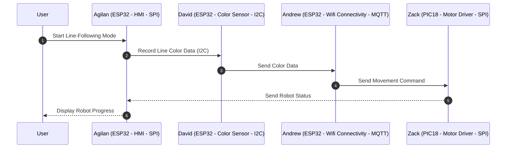
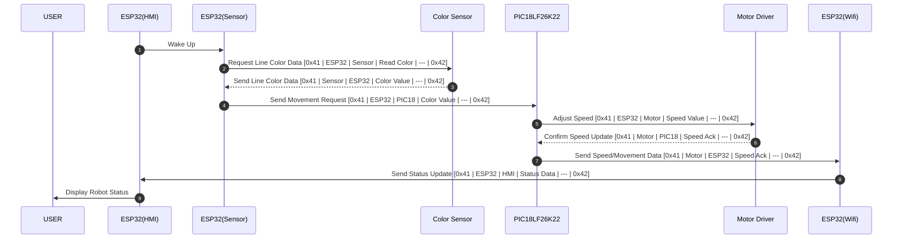

## Block Diagram
In designing our system's block diagram, we followed a logical, event-driven flow that aligned with the functional goals of our project. The decision to structure the diagram starting with the Sensor, followed by WiFi (MQTT server communication), then the Motors, and finally the HMI, was based on the natural progression of how data flows through the system and how each component responds to that data. The color sensor is the initiating element—it detects environmental input (red or blue light), which then triggers the rest of the system. Once a color is detected, that data needs to be communicated to the server, which is done through the WiFi module using MQTT protocol. This communication layer is central to decision-making and bridges the sensor input with system-wide actions.

From there, the MQTT server interprets the color data and sends specific commands to the motor system to control its motion. The motor, in turn, operates based on this command and measures its own speed data. Finally, this feedback is sent to the HMI, where users can observe system performance in real time. By following this Sensor → WiFi → Motors → HMI structure, our block diagram clearly represents the sequential interaction between subsystems and how information flows from input to action to feedback. This design ensures clarity, supports modular testing, and meets the product requirements for reliable detection, responsive actuation, real-time communication, and user interface feedback.

<!-- draw.io diagram -->
<div class="mxgraph" style="max-width:100%;border:1px solid transparent;" data-mxgraph="{&quot;highlight&quot;:&quot;#000000&quot;,&quot;nav&quot;:true,&quot;resize&quot;:true,&quot;dark-mode&quot;:&quot;auto&quot;,&quot;toolbar&quot;:&quot;zoom layers tags lightbox&quot;,&quot;edit&quot;:&quot;_blank&quot;,&quot;xml&quot;:&quot;&lt;mxfile host=\&quot;app.diagrams.net\&quot; agent=\&quot;Mozilla/5.0 (Windows NT 10.0; Win64; x64) AppleWebKit/537.36 (KHTML, like Gecko) Chrome/135.0.0.0 Safari/537.36\&quot; version=\&quot;26.2.15\&quot;&gt;\n  &lt;diagram name=\&quot;Page-1\&quot; id=\&quot;90a13364-a465-7bf4-72fc-28e22215d7a0\&quot;&gt;\n    &lt;mxGraphModel dx=\&quot;4576.5\&quot; dy=\&quot;1029\&quot; grid=\&quot;1\&quot; gridSize=\&quot;10\&quot; guides=\&quot;1\&quot; tooltips=\&quot;1\&quot; connect=\&quot;1\&quot; arrows=\&quot;1\&quot; fold=\&quot;1\&quot; page=\&quot;1\&quot; pageScale=\&quot;1.5\&quot; pageWidth=\&quot;1169\&quot; pageHeight=\&quot;827\&quot; background=\&quot;#ffffff\&quot; math=\&quot;0\&quot; shadow=\&quot;0\&quot;&gt;\n      &lt;root&gt;\n        &lt;mxCell id=\&quot;0\&quot; style=\&quot;;html=1;\&quot; /&gt;\n        &lt;mxCell id=\&quot;1\&quot; style=\&quot;;html=1;\&quot; parent=\&quot;0\&quot; /&gt;\n        &lt;mxCell id=\&quot;aC57QmPyYTqG6Asludqg-9\&quot; value=\&quot;\&quot; style=\&quot;rounded=0;whiteSpace=wrap;html=1;fontSize=16;fillColor=#f8cecc;strokeColor=#b85450;\&quot; parent=\&quot;1\&quot; vertex=\&quot;1\&quot;&gt;\n          &lt;mxGeometry x=\&quot;-170\&quot; y=\&quot;300\&quot; width=\&quot;600\&quot; height=\&quot;630\&quot; as=\&quot;geometry\&quot; /&gt;\n        &lt;/mxCell&gt;\n        &lt;mxCell id=\&quot;9j5Bc3N9rgv02oG_bQQu-47\&quot; value=\&quot;\&quot; style=\&quot;group;strokeWidth=1;\&quot; parent=\&quot;1\&quot; vertex=\&quot;1\&quot; connectable=\&quot;0\&quot;&gt;\n          &lt;mxGeometry x=\&quot;135\&quot; y=\&quot;513\&quot; width=\&quot;250\&quot; height=\&quot;190\&quot; as=\&quot;geometry\&quot; /&gt;\n        &lt;/mxCell&gt;\n        &lt;mxCell id=\&quot;9j5Bc3N9rgv02oG_bQQu-6\&quot; value=\&quot;&amp;lt;strong&amp;gt;&amp;lt;font style=&amp;quot;font-size: 18px;&amp;quot;&amp;gt;ESP32&amp;lt;/font&amp;gt;&amp;lt;/strong&amp;gt;\&quot; style=\&quot;rounded=0;whiteSpace=wrap;html=1;strokeWidth=2;fillColor=#E6E6E6;\&quot; parent=\&quot;9j5Bc3N9rgv02oG_bQQu-47\&quot; vertex=\&quot;1\&quot;&gt;\n          &lt;mxGeometry x=\&quot;-30\&quot; width=\&quot;280\&quot; height=\&quot;170\&quot; as=\&quot;geometry\&quot; /&gt;\n        &lt;/mxCell&gt;\n        &lt;mxCell id=\&quot;9j5Bc3N9rgv02oG_bQQu-31\&quot; value=\&quot;&amp;lt;div&amp;gt;GND&amp;lt;/div&amp;gt;\&quot; style=\&quot;rounded=0;whiteSpace=wrap;html=1;\&quot; parent=\&quot;9j5Bc3N9rgv02oG_bQQu-47\&quot; vertex=\&quot;1\&quot;&gt;\n          &lt;mxGeometry x=\&quot;170\&quot; y=\&quot;60\&quot; width=\&quot;80\&quot; height=\&quot;40\&quot; as=\&quot;geometry\&quot; /&gt;\n        &lt;/mxCell&gt;\n        &lt;mxCell id=\&quot;9j5Bc3N9rgv02oG_bQQu-36\&quot; value=\&quot;SDA (GPIO 21)\&quot; style=\&quot;rounded=0;whiteSpace=wrap;html=1;\&quot; parent=\&quot;9j5Bc3N9rgv02oG_bQQu-47\&quot; vertex=\&quot;1\&quot;&gt;\n          &lt;mxGeometry x=\&quot;-30\&quot; y=\&quot;130\&quot; width=\&quot;60\&quot; height=\&quot;40\&quot; as=\&quot;geometry\&quot; /&gt;\n        &lt;/mxCell&gt;\n        &lt;mxCell id=\&quot;9j5Bc3N9rgv02oG_bQQu-40\&quot; value=\&quot;UART TX (GPIO17)\&quot; style=\&quot;rounded=0;whiteSpace=wrap;html=1;\&quot; parent=\&quot;9j5Bc3N9rgv02oG_bQQu-47\&quot; vertex=\&quot;1\&quot;&gt;\n          &lt;mxGeometry x=\&quot;150\&quot; width=\&quot;80\&quot; height=\&quot;30\&quot; as=\&quot;geometry\&quot; /&gt;\n        &lt;/mxCell&gt;\n        &lt;mxCell id=\&quot;3I63KCLoRFE2I7JEEU8W-35\&quot; value=\&quot;UART RX (GPIO 16)\&quot; style=\&quot;rounded=0;whiteSpace=wrap;html=1;\&quot; parent=\&quot;9j5Bc3N9rgv02oG_bQQu-47\&quot; vertex=\&quot;1\&quot;&gt;\n          &lt;mxGeometry x=\&quot;-9.5\&quot; width=\&quot;80\&quot; height=\&quot;30\&quot; as=\&quot;geometry\&quot; /&gt;\n        &lt;/mxCell&gt;\n        &lt;mxCell id=\&quot;3I63KCLoRFE2I7JEEU8W-73\&quot; value=\&quot;SCL (GPIO 22)\&quot; style=\&quot;rounded=0;whiteSpace=wrap;html=1;\&quot; parent=\&quot;9j5Bc3N9rgv02oG_bQQu-47\&quot; vertex=\&quot;1\&quot;&gt;\n          &lt;mxGeometry x=\&quot;190\&quot; y=\&quot;130\&quot; width=\&quot;60\&quot; height=\&quot;40\&quot; as=\&quot;geometry\&quot; /&gt;\n        &lt;/mxCell&gt;\n        &lt;mxCell id=\&quot;3I63KCLoRFE2I7JEEU8W-21\&quot; style=\&quot;edgeStyle=orthogonalEdgeStyle;rounded=0;orthogonalLoop=1;jettySize=auto;html=1;entryX=0;entryY=0.5;entryDx=0;entryDy=0;\&quot; parent=\&quot;1\&quot; source=\&quot;J8ns3n-xOa6iXa_PQh_Z-11\&quot; target=\&quot;9j5Bc3N9rgv02oG_bQQu-29\&quot; edge=\&quot;1\&quot;&gt;\n          &lt;mxGeometry relative=\&quot;1\&quot; as=\&quot;geometry\&quot; /&gt;\n        &lt;/mxCell&gt;\n        &lt;mxCell id=\&quot;3I63KCLoRFE2I7JEEU8W-77\&quot; style=\&quot;edgeStyle=orthogonalEdgeStyle;rounded=0;orthogonalLoop=1;jettySize=auto;html=1;exitX=0;exitY=0.5;exitDx=0;exitDy=0;entryX=0.5;entryY=1;entryDx=0;entryDy=0;\&quot; parent=\&quot;1\&quot; source=\&quot;J8ns3n-xOa6iXa_PQh_Z-11\&quot; target=\&quot;3I63KCLoRFE2I7JEEU8W-62\&quot; edge=\&quot;1\&quot;&gt;\n          &lt;mxGeometry relative=\&quot;1\&quot; as=\&quot;geometry\&quot;&gt;\n            &lt;Array as=\&quot;points\&quot;&gt;\n              &lt;mxPoint x=\&quot;-160\&quot; y=\&quot;395\&quot; /&gt;\n              &lt;mxPoint x=\&quot;-160\&quot; y=\&quot;875\&quot; /&gt;\n              &lt;mxPoint x=\&quot;250\&quot; y=\&quot;875\&quot; /&gt;\n              &lt;mxPoint x=\&quot;250\&quot; y=\&quot;855\&quot; /&gt;\n            &lt;/Array&gt;\n          &lt;/mxGeometry&gt;\n        &lt;/mxCell&gt;\n        &lt;mxCell id=\&quot;J8ns3n-xOa6iXa_PQh_Z-11\&quot; value=\&quot;&amp;lt;p style=&amp;quot;line-height: 120%&amp;quot;&amp;gt;&amp;lt;span class=&amp;quot;hljs-variable&amp;quot;&amp;gt;ADP44002AUJZ&amp;lt;/span&amp;gt;&amp;lt;span class=&amp;quot;hljs-operator&amp;quot;&amp;gt;-&amp;lt;/span&amp;gt;&amp;lt;span class=&amp;quot;hljs-number&amp;quot;&amp;gt;3.3&amp;lt;/span&amp;gt;&amp;lt;span class=&amp;quot;hljs-operator&amp;quot;&amp;gt;-&amp;lt;/span&amp;gt;&amp;lt;span class=&amp;quot;hljs-variable&amp;quot;&amp;gt;R7&amp;lt;/span&amp;gt; &amp;lt;span class=&amp;quot;hljs-variable&amp;quot;&amp;gt;Switching&amp;lt;/span&amp;gt; &amp;lt;span class=&amp;quot;hljs-variable&amp;quot;&amp;gt;Regulator&amp;lt;/span&amp;gt;&amp;lt;br&amp;gt;&amp;lt;span class=&amp;quot;hljs-variable&amp;quot;&amp;gt;Steps&amp;lt;/span&amp;gt; &amp;lt;span class=&amp;quot;hljs-built_in&amp;quot;&amp;gt;Down&amp;lt;/span&amp;gt; &amp;lt;span class=&amp;quot;hljs-number&amp;quot;&amp;gt;9&amp;lt;/span&amp;gt;&amp;lt;span class=&amp;quot;hljs-variable&amp;quot;&amp;gt;V-12v&amp;lt;/span&amp;gt; &amp;lt;span class=&amp;quot;hljs-variable&amp;quot;&amp;gt;to&amp;lt;/span&amp;gt; &amp;lt;span class=&amp;quot;hljs-variable&amp;quot;&amp;gt;Stable&amp;lt;/span&amp;gt; &amp;lt;span class=&amp;quot;hljs-number&amp;quot;&amp;gt;3.3&amp;lt;/span&amp;gt;&amp;lt;span class=&amp;quot;hljs-variable&amp;quot;&amp;gt;V&amp;amp;nbsp;&amp;lt;/span&amp;gt;&amp;lt;span class=&amp;quot;hljs-number&amp;quot;&amp;gt;,500&amp;lt;/span&amp;gt;&amp;lt;span class=&amp;quot;hljs-variable&amp;quot;&amp;gt;mA&amp;lt;/span&amp;gt;&amp;lt;/p&amp;gt;\&quot; style=\&quot;rounded=0;whiteSpace=wrap;html=1;\&quot; parent=\&quot;1\&quot; vertex=\&quot;1\&quot;&gt;\n          &lt;mxGeometry x=\&quot;-130\&quot; y=\&quot;360\&quot; width=\&quot;155\&quot; height=\&quot;70\&quot; as=\&quot;geometry\&quot; /&gt;\n        &lt;/mxCell&gt;\n        &lt;mxCell id=\&quot;aC57QmPyYTqG6Asludqg-8\&quot; value=\&quot;&amp;lt;div style=&amp;quot;&amp;quot;&amp;gt;&amp;lt;b style=&amp;quot;&amp;quot;&amp;gt;&amp;lt;font style=&amp;quot;font-size: 24px;&amp;quot;&amp;gt;Sensor Block Diagram&amp;lt;/font&amp;gt;&amp;lt;/b&amp;gt;&amp;lt;/div&amp;gt;&amp;lt;div style=&amp;quot;&amp;quot;&amp;gt;&amp;lt;font size=&amp;quot;3&amp;quot;&amp;gt;David Diaz -- Team 305&amp;lt;/font&amp;gt;&amp;lt;/div&amp;gt;\&quot; style=\&quot;text;html=1;strokeColor=none;fillColor=none;align=center;verticalAlign=middle;whiteSpace=wrap;rounded=0;fontSize=16;\&quot; parent=\&quot;1\&quot; vertex=\&quot;1\&quot;&gt;\n          &lt;mxGeometry x=\&quot;-110\&quot; y=\&quot;195\&quot; width=\&quot;440\&quot; height=\&quot;60\&quot; as=\&quot;geometry\&quot; /&gt;\n        &lt;/mxCell&gt;\n        &lt;mxCell id=\&quot;3I63KCLoRFE2I7JEEU8W-37\&quot; style=\&quot;edgeStyle=orthogonalEdgeStyle;rounded=0;orthogonalLoop=1;jettySize=auto;html=1;\&quot; parent=\&quot;1\&quot; source=\&quot;9j5Bc3N9rgv02oG_bQQu-5\&quot; target=\&quot;3I63KCLoRFE2I7JEEU8W-35\&quot; edge=\&quot;1\&quot;&gt;\n          &lt;mxGeometry relative=\&quot;1\&quot; as=\&quot;geometry\&quot; /&gt;\n        &lt;/mxCell&gt;\n        &lt;mxCell id=\&quot;9j5Bc3N9rgv02oG_bQQu-5\&quot; value=\&quot;CONNECTOR IN&amp;amp;nbsp;\&quot; style=\&quot;rounded=0;whiteSpace=wrap;html=1;strokeWidth=2;fillColor=#E6E6E6;\&quot; parent=\&quot;1\&quot; vertex=\&quot;1\&quot;&gt;\n          &lt;mxGeometry x=\&quot;105\&quot; y=\&quot;300\&quot; width=\&quot;121\&quot; height=\&quot;60\&quot; as=\&quot;geometry\&quot; /&gt;\n        &lt;/mxCell&gt;\n        &lt;mxCell id=\&quot;3I63KCLoRFE2I7JEEU8W-11\&quot; value=\&quot;&amp;lt;div style=&amp;quot;&amp;quot;&amp;gt;&amp;lt;font style=&amp;quot;font-size: 9px;&amp;quot;&amp;gt;&amp;lt;span class=&amp;quot;hljs-variable&amp;quot;&amp;gt;Digital&amp;lt;/span&amp;gt; &amp;lt;span class=&amp;quot;hljs-variable&amp;quot;&amp;gt;Signal&amp;lt;/span&amp;gt; &amp;lt;span class=&amp;quot;hljs-punctuation&amp;quot;&amp;gt;(&amp;lt;/span&amp;gt;&amp;lt;span class=&amp;quot;hljs-built_in&amp;quot;&amp;gt;I&amp;lt;/span&amp;gt;²&amp;lt;span class=&amp;quot;hljs-built_in&amp;quot;&amp;gt;C&amp;lt;/span&amp;gt;&amp;lt;span class=&amp;quot;hljs-operator&amp;quot;&amp;gt;,&amp;lt;/span&amp;gt; &amp;lt;span class=&amp;quot;hljs-number&amp;quot;&amp;gt;2&amp;lt;/span&amp;gt; &amp;lt;span class=&amp;quot;hljs-variable&amp;quot;&amp;gt;Pins&amp;lt;/span&amp;gt;&amp;lt;span class=&amp;quot;hljs-operator&amp;quot;&amp;gt;:&amp;lt;/span&amp;gt; &amp;lt;span class=&amp;quot;hljs-variable&amp;quot;&amp;gt;SDA&amp;lt;/span&amp;gt;&amp;lt;span class=&amp;quot;hljs-operator&amp;quot;&amp;gt;,&amp;lt;/span&amp;gt; &amp;lt;span class=&amp;quot;hljs-variable&amp;quot;&amp;gt;SCL&amp;lt;/span&amp;gt;&amp;lt;span class=&amp;quot;hljs-punctuation&amp;quot;&amp;gt;)&amp;lt;/span&amp;gt;  &amp;lt;br&amp;gt;&amp;lt;span class=&amp;quot;hljs-variable&amp;quot;&amp;gt;Transmits&amp;lt;/span&amp;gt; &amp;lt;span class=&amp;quot;hljs-variable&amp;quot;&amp;gt;RGBW&amp;lt;/span&amp;gt; &amp;lt;span class=&amp;quot;hljs-variable&amp;quot;&amp;gt;Data&amp;lt;/span&amp;gt; &amp;lt;span class=&amp;quot;hljs-variable&amp;quot;&amp;gt;to&amp;lt;/span&amp;gt; &amp;lt;span class=&amp;quot;hljs-variable&amp;quot;&amp;gt;ESP32&amp;lt;/span&amp;gt; &amp;lt;span class=&amp;quot;hljs-variable&amp;quot;&amp;gt;for&amp;lt;/span&amp;gt; &amp;lt;span class=&amp;quot;hljs-variable&amp;quot;&amp;gt;Processing&amp;lt;/span&amp;gt;&amp;lt;/font&amp;gt;&amp;lt;/div&amp;gt;\&quot; style=\&quot;text;html=1;strokeColor=none;fillColor=none;align=center;verticalAlign=middle;whiteSpace=wrap;rounded=0;fontSize=8;rotation=0;\&quot; parent=\&quot;1\&quot; vertex=\&quot;1\&quot;&gt;\n          &lt;mxGeometry x=\&quot;160\&quot; y=\&quot;720\&quot; width=\&quot;175\&quot; height=\&quot;30\&quot; as=\&quot;geometry\&quot; /&gt;\n        &lt;/mxCell&gt;\n        &lt;mxCell id=\&quot;3I63KCLoRFE2I7JEEU8W-24\&quot; value=\&quot;\&quot; style=\&quot;edgeStyle=orthogonalEdgeStyle;rounded=0;orthogonalLoop=1;jettySize=auto;html=1;\&quot; parent=\&quot;1\&quot; source=\&quot;3I63KCLoRFE2I7JEEU8W-22\&quot; target=\&quot;3I63KCLoRFE2I7JEEU8W-23\&quot; edge=\&quot;1\&quot;&gt;\n          &lt;mxGeometry relative=\&quot;1\&quot; as=\&quot;geometry\&quot; /&gt;\n        &lt;/mxCell&gt;\n        &lt;mxCell id=\&quot;3I63KCLoRFE2I7JEEU8W-22\&quot; value=\&quot;&amp;lt;span class=&amp;quot;hljs-number&amp;quot;&amp;gt;12&amp;lt;/span&amp;gt;&amp;lt;span class=&amp;quot;hljs-variable&amp;quot;&amp;gt;V&amp;lt;/span&amp;gt; &amp;lt;span class=&amp;quot;hljs-number&amp;quot;&amp;gt;2&amp;lt;/span&amp;gt;&amp;lt;span class=&amp;quot;hljs-variable&amp;quot;&amp;gt;A&amp;lt;/span&amp;gt; &amp;lt;span class=&amp;quot;hljs-variable&amp;quot;&amp;gt;AC&amp;lt;/span&amp;gt;&amp;lt;span class=&amp;quot;hljs-operator&amp;quot;&amp;gt;-&amp;lt;/span&amp;gt;&amp;lt;span class=&amp;quot;hljs-variable&amp;quot;&amp;gt;DC&amp;lt;/span&amp;gt; &amp;lt;span class=&amp;quot;hljs-variable&amp;quot;&amp;gt;Wall&amp;lt;/span&amp;gt; &amp;lt;span class=&amp;quot;hljs-built_in&amp;quot;&amp;gt;Power&amp;lt;/span&amp;gt; &amp;lt;span class=&amp;quot;hljs-variable&amp;quot;&amp;gt;Supply&amp;lt;/span&amp;gt;  &amp;lt;br/&amp;gt;&amp;lt;span class=&amp;quot;hljs-variable&amp;quot;&amp;gt;Provides&amp;lt;/span&amp;gt; &amp;lt;span class=&amp;quot;hljs-built_in&amp;quot;&amp;gt;Power&amp;lt;/span&amp;gt; &amp;lt;span class=&amp;quot;hljs-variable&amp;quot;&amp;gt;to&amp;lt;/span&amp;gt; &amp;lt;span class=&amp;quot;hljs-variable&amp;quot;&amp;gt;Barrel&amp;lt;/span&amp;gt; &amp;lt;span class=&amp;quot;hljs-variable&amp;quot;&amp;gt;Jack&amp;lt;/span&amp;gt; &amp;lt;span class=&amp;quot;hljs-variable&amp;quot;&amp;gt;Adapter&amp;lt;/span&amp;gt;\&quot; style=\&quot;rounded=0;whiteSpace=wrap;html=1;\&quot; parent=\&quot;1\&quot; vertex=\&quot;1\&quot;&gt;\n          &lt;mxGeometry x=\&quot;-142.5\&quot; y=\&quot;930\&quot; width=\&quot;180\&quot; height=\&quot;70\&quot; as=\&quot;geometry\&quot; /&gt;\n        &lt;/mxCell&gt;\n        &lt;mxCell id=\&quot;3I63KCLoRFE2I7JEEU8W-81\&quot; style=\&quot;edgeStyle=orthogonalEdgeStyle;rounded=0;orthogonalLoop=1;jettySize=auto;html=1;entryX=0.5;entryY=1;entryDx=0;entryDy=0;\&quot; parent=\&quot;1\&quot; source=\&quot;3I63KCLoRFE2I7JEEU8W-23\&quot; target=\&quot;J8ns3n-xOa6iXa_PQh_Z-11\&quot; edge=\&quot;1\&quot;&gt;\n          &lt;mxGeometry relative=\&quot;1\&quot; as=\&quot;geometry\&quot; /&gt;\n        &lt;/mxCell&gt;\n        &lt;mxCell id=\&quot;3I63KCLoRFE2I7JEEU8W-23\&quot; value=\&quot;&amp;lt;p style=&amp;quot;line-height: 120%&amp;quot;&amp;gt;Barrel Jack Adapter  &amp;lt;br/&amp;gt;Outputs &amp;lt;span class=&amp;quot;hljs-number&amp;quot;&amp;gt;9&amp;lt;/span&amp;gt;V/&amp;lt;span class=&amp;quot;hljs-number&amp;quot;&amp;gt;12&amp;lt;/span&amp;gt;V &amp;lt;span class=&amp;quot;hljs-selector-tag&amp;quot;&amp;gt;to&amp;lt;/span&amp;gt; Voltage Regulator&amp;amp;nbsp;&amp;lt;/p&amp;gt;\&quot; style=\&quot;rounded=0;whiteSpace=wrap;html=1;\&quot; parent=\&quot;1\&quot; vertex=\&quot;1\&quot;&gt;\n          &lt;mxGeometry x=\&quot;-130\&quot; y=\&quot;520\&quot; width=\&quot;155\&quot; height=\&quot;70\&quot; as=\&quot;geometry\&quot; /&gt;\n        &lt;/mxCell&gt;\n        &lt;mxCell id=\&quot;3ANQvioIpX5no5iEAwux-1\&quot; style=\&quot;edgeStyle=orthogonalEdgeStyle;rounded=0;orthogonalLoop=1;jettySize=auto;html=1;entryX=0.5;entryY=0;entryDx=0;entryDy=0;\&quot; edge=\&quot;1\&quot; parent=\&quot;1\&quot; source=\&quot;3I63KCLoRFE2I7JEEU8W-36\&quot; target=\&quot;aVXlbrfe1HY1APvneNgD-26\&quot;&gt;\n          &lt;mxGeometry relative=\&quot;1\&quot; as=\&quot;geometry\&quot;&gt;\n            &lt;Array as=\&quot;points\&quot;&gt;\n              &lt;mxPoint x=\&quot;325\&quot; y=\&quot;277\&quot; /&gt;\n              &lt;mxPoint x=\&quot;605\&quot; y=\&quot;277\&quot; /&gt;\n            &lt;/Array&gt;\n          &lt;/mxGeometry&gt;\n        &lt;/mxCell&gt;\n        &lt;mxCell id=\&quot;3I63KCLoRFE2I7JEEU8W-36\&quot; value=\&quot;CONNECTOR OUT\&quot; style=\&quot;rounded=0;whiteSpace=wrap;html=1;strokeWidth=2;fillColor=#E6E6E6;\&quot; parent=\&quot;1\&quot; vertex=\&quot;1\&quot;&gt;\n          &lt;mxGeometry x=\&quot;264\&quot; y=\&quot;300\&quot; width=\&quot;121\&quot; height=\&quot;60\&quot; as=\&quot;geometry\&quot; /&gt;\n        &lt;/mxCell&gt;\n        &lt;mxCell id=\&quot;3I63KCLoRFE2I7JEEU8W-38\&quot; style=\&quot;edgeStyle=orthogonalEdgeStyle;rounded=0;orthogonalLoop=1;jettySize=auto;html=1;entryX=0.5;entryY=1;entryDx=0;entryDy=0;\&quot; parent=\&quot;1\&quot; source=\&quot;9j5Bc3N9rgv02oG_bQQu-40\&quot; target=\&quot;3I63KCLoRFE2I7JEEU8W-36\&quot; edge=\&quot;1\&quot;&gt;\n          &lt;mxGeometry relative=\&quot;1\&quot; as=\&quot;geometry\&quot; /&gt;\n        &lt;/mxCell&gt;\n        &lt;mxCell id=\&quot;3I63KCLoRFE2I7JEEU8W-72\&quot; style=\&quot;edgeStyle=orthogonalEdgeStyle;rounded=0;orthogonalLoop=1;jettySize=auto;html=1;exitX=0;exitY=0.5;exitDx=0;exitDy=0;entryX=0.25;entryY=1;entryDx=0;entryDy=0;\&quot; parent=\&quot;1\&quot; edge=\&quot;1\&quot;&gt;\n          &lt;mxGeometry relative=\&quot;1\&quot; as=\&quot;geometry\&quot;&gt;\n            &lt;mxPoint x=\&quot;167.5\&quot; y=\&quot;807.5\&quot; as=\&quot;sourcePoint\&quot; /&gt;\n            &lt;mxPoint x=\&quot;135\&quot; y=\&quot;683\&quot; as=\&quot;targetPoint\&quot; /&gt;\n          &lt;/mxGeometry&gt;\n        &lt;/mxCell&gt;\n        &lt;mxCell id=\&quot;3I63KCLoRFE2I7JEEU8W-75\&quot; style=\&quot;edgeStyle=orthogonalEdgeStyle;rounded=0;orthogonalLoop=1;jettySize=auto;html=1;exitX=1;exitY=0.5;exitDx=0;exitDy=0;\&quot; parent=\&quot;1\&quot; source=\&quot;3I63KCLoRFE2I7JEEU8W-62\&quot; target=\&quot;3I63KCLoRFE2I7JEEU8W-73\&quot; edge=\&quot;1\&quot;&gt;\n          &lt;mxGeometry relative=\&quot;1\&quot; as=\&quot;geometry\&quot;&gt;\n            &lt;Array as=\&quot;points\&quot;&gt;\n              &lt;mxPoint x=\&quot;355\&quot; y=\&quot;808\&quot; /&gt;\n            &lt;/Array&gt;\n          &lt;/mxGeometry&gt;\n        &lt;/mxCell&gt;\n        &lt;mxCell id=\&quot;3I63KCLoRFE2I7JEEU8W-62\&quot; value=\&quot;&amp;lt;span class=&amp;quot;hljs-variable&amp;quot;&amp;gt;OPT4060&amp;lt;/span&amp;gt; &amp;lt;span class=&amp;quot;hljs-variable&amp;quot;&amp;gt;RGBW&amp;lt;/span&amp;gt; &amp;lt;span class=&amp;quot;hljs-variable&amp;quot;&amp;gt;Color&amp;lt;/span&amp;gt; &amp;lt;span class=&amp;quot;hljs-variable&amp;quot;&amp;gt;Sensor&amp;lt;/span&amp;gt;  &amp;lt;br/&amp;gt;&amp;lt;span class=&amp;quot;hljs-variable&amp;quot;&amp;gt;Detects&amp;lt;/span&amp;gt; &amp;lt;span class=&amp;quot;hljs-built_in&amp;quot;&amp;gt;Line&amp;lt;/span&amp;gt; &amp;lt;span class=&amp;quot;hljs-variable&amp;quot;&amp;gt;Color&amp;lt;/span&amp;gt; &amp;lt;span class=&amp;quot;hljs-variable&amp;quot;&amp;gt;Contrast&amp;lt;/span&amp;gt;&amp;amp;nbsp;&amp;lt;span class=&amp;quot;hljs-built_in&amp;quot;&amp;gt;I&amp;lt;/span&amp;gt;²&amp;lt;span class=&amp;quot;hljs-built_in&amp;quot;&amp;gt;C&amp;lt;/span&amp;gt; &amp;lt;span class=&amp;quot;hljs-variable&amp;quot;&amp;gt;Serial&amp;lt;/span&amp;gt; &amp;lt;span class=&amp;quot;hljs-variable&amp;quot;&amp;gt;Output&amp;lt;/span&amp;gt; &amp;lt;span class=&amp;quot;hljs-punctuation&amp;quot;&amp;gt;(&amp;lt;/span&amp;gt;&amp;lt;span class=&amp;quot;hljs-variable&amp;quot;&amp;gt;SDA&amp;lt;/span&amp;gt;&amp;lt;span class=&amp;quot;hljs-operator&amp;quot;&amp;gt;,&amp;lt;/span&amp;gt; &amp;lt;span class=&amp;quot;hljs-variable&amp;quot;&amp;gt;SCL&amp;lt;/span&amp;gt;&amp;lt;span class=&amp;quot;hljs-punctuation&amp;quot;&amp;gt;)&amp;lt;/span&amp;gt;\&quot; style=\&quot;rounded=0;whiteSpace=wrap;html=1;\&quot; parent=\&quot;1\&quot; vertex=\&quot;1\&quot;&gt;\n          &lt;mxGeometry x=\&quot;152.5\&quot; y=\&quot;760\&quot; width=\&quot;185\&quot; height=\&quot;95\&quot; as=\&quot;geometry\&quot; /&gt;\n        &lt;/mxCell&gt;\n        &lt;mxCell id=\&quot;9j5Bc3N9rgv02oG_bQQu-29\&quot; value=\&quot;&amp;lt;div&amp;gt;3.3V VCC&amp;lt;/div&amp;gt;\&quot; style=\&quot;rounded=0;whiteSpace=wrap;html=1;\&quot; parent=\&quot;1\&quot; vertex=\&quot;1\&quot;&gt;\n          &lt;mxGeometry x=\&quot;105\&quot; y=\&quot;570\&quot; width=\&quot;80\&quot; height=\&quot;40\&quot; as=\&quot;geometry\&quot; /&gt;\n        &lt;/mxCell&gt;\n        &lt;mxCell id=\&quot;S8yp5X4-lJhxRksTFqpk-8\&quot; value=\&quot;\&quot; style=\&quot;rounded=1;whiteSpace=wrap;html=1;fillColor=none;dashed=1;\&quot; parent=\&quot;1\&quot; vertex=\&quot;1\&quot;&gt;\n          &lt;mxGeometry x=\&quot;-147.5\&quot; y=\&quot;350\&quot; width=\&quot;190\&quot; height=\&quot;250\&quot; as=\&quot;geometry\&quot; /&gt;\n        &lt;/mxCell&gt;\n        &lt;mxCell id=\&quot;cNyn5FgZRci5ZLgEMvEf-2\&quot; value=\&quot;\&quot; style=\&quot;rounded=0;whiteSpace=wrap;html=1;fillColor=none;dashed=1;strokeWidth=2;\&quot; parent=\&quot;1\&quot; vertex=\&quot;1\&quot;&gt;\n          &lt;mxGeometry x=\&quot;60\&quot; y=\&quot;490\&quot; width=\&quot;335\&quot; height=\&quot;410\&quot; as=\&quot;geometry\&quot; /&gt;\n        &lt;/mxCell&gt;\n        &lt;mxCell id=\&quot;Zyt2fzy2bafqhQG2lDP6-1\&quot; value=\&quot;\&quot; style=\&quot;rounded=0;whiteSpace=wrap;html=1;fillColor=#d5e8d4;strokeColor=#82b366;\&quot; parent=\&quot;1\&quot; vertex=\&quot;1\&quot;&gt;\n          &lt;mxGeometry x=\&quot;980\&quot; y=\&quot;297\&quot; width=\&quot;540\&quot; height=\&quot;630\&quot; as=\&quot;geometry\&quot; /&gt;\n        &lt;/mxCell&gt;\n        &lt;mxCell id=\&quot;Zyt2fzy2bafqhQG2lDP6-2\&quot; value=\&quot;\&quot; style=\&quot;rounded=0;html=1;dashed=1;dashPattern=12 12;whiteSpace=wrap;fillColor=#d5e8d4;strokeColor=#82b366;\&quot; parent=\&quot;1\&quot; vertex=\&quot;1\&quot;&gt;\n          &lt;mxGeometry x=\&quot;990\&quot; y=\&quot;454\&quot; width=\&quot;510\&quot; height=\&quot;353\&quot; as=\&quot;geometry\&quot; /&gt;\n        &lt;/mxCell&gt;\n        &lt;mxCell id=\&quot;Zyt2fzy2bafqhQG2lDP6-3\&quot; value=\&quot;Microchip&amp;amp;nbsp;&amp;lt;div&amp;gt;PIC18LF26K22&amp;lt;br&amp;gt;&amp;lt;/div&amp;gt;\&quot; style=\&quot;rounded=0;whiteSpace=wrap;html=1;fillColor=light-dark(#E6E6E6,#3E3E3E);strokeColor=#23445d;strokeWidth=2;\&quot; parent=\&quot;1\&quot; vertex=\&quot;1\&quot;&gt;\n          &lt;mxGeometry x=\&quot;1090\&quot; y=\&quot;484\&quot; width=\&quot;260\&quot; height=\&quot;233\&quot; as=\&quot;geometry\&quot; /&gt;\n        &lt;/mxCell&gt;\n        &lt;mxCell id=\&quot;Zyt2fzy2bafqhQG2lDP6-4\&quot; value=\&quot;UART RX1\&quot; style=\&quot;rounded=0;whiteSpace=wrap;html=1;\&quot; parent=\&quot;1\&quot; vertex=\&quot;1\&quot;&gt;\n          &lt;mxGeometry x=\&quot;1090\&quot; y=\&quot;484\&quot; width=\&quot;60\&quot; height=\&quot;30\&quot; as=\&quot;geometry\&quot; /&gt;\n        &lt;/mxCell&gt;\n        &lt;mxCell id=\&quot;Zyt2fzy2bafqhQG2lDP6-5\&quot; style=\&quot;edgeStyle=orthogonalEdgeStyle;rounded=0;orthogonalLoop=1;jettySize=auto;html=1;exitX=0.5;exitY=0;exitDx=0;exitDy=0;entryX=0.5;entryY=1;entryDx=0;entryDy=0;\&quot; parent=\&quot;1\&quot; source=\&quot;Zyt2fzy2bafqhQG2lDP6-6\&quot; target=\&quot;Zyt2fzy2bafqhQG2lDP6-9\&quot; edge=\&quot;1\&quot;&gt;\n          &lt;mxGeometry relative=\&quot;1\&quot; as=\&quot;geometry\&quot; /&gt;\n        &lt;/mxCell&gt;\n        &lt;mxCell id=\&quot;Zyt2fzy2bafqhQG2lDP6-6\&quot; value=\&quot;UART&amp;amp;nbsp; TX1\&quot; style=\&quot;rounded=0;whiteSpace=wrap;html=1;\&quot; parent=\&quot;1\&quot; vertex=\&quot;1\&quot;&gt;\n          &lt;mxGeometry x=\&quot;1290\&quot; y=\&quot;484\&quot; width=\&quot;60\&quot; height=\&quot;30\&quot; as=\&quot;geometry\&quot; /&gt;\n        &lt;/mxCell&gt;\n        &lt;mxCell id=\&quot;Zyt2fzy2bafqhQG2lDP6-7\&quot; style=\&quot;edgeStyle=orthogonalEdgeStyle;rounded=0;orthogonalLoop=1;jettySize=auto;html=1;exitX=0.5;exitY=1;exitDx=0;exitDy=0;entryX=0.5;entryY=0;entryDx=0;entryDy=0;\&quot; parent=\&quot;1\&quot; source=\&quot;Zyt2fzy2bafqhQG2lDP6-8\&quot; target=\&quot;Zyt2fzy2bafqhQG2lDP6-4\&quot; edge=\&quot;1\&quot;&gt;\n          &lt;mxGeometry relative=\&quot;1\&quot; as=\&quot;geometry\&quot; /&gt;\n        &lt;/mxCell&gt;\n        &lt;mxCell id=\&quot;Zyt2fzy2bafqhQG2lDP6-8\&quot; value=\&quot;CONNECTOR IN\&quot; style=\&quot;rounded=0;whiteSpace=wrap;html=1;fillColor=light-dark(#e6e6e6, #3e3e3e);\&quot; parent=\&quot;1\&quot; vertex=\&quot;1\&quot;&gt;\n          &lt;mxGeometry x=\&quot;1060\&quot; y=\&quot;297\&quot; width=\&quot;120\&quot; height=\&quot;60\&quot; as=\&quot;geometry\&quot; /&gt;\n        &lt;/mxCell&gt;\n        &lt;mxCell id=\&quot;3ANQvioIpX5no5iEAwux-3\&quot; style=\&quot;edgeStyle=orthogonalEdgeStyle;rounded=0;orthogonalLoop=1;jettySize=auto;html=1;exitX=0.5;exitY=0;exitDx=0;exitDy=0;entryX=0.5;entryY=0;entryDx=0;entryDy=0;\&quot; edge=\&quot;1\&quot; parent=\&quot;1\&quot; source=\&quot;Zyt2fzy2bafqhQG2lDP6-9\&quot; target=\&quot;CHz-cVB5UHpbshBLmoc9-26\&quot;&gt;\n          &lt;mxGeometry relative=\&quot;1\&quot; as=\&quot;geometry\&quot;&gt;\n            &lt;Array as=\&quot;points\&quot;&gt;\n              &lt;mxPoint x=\&quot;1320\&quot; y=\&quot;260\&quot; /&gt;\n              &lt;mxPoint x=\&quot;-470\&quot; y=\&quot;260\&quot; /&gt;\n            &lt;/Array&gt;\n          &lt;/mxGeometry&gt;\n        &lt;/mxCell&gt;\n        &lt;mxCell id=\&quot;Zyt2fzy2bafqhQG2lDP6-9\&quot; value=\&quot;CONNECTOR OUT\&quot; style=\&quot;rounded=0;whiteSpace=wrap;html=1;fillColor=light-dark(#e6e6e6, #3e3e3e);\&quot; parent=\&quot;1\&quot; vertex=\&quot;1\&quot;&gt;\n          &lt;mxGeometry x=\&quot;1260\&quot; y=\&quot;297\&quot; width=\&quot;120\&quot; height=\&quot;60\&quot; as=\&quot;geometry\&quot; /&gt;\n        &lt;/mxCell&gt;\n        &lt;mxCell id=\&quot;Zyt2fzy2bafqhQG2lDP6-10\&quot; value=\&quot;3.3V 1.5A Switching Voltage Regulator\&quot; style=\&quot;rounded=0;whiteSpace=wrap;html=1;\&quot; parent=\&quot;1\&quot; vertex=\&quot;1\&quot;&gt;\n          &lt;mxGeometry x=\&quot;990\&quot; y=\&quot;757\&quot; width=\&quot;120\&quot; height=\&quot;50\&quot; as=\&quot;geometry\&quot; /&gt;\n        &lt;/mxCell&gt;\n        &lt;mxCell id=\&quot;Zyt2fzy2bafqhQG2lDP6-11\&quot; style=\&quot;edgeStyle=orthogonalEdgeStyle;rounded=0;orthogonalLoop=1;jettySize=auto;html=1;exitX=0.5;exitY=0;exitDx=0;exitDy=0;entryX=0.5;entryY=1;entryDx=0;entryDy=0;\&quot; parent=\&quot;1\&quot; source=\&quot;Zyt2fzy2bafqhQG2lDP6-23\&quot; target=\&quot;Zyt2fzy2bafqhQG2lDP6-10\&quot; edge=\&quot;1\&quot;&gt;\n          &lt;mxGeometry relative=\&quot;1\&quot; as=\&quot;geometry\&quot;&gt;\n            &lt;mxPoint x=\&quot;1060\&quot; y=\&quot;837\&quot; as=\&quot;sourcePoint\&quot; /&gt;\n          &lt;/mxGeometry&gt;\n        &lt;/mxCell&gt;\n        &lt;mxCell id=\&quot;Zyt2fzy2bafqhQG2lDP6-12\&quot; value=\&quot;Power\&quot; style=\&quot;edgeLabel;html=1;align=center;verticalAlign=middle;resizable=0;points=[];\&quot; parent=\&quot;Zyt2fzy2bafqhQG2lDP6-11\&quot; connectable=\&quot;0\&quot; vertex=\&quot;1\&quot;&gt;\n          &lt;mxGeometry x=\&quot;0.0245\&quot; relative=\&quot;1\&quot; as=\&quot;geometry\&quot;&gt;\n            &lt;mxPoint as=\&quot;offset\&quot; /&gt;\n          &lt;/mxGeometry&gt;\n        &lt;/mxCell&gt;\n        &lt;mxCell id=\&quot;Zyt2fzy2bafqhQG2lDP6-14\&quot; value=\&quot;&amp;lt;font style=&amp;quot;font-size: 24px;&amp;quot;&amp;gt;&amp;lt;b style=&amp;quot;&amp;quot;&amp;gt;MQTT Wifi Server Block Diagram&amp;lt;/b&amp;gt;&amp;lt;/font&amp;gt;&amp;lt;div&amp;gt;&amp;lt;font style=&amp;quot;font-size: 16px;&amp;quot;&amp;gt;Andrew Rushton -- Team 305&amp;lt;/font&amp;gt;&amp;lt;/div&amp;gt;\&quot; style=\&quot;text;html=1;align=center;verticalAlign=middle;whiteSpace=wrap;rounded=0;\&quot; parent=\&quot;1\&quot; vertex=\&quot;1\&quot;&gt;\n          &lt;mxGeometry x=\&quot;467.5\&quot; y=\&quot;177\&quot; width=\&quot;473.5\&quot; height=\&quot;90\&quot; as=\&quot;geometry\&quot; /&gt;\n        &lt;/mxCell&gt;\n        &lt;mxCell id=\&quot;un7PfHGXHGi1KQfJizUK-20\&quot; style=\&quot;edgeStyle=orthogonalEdgeStyle;rounded=0;orthogonalLoop=1;jettySize=auto;html=1;exitX=0.5;exitY=1;exitDx=0;exitDy=0;entryX=1;entryY=0.5;entryDx=0;entryDy=0;\&quot; parent=\&quot;1\&quot; source=\&quot;Zyt2fzy2bafqhQG2lDP6-16\&quot; target=\&quot;Zyt2fzy2bafqhQG2lDP6-18\&quot; edge=\&quot;1\&quot;&gt;\n          &lt;mxGeometry relative=\&quot;1\&quot; as=\&quot;geometry\&quot; /&gt;\n        &lt;/mxCell&gt;\n        &lt;mxCell id=\&quot;Zyt2fzy2bafqhQG2lDP6-16\&quot; value=\&quot;Microchip Snap Programmer\&quot; style=\&quot;rounded=0;whiteSpace=wrap;html=1;\&quot; parent=\&quot;1\&quot; vertex=\&quot;1\&quot;&gt;\n          &lt;mxGeometry x=\&quot;1360\&quot; y=\&quot;377\&quot; width=\&quot;120\&quot; height=\&quot;60\&quot; as=\&quot;geometry\&quot; /&gt;\n        &lt;/mxCell&gt;\n        &lt;mxCell id=\&quot;Zyt2fzy2bafqhQG2lDP6-18\&quot; value=\&quot;ICSP\&quot; style=\&quot;rounded=0;whiteSpace=wrap;html=1;\&quot; parent=\&quot;1\&quot; vertex=\&quot;1\&quot;&gt;\n          &lt;mxGeometry x=\&quot;1300\&quot; y=\&quot;534\&quot; width=\&quot;50\&quot; height=\&quot;30\&quot; as=\&quot;geometry\&quot; /&gt;\n        &lt;/mxCell&gt;\n        &lt;mxCell id=\&quot;Zyt2fzy2bafqhQG2lDP6-19\&quot; style=\&quot;edgeStyle=orthogonalEdgeStyle;rounded=0;orthogonalLoop=1;jettySize=auto;html=1;exitX=1;exitY=0.5;exitDx=0;exitDy=0;\&quot; parent=\&quot;1\&quot; source=\&quot;Zyt2fzy2bafqhQG2lDP6-20\&quot; target=\&quot;Zyt2fzy2bafqhQG2lDP6-35\&quot; edge=\&quot;1\&quot;&gt;\n          &lt;mxGeometry relative=\&quot;1\&quot; as=\&quot;geometry\&quot; /&gt;\n        &lt;/mxCell&gt;\n        &lt;mxCell id=\&quot;Zyt2fzy2bafqhQG2lDP6-20\&quot; value=\&quot;SPI\&quot; style=\&quot;rounded=0;whiteSpace=wrap;html=1;\&quot; parent=\&quot;1\&quot; vertex=\&quot;1\&quot;&gt;\n          &lt;mxGeometry x=\&quot;1300\&quot; y=\&quot;572\&quot; width=\&quot;50\&quot; height=\&quot;50\&quot; as=\&quot;geometry\&quot; /&gt;\n        &lt;/mxCell&gt;\n        &lt;mxCell id=\&quot;Zyt2fzy2bafqhQG2lDP6-21\&quot; value=\&quot;2x SE15K1BTYJ&amp;lt;br&amp;gt;&amp;lt;div&amp;gt;12V DC Motors&amp;lt;/div&amp;gt;\&quot; style=\&quot;rounded=0;whiteSpace=wrap;html=1;\&quot; parent=\&quot;1\&quot; vertex=\&quot;1\&quot;&gt;\n          &lt;mxGeometry x=\&quot;1360\&quot; y=\&quot;837\&quot; width=\&quot;120\&quot; height=\&quot;60\&quot; as=\&quot;geometry\&quot; /&gt;\n        &lt;/mxCell&gt;\n        &lt;mxCell id=\&quot;Zyt2fzy2bafqhQG2lDP6-23\&quot; value=\&quot;&amp;lt;div&amp;gt;9V Battery or 9V 3A AC-DC Power Supply&amp;lt;/div&amp;gt;\&quot; style=\&quot;rounded=0;whiteSpace=wrap;html=1;\&quot; parent=\&quot;1\&quot; vertex=\&quot;1\&quot;&gt;\n          &lt;mxGeometry x=\&quot;990\&quot; y=\&quot;927\&quot; width=\&quot;120\&quot; height=\&quot;50\&quot; as=\&quot;geometry\&quot; /&gt;\n        &lt;/mxCell&gt;\n        &lt;mxCell id=\&quot;hVMliXPcuLUprzn8B3sD-21\&quot; style=\&quot;edgeStyle=orthogonalEdgeStyle;rounded=0;orthogonalLoop=1;jettySize=auto;html=1;\&quot; parent=\&quot;1\&quot; source=\&quot;Zyt2fzy2bafqhQG2lDP6-25\&quot; target=\&quot;hVMliXPcuLUprzn8B3sD-17\&quot; edge=\&quot;1\&quot;&gt;\n          &lt;mxGeometry relative=\&quot;1\&quot; as=\&quot;geometry\&quot; /&gt;\n        &lt;/mxCell&gt;\n        &lt;mxCell id=\&quot;Zyt2fzy2bafqhQG2lDP6-25\&quot; value=\&quot;&amp;lt;div&amp;gt;DO&amp;lt;/div&amp;gt;RA1\&quot; style=\&quot;rounded=0;whiteSpace=wrap;html=1;\&quot; parent=\&quot;1\&quot; vertex=\&quot;1\&quot;&gt;\n          &lt;mxGeometry x=\&quot;1090\&quot; y=\&quot;601.5\&quot; width=\&quot;50\&quot; height=\&quot;30\&quot; as=\&quot;geometry\&quot; /&gt;\n        &lt;/mxCell&gt;\n        &lt;mxCell id=\&quot;hVMliXPcuLUprzn8B3sD-22\&quot; style=\&quot;edgeStyle=orthogonalEdgeStyle;rounded=0;orthogonalLoop=1;jettySize=auto;html=1;\&quot; parent=\&quot;1\&quot; source=\&quot;Zyt2fzy2bafqhQG2lDP6-27\&quot; target=\&quot;hVMliXPcuLUprzn8B3sD-18\&quot; edge=\&quot;1\&quot;&gt;\n          &lt;mxGeometry relative=\&quot;1\&quot; as=\&quot;geometry\&quot;&gt;\n            &lt;mxPoint x=\&quot;1070\&quot; y=\&quot;661\&quot; as=\&quot;targetPoint\&quot; /&gt;\n          &lt;/mxGeometry&gt;\n        &lt;/mxCell&gt;\n        &lt;mxCell id=\&quot;Zyt2fzy2bafqhQG2lDP6-27\&quot; value=\&quot;&amp;lt;div&amp;gt;DO&amp;lt;/div&amp;gt;RA0\&quot; style=\&quot;rounded=0;whiteSpace=wrap;html=1;\&quot; parent=\&quot;1\&quot; vertex=\&quot;1\&quot;&gt;\n          &lt;mxGeometry x=\&quot;1090\&quot; y=\&quot;645.5\&quot; width=\&quot;50\&quot; height=\&quot;30\&quot; as=\&quot;geometry\&quot; /&gt;\n        &lt;/mxCell&gt;\n        &lt;mxCell id=\&quot;hVMliXPcuLUprzn8B3sD-1\&quot; style=\&quot;edgeStyle=orthogonalEdgeStyle;rounded=0;orthogonalLoop=1;jettySize=auto;html=1;entryX=1;entryY=0.5;entryDx=0;entryDy=0;\&quot; parent=\&quot;1\&quot; source=\&quot;Zyt2fzy2bafqhQG2lDP6-29\&quot; target=\&quot;Zyt2fzy2bafqhQG2lDP6-38\&quot; edge=\&quot;1\&quot;&gt;\n          &lt;mxGeometry relative=\&quot;1\&quot; as=\&quot;geometry\&quot; /&gt;\n        &lt;/mxCell&gt;\n        &lt;mxCell id=\&quot;Zyt2fzy2bafqhQG2lDP6-29\&quot; value=\&quot;&amp;lt;div&amp;gt;DO&amp;lt;/div&amp;gt;RA3\&quot; style=\&quot;rounded=0;whiteSpace=wrap;html=1;\&quot; parent=\&quot;1\&quot; vertex=\&quot;1\&quot;&gt;\n          &lt;mxGeometry x=\&quot;1090\&quot; y=\&quot;517.5\&quot; width=\&quot;50\&quot; height=\&quot;30\&quot; as=\&quot;geometry\&quot; /&gt;\n        &lt;/mxCell&gt;\n        &lt;mxCell id=\&quot;hVMliXPcuLUprzn8B3sD-20\&quot; style=\&quot;edgeStyle=orthogonalEdgeStyle;rounded=0;orthogonalLoop=1;jettySize=auto;html=1;entryX=1;entryY=0.5;entryDx=0;entryDy=0;\&quot; parent=\&quot;1\&quot; source=\&quot;Zyt2fzy2bafqhQG2lDP6-31\&quot; target=\&quot;hVMliXPcuLUprzn8B3sD-16\&quot; edge=\&quot;1\&quot;&gt;\n          &lt;mxGeometry relative=\&quot;1\&quot; as=\&quot;geometry\&quot; /&gt;\n        &lt;/mxCell&gt;\n        &lt;mxCell id=\&quot;Zyt2fzy2bafqhQG2lDP6-31\&quot; value=\&quot;&amp;lt;div&amp;gt;DO&amp;lt;/div&amp;gt;RA2\&quot; style=\&quot;rounded=0;whiteSpace=wrap;html=1;\&quot; parent=\&quot;1\&quot; vertex=\&quot;1\&quot;&gt;\n          &lt;mxGeometry x=\&quot;1090\&quot; y=\&quot;560.5\&quot; width=\&quot;50\&quot; height=\&quot;30\&quot; as=\&quot;geometry\&quot; /&gt;\n        &lt;/mxCell&gt;\n        &lt;mxCell id=\&quot;Zyt2fzy2bafqhQG2lDP6-35\&quot; value=\&quot;2x&amp;amp;nbsp;&amp;lt;div&amp;gt;BTM9011EPXUMA1&amp;lt;/div&amp;gt;&amp;lt;div&amp;gt;Motor Drivers&amp;lt;/div&amp;gt;\&quot; style=\&quot;rounded=0;whiteSpace=wrap;html=1;\&quot; parent=\&quot;1\&quot; vertex=\&quot;1\&quot;&gt;\n          &lt;mxGeometry x=\&quot;1360\&quot; y=\&quot;659\&quot; width=\&quot;120\&quot; height=\&quot;60\&quot; as=\&quot;geometry\&quot; /&gt;\n        &lt;/mxCell&gt;\n        &lt;mxCell id=\&quot;Zyt2fzy2bafqhQG2lDP6-36\&quot; style=\&quot;edgeStyle=orthogonalEdgeStyle;rounded=0;orthogonalLoop=1;jettySize=auto;html=1;exitX=0.5;exitY=1;exitDx=0;exitDy=0;\&quot; parent=\&quot;1\&quot; source=\&quot;Zyt2fzy2bafqhQG2lDP6-2\&quot; target=\&quot;Zyt2fzy2bafqhQG2lDP6-2\&quot; edge=\&quot;1\&quot;&gt;\n          &lt;mxGeometry relative=\&quot;1\&quot; as=\&quot;geometry\&quot; /&gt;\n        &lt;/mxCell&gt;\n        &lt;mxCell id=\&quot;Zyt2fzy2bafqhQG2lDP6-37\&quot; style=\&quot;edgeStyle=orthogonalEdgeStyle;rounded=0;orthogonalLoop=1;jettySize=auto;html=1;exitX=0.5;exitY=1;exitDx=0;exitDy=0;\&quot; parent=\&quot;1\&quot; edge=\&quot;1\&quot;&gt;\n          &lt;mxGeometry relative=\&quot;1\&quot; as=\&quot;geometry\&quot;&gt;\n            &lt;mxPoint x=\&quot;1370\&quot; y=\&quot;924.0000000000002\&quot; as=\&quot;sourcePoint\&quot; /&gt;\n            &lt;mxPoint x=\&quot;1370\&quot; y=\&quot;924.0000000000002\&quot; as=\&quot;targetPoint\&quot; /&gt;\n          &lt;/mxGeometry&gt;\n        &lt;/mxCell&gt;\n        &lt;mxCell id=\&quot;Zyt2fzy2bafqhQG2lDP6-38\&quot; value=\&quot;White LED\&quot; style=\&quot;rounded=0;whiteSpace=wrap;html=1;\&quot; parent=\&quot;1\&quot; vertex=\&quot;1\&quot;&gt;\n          &lt;mxGeometry x=\&quot;997.5\&quot; y=\&quot;518.5\&quot; width=\&quot;70\&quot; height=\&quot;28\&quot; as=\&quot;geometry\&quot; /&gt;\n        &lt;/mxCell&gt;\n        &lt;mxCell id=\&quot;aVXlbrfe1HY1APvneNgD-1\&quot; value=\&quot;\&quot; style=\&quot;rounded=0;whiteSpace=wrap;html=1;fillColor=#e1d5e7;strokeColor=#9673a6;\&quot; parent=\&quot;1\&quot; vertex=\&quot;1\&quot;&gt;\n          &lt;mxGeometry x=\&quot;450\&quot; y=\&quot;297\&quot; width=\&quot;520\&quot; height=\&quot;630\&quot; as=\&quot;geometry\&quot; /&gt;\n        &lt;/mxCell&gt;\n        &lt;mxCell id=\&quot;aVXlbrfe1HY1APvneNgD-2\&quot; value=\&quot;\&quot; style=\&quot;rounded=0;whiteSpace=wrap;html=1;dashed=1;dashPattern=8 8;fillColor=#e1d5e7;strokeColor=#9673a6;\&quot; parent=\&quot;1\&quot; vertex=\&quot;1\&quot;&gt;\n          &lt;mxGeometry x=\&quot;460\&quot; y=\&quot;447\&quot; width=\&quot;500\&quot; height=\&quot;320\&quot; as=\&quot;geometry\&quot; /&gt;\n        &lt;/mxCell&gt;\n        &lt;mxCell id=\&quot;aVXlbrfe1HY1APvneNgD-3\&quot; value=\&quot;&amp;lt;div style=&amp;quot;color: rgb(0, 0, 0);&amp;quot;&amp;gt;Espressif Systems&amp;lt;/div&amp;gt;&amp;lt;div style=&amp;quot;color: rgb(0, 0, 0);&amp;quot;&amp;gt;ESP32&amp;lt;/div&amp;gt;\&quot; style=\&quot;rounded=0;whiteSpace=wrap;html=1;fillColor=#E6E6E6;strokeColor=#666666;fontColor=#333333;\&quot; parent=\&quot;1\&quot; vertex=\&quot;1\&quot;&gt;\n          &lt;mxGeometry x=\&quot;569.25\&quot; y=\&quot;467\&quot; width=\&quot;284\&quot; height=\&quot;170\&quot; as=\&quot;geometry\&quot; /&gt;\n        &lt;/mxCell&gt;\n        &lt;mxCell id=\&quot;aVXlbrfe1HY1APvneNgD-6\&quot; value=\&quot;MQTT Server\&quot; style=\&quot;ellipse;shape=cloud;whiteSpace=wrap;html=1;\&quot; parent=\&quot;1\&quot; vertex=\&quot;1\&quot;&gt;\n          &lt;mxGeometry x=\&quot;569.25\&quot; y=\&quot;757\&quot; width=\&quot;325\&quot; height=\&quot;140\&quot; as=\&quot;geometry\&quot; /&gt;\n        &lt;/mxCell&gt;\n        &lt;mxCell id=\&quot;aVXlbrfe1HY1APvneNgD-7\&quot; value=\&quot;Publish\&quot; style=\&quot;rounded=0;whiteSpace=wrap;html=1;\&quot; parent=\&quot;1\&quot; vertex=\&quot;1\&quot;&gt;\n          &lt;mxGeometry x=\&quot;618.75\&quot; y=\&quot;607\&quot; width=\&quot;115\&quot; height=\&quot;30\&quot; as=\&quot;geometry\&quot; /&gt;\n        &lt;/mxCell&gt;\n        &lt;mxCell id=\&quot;aVXlbrfe1HY1APvneNgD-8\&quot; value=\&quot;Subscribe\&quot; style=\&quot;rounded=0;whiteSpace=wrap;html=1;\&quot; parent=\&quot;1\&quot; vertex=\&quot;1\&quot;&gt;\n          &lt;mxGeometry x=\&quot;733.75\&quot; y=\&quot;607\&quot; width=\&quot;115\&quot; height=\&quot;30\&quot; as=\&quot;geometry\&quot; /&gt;\n        &lt;/mxCell&gt;\n        &lt;mxCell id=\&quot;aVXlbrfe1HY1APvneNgD-15\&quot; value=\&quot;UART RX0\&quot; style=\&quot;rounded=0;whiteSpace=wrap;html=1;\&quot; parent=\&quot;1\&quot; vertex=\&quot;1\&quot;&gt;\n          &lt;mxGeometry x=\&quot;569.25\&quot; y=\&quot;467\&quot; width=\&quot;71\&quot; height=\&quot;40\&quot; as=\&quot;geometry\&quot; /&gt;\n        &lt;/mxCell&gt;\n        &lt;mxCell id=\&quot;aVXlbrfe1HY1APvneNgD-16\&quot; value=\&quot;UART RX1\&quot; style=\&quot;rounded=0;whiteSpace=wrap;html=1;\&quot; parent=\&quot;1\&quot; vertex=\&quot;1\&quot;&gt;\n          &lt;mxGeometry x=\&quot;640.25\&quot; y=\&quot;467\&quot; width=\&quot;71\&quot; height=\&quot;40\&quot; as=\&quot;geometry\&quot; /&gt;\n        &lt;/mxCell&gt;\n        &lt;mxCell id=\&quot;aVXlbrfe1HY1APvneNgD-25\&quot; value=\&quot;&amp;lt;font style=&amp;quot;font-size: 24px;&amp;quot;&amp;gt;&amp;lt;b style=&amp;quot;&amp;quot;&amp;gt;Motor Drive Block Diagram&amp;lt;/b&amp;gt;&amp;lt;/font&amp;gt;&amp;lt;div&amp;gt;&amp;lt;font style=&amp;quot;font-size: 16px;&amp;quot;&amp;gt;Zachary Romero -- Team 305&amp;lt;/font&amp;gt;&amp;lt;/div&amp;gt;\&quot; style=\&quot;text;html=1;align=center;verticalAlign=middle;whiteSpace=wrap;rounded=0;\&quot; parent=\&quot;1\&quot; vertex=\&quot;1\&quot;&gt;\n          &lt;mxGeometry x=\&quot;1070\&quot; y=\&quot;177\&quot; width=\&quot;390\&quot; height=\&quot;90\&quot; as=\&quot;geometry\&quot; /&gt;\n        &lt;/mxCell&gt;\n        &lt;mxCell id=\&quot;un7PfHGXHGi1KQfJizUK-13\&quot; style=\&quot;edgeStyle=orthogonalEdgeStyle;rounded=0;orthogonalLoop=1;jettySize=auto;html=1;exitX=0.5;exitY=1;exitDx=0;exitDy=0;entryX=0.5;entryY=0;entryDx=0;entryDy=0;\&quot; parent=\&quot;1\&quot; source=\&quot;aVXlbrfe1HY1APvneNgD-26\&quot; target=\&quot;aVXlbrfe1HY1APvneNgD-15\&quot; edge=\&quot;1\&quot;&gt;\n          &lt;mxGeometry relative=\&quot;1\&quot; as=\&quot;geometry\&quot; /&gt;\n        &lt;/mxCell&gt;\n        &lt;mxCell id=\&quot;aVXlbrfe1HY1APvneNgD-26\&quot; value=\&quot;CONNECTOR IN\&quot; style=\&quot;rounded=0;whiteSpace=wrap;html=1;fillColor=light-dark(#e6e6e6, #3e3e3e);\&quot; parent=\&quot;1\&quot; vertex=\&quot;1\&quot;&gt;\n          &lt;mxGeometry x=\&quot;544.75\&quot; y=\&quot;297\&quot; width=\&quot;120\&quot; height=\&quot;60\&quot; as=\&quot;geometry\&quot; /&gt;\n        &lt;/mxCell&gt;\n        &lt;mxCell id=\&quot;3ANQvioIpX5no5iEAwux-2\&quot; style=\&quot;edgeStyle=orthogonalEdgeStyle;rounded=0;orthogonalLoop=1;jettySize=auto;html=1;exitX=0.5;exitY=0;exitDx=0;exitDy=0;entryX=0.5;entryY=0;entryDx=0;entryDy=0;\&quot; edge=\&quot;1\&quot; parent=\&quot;1\&quot; source=\&quot;aVXlbrfe1HY1APvneNgD-27\&quot; target=\&quot;Zyt2fzy2bafqhQG2lDP6-8\&quot;&gt;\n          &lt;mxGeometry relative=\&quot;1\&quot; as=\&quot;geometry\&quot; /&gt;\n        &lt;/mxCell&gt;\n        &lt;mxCell id=\&quot;aVXlbrfe1HY1APvneNgD-27\&quot; value=\&quot;CONNECTOR OUT\&quot; style=\&quot;rounded=0;whiteSpace=wrap;html=1;fillColor=light-dark(#e6e6e6, #3e3e3e);\&quot; parent=\&quot;1\&quot; vertex=\&quot;1\&quot;&gt;\n          &lt;mxGeometry x=\&quot;686.75\&quot; y=\&quot;297\&quot; width=\&quot;120\&quot; height=\&quot;60\&quot; as=\&quot;geometry\&quot; /&gt;\n        &lt;/mxCell&gt;\n        &lt;mxCell id=\&quot;aVXlbrfe1HY1APvneNgD-28\&quot; value=\&quot;GPIO 10\&quot; style=\&quot;rounded=0;whiteSpace=wrap;html=1;\&quot; parent=\&quot;1\&quot; vertex=\&quot;1\&quot;&gt;\n          &lt;mxGeometry x=\&quot;768.25\&quot; y=\&quot;532\&quot; width=\&quot;85\&quot; height=\&quot;40\&quot; as=\&quot;geometry\&quot; /&gt;\n        &lt;/mxCell&gt;\n        &lt;mxCell id=\&quot;aVXlbrfe1HY1APvneNgD-29\&quot; value=\&quot;GPIO 11\&quot; style=\&quot;rounded=0;whiteSpace=wrap;html=1;\&quot; parent=\&quot;1\&quot; vertex=\&quot;1\&quot;&gt;\n          &lt;mxGeometry x=\&quot;569.25\&quot; y=\&quot;532\&quot; width=\&quot;85\&quot; height=\&quot;40\&quot; as=\&quot;geometry\&quot; /&gt;\n        &lt;/mxCell&gt;\n        &lt;mxCell id=\&quot;aVXlbrfe1HY1APvneNgD-30\&quot; value=\&quot;Debug LED\&quot; style=\&quot;rounded=0;whiteSpace=wrap;html=1;\&quot; parent=\&quot;1\&quot; vertex=\&quot;1\&quot;&gt;\n          &lt;mxGeometry x=\&quot;467.5\&quot; y=\&quot;492\&quot; width=\&quot;85\&quot; height=\&quot;40\&quot; as=\&quot;geometry\&quot; /&gt;\n        &lt;/mxCell&gt;\n        &lt;mxCell id=\&quot;aVXlbrfe1HY1APvneNgD-32\&quot; value=\&quot;Debug LED\&quot; style=\&quot;rounded=0;whiteSpace=wrap;html=1;\&quot; parent=\&quot;1\&quot; vertex=\&quot;1\&quot;&gt;\n          &lt;mxGeometry x=\&quot;870\&quot; y=\&quot;490\&quot; width=\&quot;85\&quot; height=\&quot;40\&quot; as=\&quot;geometry\&quot; /&gt;\n        &lt;/mxCell&gt;\n        &lt;mxCell id=\&quot;un7PfHGXHGi1KQfJizUK-14\&quot; style=\&quot;edgeStyle=orthogonalEdgeStyle;rounded=0;orthogonalLoop=1;jettySize=auto;html=1;exitX=0.5;exitY=0;exitDx=0;exitDy=0;entryX=0.5;entryY=1;entryDx=0;entryDy=0;\&quot; parent=\&quot;1\&quot; source=\&quot;aVXlbrfe1HY1APvneNgD-35\&quot; target=\&quot;aVXlbrfe1HY1APvneNgD-27\&quot; edge=\&quot;1\&quot;&gt;\n          &lt;mxGeometry relative=\&quot;1\&quot; as=\&quot;geometry\&quot; /&gt;\n        &lt;/mxCell&gt;\n        &lt;mxCell id=\&quot;aVXlbrfe1HY1APvneNgD-35\&quot; value=\&quot;UART TX0\&quot; style=\&quot;rounded=0;whiteSpace=wrap;html=1;\&quot; parent=\&quot;1\&quot; vertex=\&quot;1\&quot;&gt;\n          &lt;mxGeometry x=\&quot;711.25\&quot; y=\&quot;467\&quot; width=\&quot;71\&quot; height=\&quot;40\&quot; as=\&quot;geometry\&quot; /&gt;\n        &lt;/mxCell&gt;\n        &lt;mxCell id=\&quot;aVXlbrfe1HY1APvneNgD-36\&quot; value=\&quot;UART TX1\&quot; style=\&quot;rounded=0;whiteSpace=wrap;html=1;\&quot; parent=\&quot;1\&quot; vertex=\&quot;1\&quot;&gt;\n          &lt;mxGeometry x=\&quot;782.25\&quot; y=\&quot;467\&quot; width=\&quot;71\&quot; height=\&quot;40\&quot; as=\&quot;geometry\&quot; /&gt;\n        &lt;/mxCell&gt;\n        &lt;mxCell id=\&quot;aVXlbrfe1HY1APvneNgD-39\&quot; value=\&quot;\&quot; style=\&quot;endArrow=classic;html=1;rounded=0;exitX=0;exitY=0.5;exitDx=0;exitDy=0;entryX=0.5;entryY=1;entryDx=0;entryDy=0;\&quot; parent=\&quot;1\&quot; source=\&quot;aVXlbrfe1HY1APvneNgD-29\&quot; target=\&quot;aVXlbrfe1HY1APvneNgD-30\&quot; edge=\&quot;1\&quot;&gt;\n          &lt;mxGeometry width=\&quot;50\&quot; height=\&quot;50\&quot; relative=\&quot;1\&quot; as=\&quot;geometry\&quot;&gt;\n            &lt;mxPoint x=\&quot;485\&quot; y=\&quot;532\&quot; as=\&quot;sourcePoint\&quot; /&gt;\n            &lt;mxPoint x=\&quot;535\&quot; y=\&quot;482\&quot; as=\&quot;targetPoint\&quot; /&gt;\n            &lt;Array as=\&quot;points\&quot;&gt;\n              &lt;mxPoint x=\&quot;510.25\&quot; y=\&quot;552\&quot; /&gt;\n            &lt;/Array&gt;\n          &lt;/mxGeometry&gt;\n        &lt;/mxCell&gt;\n        &lt;mxCell id=\&quot;aVXlbrfe1HY1APvneNgD-40\&quot; value=\&quot;\&quot; style=\&quot;endArrow=classic;html=1;rounded=0;exitX=1;exitY=0.5;exitDx=0;exitDy=0;entryX=0.5;entryY=1;entryDx=0;entryDy=0;\&quot; parent=\&quot;1\&quot; source=\&quot;aVXlbrfe1HY1APvneNgD-28\&quot; edge=\&quot;1\&quot;&gt;\n          &lt;mxGeometry width=\&quot;50\&quot; height=\&quot;50\&quot; relative=\&quot;1\&quot; as=\&quot;geometry\&quot;&gt;\n            &lt;mxPoint x=\&quot;484.25\&quot; y=\&quot;677\&quot; as=\&quot;sourcePoint\&quot; /&gt;\n            &lt;mxPoint x=\&quot;913.25\&quot; y=\&quot;530\&quot; as=\&quot;targetPoint\&quot; /&gt;\n            &lt;Array as=\&quot;points\&quot;&gt;\n              &lt;mxPoint x=\&quot;913.25\&quot; y=\&quot;552\&quot; /&gt;\n            &lt;/Array&gt;\n          &lt;/mxGeometry&gt;\n        &lt;/mxCell&gt;\n        &lt;mxCell id=\&quot;aVXlbrfe1HY1APvneNgD-41\&quot; value=\&quot;\&quot; style=\&quot;endArrow=classic;html=1;rounded=0;exitX=0.5;exitY=1;exitDx=0;exitDy=0;entryX=0.334;entryY=0.145;entryDx=0;entryDy=0;entryPerimeter=0;\&quot; parent=\&quot;1\&quot; source=\&quot;aVXlbrfe1HY1APvneNgD-7\&quot; target=\&quot;aVXlbrfe1HY1APvneNgD-6\&quot; edge=\&quot;1\&quot;&gt;\n          &lt;mxGeometry width=\&quot;50\&quot; height=\&quot;50\&quot; relative=\&quot;1\&quot; as=\&quot;geometry\&quot;&gt;\n            &lt;mxPoint x=\&quot;770.5\&quot; y=\&quot;714.5\&quot; as=\&quot;sourcePoint\&quot; /&gt;\n            &lt;mxPoint x=\&quot;820.5\&quot; y=\&quot;664.5\&quot; as=\&quot;targetPoint\&quot; /&gt;\n          &lt;/mxGeometry&gt;\n        &lt;/mxCell&gt;\n        &lt;mxCell id=\&quot;aVXlbrfe1HY1APvneNgD-42\&quot; value=\&quot;\&quot; style=\&quot;endArrow=classic;html=1;rounded=0;exitX=0.692;exitY=0.216;exitDx=0;exitDy=0;exitPerimeter=0;entryX=0.5;entryY=1;entryDx=0;entryDy=0;\&quot; parent=\&quot;1\&quot; source=\&quot;aVXlbrfe1HY1APvneNgD-6\&quot; target=\&quot;aVXlbrfe1HY1APvneNgD-8\&quot; edge=\&quot;1\&quot;&gt;\n          &lt;mxGeometry width=\&quot;50\&quot; height=\&quot;50\&quot; relative=\&quot;1\&quot; as=\&quot;geometry\&quot;&gt;\n            &lt;mxPoint x=\&quot;860.5\&quot; y=\&quot;714.5\&quot; as=\&quot;sourcePoint\&quot; /&gt;\n            &lt;mxPoint x=\&quot;910.5\&quot; y=\&quot;664.5\&quot; as=\&quot;targetPoint\&quot; /&gt;\n          &lt;/mxGeometry&gt;\n        &lt;/mxCell&gt;\n        &lt;mxCell id=\&quot;CHz-cVB5UHpbshBLmoc9-2\&quot; value=\&quot;\&quot; style=\&quot;rounded=0;whiteSpace=wrap;html=1;fontSize=16;fillColor=#dae8fc;strokeColor=#6c8ebf;\&quot; parent=\&quot;1\&quot; vertex=\&quot;1\&quot;&gt;\n          &lt;mxGeometry x=\&quot;-620\&quot; y=\&quot;300\&quot; width=\&quot;430\&quot; height=\&quot;630\&quot; as=\&quot;geometry\&quot; /&gt;\n        &lt;/mxCell&gt;\n        &lt;mxCell id=\&quot;CHz-cVB5UHpbshBLmoc9-3\&quot; value=\&quot;\&quot; style=\&quot;rounded=0;whiteSpace=wrap;html=1;fillColor=none;dashed=1;strokeWidth=2;\&quot; parent=\&quot;1\&quot; vertex=\&quot;1\&quot;&gt;\n          &lt;mxGeometry x=\&quot;-610\&quot; y=\&quot;470\&quot; width=\&quot;410\&quot; height=\&quot;400\&quot; as=\&quot;geometry\&quot; /&gt;\n        &lt;/mxCell&gt;\n        &lt;mxCell id=\&quot;CHz-cVB5UHpbshBLmoc9-4\&quot; value=\&quot;\&quot; style=\&quot;group;strokeWidth=1;\&quot; parent=\&quot;1\&quot; connectable=\&quot;0\&quot; vertex=\&quot;1\&quot;&gt;\n          &lt;mxGeometry x=\&quot;-480\&quot; y=\&quot;493\&quot; width=\&quot;250\&quot; height=\&quot;190\&quot; as=\&quot;geometry\&quot; /&gt;\n        &lt;/mxCell&gt;\n        &lt;mxCell id=\&quot;CHz-cVB5UHpbshBLmoc9-5\&quot; value=\&quot;&amp;lt;div&amp;gt;Espressif Systems&amp;lt;/div&amp;gt;&amp;lt;div&amp;gt;ESP32&amp;lt;/div&amp;gt;\&quot; style=\&quot;rounded=0;whiteSpace=wrap;html=1;strokeWidth=2;fillColor=#E6E6E6;\&quot; parent=\&quot;CHz-cVB5UHpbshBLmoc9-4\&quot; vertex=\&quot;1\&quot;&gt;\n          &lt;mxGeometry x=\&quot;-30\&quot; width=\&quot;280\&quot; height=\&quot;170\&quot; as=\&quot;geometry\&quot; /&gt;\n        &lt;/mxCell&gt;\n        &lt;mxCell id=\&quot;CHz-cVB5UHpbshBLmoc9-6\&quot; value=\&quot;&amp;lt;div&amp;gt;UART RX&amp;lt;/div&amp;gt;\&quot; style=\&quot;rounded=0;whiteSpace=wrap;html=1;\&quot; parent=\&quot;CHz-cVB5UHpbshBLmoc9-4\&quot; vertex=\&quot;1\&quot;&gt;\n          &lt;mxGeometry x=\&quot;-30\&quot; width=\&quot;80\&quot; height=\&quot;30\&quot; as=\&quot;geometry\&quot; /&gt;\n        &lt;/mxCell&gt;\n        &lt;mxCell id=\&quot;CHz-cVB5UHpbshBLmoc9-7\&quot; value=\&quot;VCC&amp;lt;div&amp;gt;3.3V/5V&amp;lt;/div&amp;gt;\&quot; style=\&quot;rounded=0;whiteSpace=wrap;html=1;\&quot; parent=\&quot;CHz-cVB5UHpbshBLmoc9-4\&quot; vertex=\&quot;1\&quot;&gt;\n          &lt;mxGeometry x=\&quot;-30\&quot; y=\&quot;57\&quot; width=\&quot;70\&quot; height=\&quot;30\&quot; as=\&quot;geometry\&quot; /&gt;\n        &lt;/mxCell&gt;\n        &lt;mxCell id=\&quot;CHz-cVB5UHpbshBLmoc9-8\&quot; value=\&quot;SPI\&quot; style=\&quot;rounded=0;whiteSpace=wrap;html=1;\&quot; parent=\&quot;CHz-cVB5UHpbshBLmoc9-4\&quot; vertex=\&quot;1\&quot;&gt;\n          &lt;mxGeometry x=\&quot;175\&quot; y=\&quot;140\&quot; width=\&quot;70\&quot; height=\&quot;30\&quot; as=\&quot;geometry\&quot; /&gt;\n        &lt;/mxCell&gt;\n        &lt;mxCell id=\&quot;un7PfHGXHGi1KQfJizUK-22\&quot; value=\&quot;&amp;lt;div&amp;gt;UART TX&amp;lt;/div&amp;gt;\&quot; style=\&quot;rounded=0;whiteSpace=wrap;html=1;\&quot; parent=\&quot;CHz-cVB5UHpbshBLmoc9-4\&quot; vertex=\&quot;1\&quot;&gt;\n          &lt;mxGeometry x=\&quot;100.5\&quot; width=\&quot;80\&quot; height=\&quot;30\&quot; as=\&quot;geometry\&quot; /&gt;\n        &lt;/mxCell&gt;\n        &lt;mxCell id=\&quot;CHz-cVB5UHpbshBLmoc9-22\&quot; value=\&quot;OLED/LCD&amp;lt;div&amp;gt;Display&amp;lt;/div&amp;gt;\&quot; style=\&quot;rounded=0;whiteSpace=wrap;html=1;\&quot; parent=\&quot;1\&quot; vertex=\&quot;1\&quot;&gt;\n          &lt;mxGeometry x=\&quot;-330\&quot; y=\&quot;760\&quot; width=\&quot;120\&quot; height=\&quot;60\&quot; as=\&quot;geometry\&quot; /&gt;\n        &lt;/mxCell&gt;\n        &lt;mxCell id=\&quot;CHz-cVB5UHpbshBLmoc9-26\&quot; value=\&quot;CONNECTOR IN&amp;amp;nbsp;\&quot; style=\&quot;rounded=0;whiteSpace=wrap;html=1;strokeWidth=2;fillColor=#E6E6E6;\&quot; parent=\&quot;1\&quot; vertex=\&quot;1\&quot;&gt;\n          &lt;mxGeometry x=\&quot;-530.5\&quot; y=\&quot;300\&quot; width=\&quot;121\&quot; height=\&quot;60\&quot; as=\&quot;geometry\&quot; /&gt;\n        &lt;/mxCell&gt;\n        &lt;mxCell id=\&quot;l1yQYvgbWmrKeJ51ZKhI-2\&quot; style=\&quot;edgeStyle=orthogonalEdgeStyle;rounded=0;orthogonalLoop=1;jettySize=auto;html=1;exitX=0.5;exitY=0;exitDx=0;exitDy=0;entryX=0.5;entryY=0;entryDx=0;entryDy=0;\&quot; parent=\&quot;1\&quot; source=\&quot;CHz-cVB5UHpbshBLmoc9-27\&quot; target=\&quot;9j5Bc3N9rgv02oG_bQQu-5\&quot; edge=\&quot;1\&quot;&gt;\n          &lt;mxGeometry relative=\&quot;1\&quot; as=\&quot;geometry\&quot;&gt;\n            &lt;mxPoint x=\&quot;100\&quot; y=\&quot;150\&quot; as=\&quot;targetPoint\&quot; /&gt;\n            &lt;Array as=\&quot;points\&quot;&gt;\n              &lt;mxPoint x=\&quot;-339\&quot; y=\&quot;280\&quot; /&gt;\n              &lt;mxPoint x=\&quot;166\&quot; y=\&quot;280\&quot; /&gt;\n            &lt;/Array&gt;\n          &lt;/mxGeometry&gt;\n        &lt;/mxCell&gt;\n        &lt;mxCell id=\&quot;CHz-cVB5UHpbshBLmoc9-27\&quot; value=\&quot;CONNECTOR OUT\&quot; style=\&quot;rounded=0;whiteSpace=wrap;html=1;strokeWidth=2;fillColor=#E6E6E6;\&quot; parent=\&quot;1\&quot; vertex=\&quot;1\&quot;&gt;\n          &lt;mxGeometry x=\&quot;-400\&quot; y=\&quot;300\&quot; width=\&quot;121\&quot; height=\&quot;60\&quot; as=\&quot;geometry\&quot; /&gt;\n        &lt;/mxCell&gt;\n        &lt;mxCell id=\&quot;un7PfHGXHGi1KQfJizUK-19\&quot; value=\&quot;&amp;lt;div style=&amp;quot;&amp;quot;&amp;gt;&amp;lt;b style=&amp;quot;&amp;quot;&amp;gt;&amp;lt;font style=&amp;quot;font-size: 24px;&amp;quot;&amp;gt;HMI Interface Block Diagram&amp;lt;/font&amp;gt;&amp;lt;/b&amp;gt;&amp;lt;/div&amp;gt;&amp;lt;div style=&amp;quot;&amp;quot;&amp;gt;&amp;lt;font size=&amp;quot;3&amp;quot;&amp;gt;Agilan Kumar-Team 305&amp;lt;/font&amp;gt;&amp;lt;/div&amp;gt;\&quot; style=\&quot;text;html=1;strokeColor=none;fillColor=none;align=center;verticalAlign=middle;whiteSpace=wrap;rounded=0;fontSize=16;\&quot; parent=\&quot;1\&quot; vertex=\&quot;1\&quot;&gt;\n          &lt;mxGeometry x=\&quot;-610\&quot; y=\&quot;195\&quot; width=\&quot;410\&quot; height=\&quot;60\&quot; as=\&quot;geometry\&quot; /&gt;\n        &lt;/mxCell&gt;\n        &lt;mxCell id=\&quot;un7PfHGXHGi1KQfJizUK-23\&quot; style=\&quot;edgeStyle=orthogonalEdgeStyle;rounded=0;orthogonalLoop=1;jettySize=auto;html=1;exitX=0.5;exitY=0;exitDx=0;exitDy=0;entryX=0.5;entryY=1;entryDx=0;entryDy=0;\&quot; parent=\&quot;1\&quot; source=\&quot;CHz-cVB5UHpbshBLmoc9-6\&quot; target=\&quot;CHz-cVB5UHpbshBLmoc9-26\&quot; edge=\&quot;1\&quot;&gt;\n          &lt;mxGeometry relative=\&quot;1\&quot; as=\&quot;geometry\&quot; /&gt;\n        &lt;/mxCell&gt;\n        &lt;mxCell id=\&quot;un7PfHGXHGi1KQfJizUK-24\&quot; style=\&quot;edgeStyle=orthogonalEdgeStyle;rounded=0;orthogonalLoop=1;jettySize=auto;html=1;exitX=0.5;exitY=0;exitDx=0;exitDy=0;entryX=0.5;entryY=1;entryDx=0;entryDy=0;\&quot; parent=\&quot;1\&quot; source=\&quot;un7PfHGXHGi1KQfJizUK-22\&quot; target=\&quot;CHz-cVB5UHpbshBLmoc9-27\&quot; edge=\&quot;1\&quot;&gt;\n          &lt;mxGeometry relative=\&quot;1\&quot; as=\&quot;geometry\&quot; /&gt;\n        &lt;/mxCell&gt;\n        &lt;mxCell id=\&quot;aVXlbrfe1HY1APvneNgD-43\&quot; value=\&quot;&amp;lt;div&amp;gt;12V 2A DC Battery Pack&amp;lt;/div&amp;gt;\&quot; style=\&quot;rounded=0;whiteSpace=wrap;html=1;\&quot; parent=\&quot;1\&quot; vertex=\&quot;1\&quot;&gt;\n          &lt;mxGeometry x=\&quot;-610\&quot; y=\&quot;930\&quot; width=\&quot;120\&quot; height=\&quot;50\&quot; as=\&quot;geometry\&quot; /&gt;\n        &lt;/mxCell&gt;\n        &lt;mxCell id=\&quot;aVXlbrfe1HY1APvneNgD-44\&quot; value=\&quot;Barrel Jack Adapter\&quot; style=\&quot;rounded=0;whiteSpace=wrap;html=1;\&quot; parent=\&quot;1\&quot; vertex=\&quot;1\&quot;&gt;\n          &lt;mxGeometry x=\&quot;-610\&quot; y=\&quot;810\&quot; width=\&quot;120\&quot; height=\&quot;60\&quot; as=\&quot;geometry\&quot; /&gt;\n        &lt;/mxCell&gt;\n        &lt;mxCell id=\&quot;aVXlbrfe1HY1APvneNgD-45\&quot; value=\&quot;3.3V 1.5A Switching Voltage Regulator\&quot; style=\&quot;rounded=0;whiteSpace=wrap;html=1;\&quot; parent=\&quot;1\&quot; vertex=\&quot;1\&quot;&gt;\n          &lt;mxGeometry x=\&quot;-610\&quot; y=\&quot;710\&quot; width=\&quot;120\&quot; height=\&quot;50\&quot; as=\&quot;geometry\&quot; /&gt;\n        &lt;/mxCell&gt;\n        &lt;mxCell id=\&quot;aVXlbrfe1HY1APvneNgD-46\&quot; value=\&quot;\&quot; style=\&quot;endArrow=classic;html=1;rounded=0;exitX=0.5;exitY=0;exitDx=0;exitDy=0;entryX=0.5;entryY=1;entryDx=0;entryDy=0;\&quot; parent=\&quot;1\&quot; source=\&quot;aVXlbrfe1HY1APvneNgD-44\&quot; target=\&quot;aVXlbrfe1HY1APvneNgD-45\&quot; edge=\&quot;1\&quot;&gt;\n          &lt;mxGeometry width=\&quot;50\&quot; height=\&quot;50\&quot; relative=\&quot;1\&quot; as=\&quot;geometry\&quot;&gt;\n            &lt;mxPoint x=\&quot;-575\&quot; y=\&quot;805\&quot; as=\&quot;sourcePoint\&quot; /&gt;\n            &lt;mxPoint x=\&quot;-525\&quot; y=\&quot;755\&quot; as=\&quot;targetPoint\&quot; /&gt;\n          &lt;/mxGeometry&gt;\n        &lt;/mxCell&gt;\n        &lt;mxCell id=\&quot;aVXlbrfe1HY1APvneNgD-47\&quot; value=\&quot;\&quot; style=\&quot;endArrow=classic;html=1;rounded=0;exitX=0.5;exitY=0;exitDx=0;exitDy=0;entryX=0.5;entryY=1;entryDx=0;entryDy=0;\&quot; parent=\&quot;1\&quot; source=\&quot;aVXlbrfe1HY1APvneNgD-43\&quot; target=\&quot;aVXlbrfe1HY1APvneNgD-44\&quot; edge=\&quot;1\&quot;&gt;\n          &lt;mxGeometry width=\&quot;50\&quot; height=\&quot;50\&quot; relative=\&quot;1\&quot; as=\&quot;geometry\&quot;&gt;\n            &lt;mxPoint x=\&quot;-550\&quot; y=\&quot;1030\&quot; as=\&quot;sourcePoint\&quot; /&gt;\n            &lt;mxPoint x=\&quot;-510\&quot; y=\&quot;920\&quot; as=\&quot;targetPoint\&quot; /&gt;\n          &lt;/mxGeometry&gt;\n        &lt;/mxCell&gt;\n        &lt;mxCell id=\&quot;un7PfHGXHGi1KQfJizUK-28\&quot; style=\&quot;edgeStyle=orthogonalEdgeStyle;rounded=0;orthogonalLoop=1;jettySize=auto;html=1;exitX=0.5;exitY=1;exitDx=0;exitDy=0;entryX=0.5;entryY=0;entryDx=0;entryDy=0;\&quot; parent=\&quot;1\&quot; source=\&quot;CHz-cVB5UHpbshBLmoc9-8\&quot; target=\&quot;CHz-cVB5UHpbshBLmoc9-22\&quot; edge=\&quot;1\&quot;&gt;\n          &lt;mxGeometry relative=\&quot;1\&quot; as=\&quot;geometry\&quot; /&gt;\n        &lt;/mxCell&gt;\n        &lt;mxCell id=\&quot;un7PfHGXHGi1KQfJizUK-33\&quot; value=\&quot;&amp;lt;div&amp;gt;12V 2A DC Battery Pack&amp;lt;/div&amp;gt;\&quot; style=\&quot;rounded=0;whiteSpace=wrap;html=1;\&quot; parent=\&quot;1\&quot; vertex=\&quot;1\&quot;&gt;\n          &lt;mxGeometry x=\&quot;460\&quot; y=\&quot;927\&quot; width=\&quot;120\&quot; height=\&quot;50\&quot; as=\&quot;geometry\&quot; /&gt;\n        &lt;/mxCell&gt;\n        &lt;mxCell id=\&quot;un7PfHGXHGi1KQfJizUK-34\&quot; value=\&quot;Barrel Jack Adapter\&quot; style=\&quot;rounded=0;whiteSpace=wrap;html=1;\&quot; parent=\&quot;1\&quot; vertex=\&quot;1\&quot;&gt;\n          &lt;mxGeometry x=\&quot;460\&quot; y=\&quot;827\&quot; width=\&quot;120\&quot; height=\&quot;60\&quot; as=\&quot;geometry\&quot; /&gt;\n        &lt;/mxCell&gt;\n        &lt;mxCell id=\&quot;un7PfHGXHGi1KQfJizUK-35\&quot; value=\&quot;3.3V 1.5A Switching Voltage Regulator\&quot; style=\&quot;rounded=0;whiteSpace=wrap;html=1;\&quot; parent=\&quot;1\&quot; vertex=\&quot;1\&quot;&gt;\n          &lt;mxGeometry x=\&quot;460\&quot; y=\&quot;719\&quot; width=\&quot;120\&quot; height=\&quot;50\&quot; as=\&quot;geometry\&quot; /&gt;\n        &lt;/mxCell&gt;\n        &lt;mxCell id=\&quot;un7PfHGXHGi1KQfJizUK-36\&quot; value=\&quot;\&quot; style=\&quot;endArrow=classic;html=1;rounded=0;exitX=0.5;exitY=0;exitDx=0;exitDy=0;entryX=0.5;entryY=1;entryDx=0;entryDy=0;\&quot; parent=\&quot;1\&quot; source=\&quot;un7PfHGXHGi1KQfJizUK-34\&quot; target=\&quot;un7PfHGXHGi1KQfJizUK-35\&quot; edge=\&quot;1\&quot;&gt;\n          &lt;mxGeometry width=\&quot;50\&quot; height=\&quot;50\&quot; relative=\&quot;1\&quot; as=\&quot;geometry\&quot;&gt;\n            &lt;mxPoint x=\&quot;495\&quot; y=\&quot;802\&quot; as=\&quot;sourcePoint\&quot; /&gt;\n            &lt;mxPoint x=\&quot;545\&quot; y=\&quot;752\&quot; as=\&quot;targetPoint\&quot; /&gt;\n          &lt;/mxGeometry&gt;\n        &lt;/mxCell&gt;\n        &lt;mxCell id=\&quot;un7PfHGXHGi1KQfJizUK-37\&quot; value=\&quot;\&quot; style=\&quot;endArrow=classic;html=1;rounded=0;exitX=0.5;exitY=0;exitDx=0;exitDy=0;entryX=0.5;entryY=1;entryDx=0;entryDy=0;\&quot; parent=\&quot;1\&quot; source=\&quot;un7PfHGXHGi1KQfJizUK-33\&quot; target=\&quot;un7PfHGXHGi1KQfJizUK-34\&quot; edge=\&quot;1\&quot;&gt;\n          &lt;mxGeometry width=\&quot;50\&quot; height=\&quot;50\&quot; relative=\&quot;1\&quot; as=\&quot;geometry\&quot;&gt;\n            &lt;mxPoint x=\&quot;520\&quot; y=\&quot;1027\&quot; as=\&quot;sourcePoint\&quot; /&gt;\n            &lt;mxPoint x=\&quot;560\&quot; y=\&quot;917\&quot; as=\&quot;targetPoint\&quot; /&gt;\n          &lt;/mxGeometry&gt;\n        &lt;/mxCell&gt;\n        &lt;mxCell id=\&quot;hVMliXPcuLUprzn8B3sD-3\&quot; style=\&quot;edgeStyle=orthogonalEdgeStyle;rounded=0;orthogonalLoop=1;jettySize=auto;html=1;exitX=0.5;exitY=1;exitDx=0;exitDy=0;\&quot; parent=\&quot;1\&quot; source=\&quot;Zyt2fzy2bafqhQG2lDP6-3\&quot; target=\&quot;Zyt2fzy2bafqhQG2lDP6-3\&quot; edge=\&quot;1\&quot;&gt;\n          &lt;mxGeometry relative=\&quot;1\&quot; as=\&quot;geometry\&quot; /&gt;\n        &lt;/mxCell&gt;\n        &lt;mxCell id=\&quot;hVMliXPcuLUprzn8B3sD-4\&quot; value=\&quot;&amp;lt;div&amp;gt;DO&amp;lt;/div&amp;gt;RB4\&quot; style=\&quot;rounded=0;whiteSpace=wrap;html=1;\&quot; parent=\&quot;1\&quot; vertex=\&quot;1\&quot;&gt;\n          &lt;mxGeometry x=\&quot;1161\&quot; y=\&quot;687\&quot; width=\&quot;50\&quot; height=\&quot;30\&quot; as=\&quot;geometry\&quot; /&gt;\n        &lt;/mxCell&gt;\n        &lt;mxCell id=\&quot;hVMliXPcuLUprzn8B3sD-12\&quot; style=\&quot;edgeStyle=orthogonalEdgeStyle;rounded=0;orthogonalLoop=1;jettySize=auto;html=1;exitX=0.5;exitY=1;exitDx=0;exitDy=0;entryX=0.75;entryY=0;entryDx=0;entryDy=0;\&quot; parent=\&quot;1\&quot; source=\&quot;hVMliXPcuLUprzn8B3sD-5\&quot; target=\&quot;hVMliXPcuLUprzn8B3sD-8\&quot; edge=\&quot;1\&quot;&gt;\n          &lt;mxGeometry relative=\&quot;1\&quot; as=\&quot;geometry\&quot; /&gt;\n        &lt;/mxCell&gt;\n        &lt;mxCell id=\&quot;hVMliXPcuLUprzn8B3sD-5\&quot; value=\&quot;&amp;lt;div&amp;gt;DO&amp;lt;/div&amp;gt;RC0\&quot; style=\&quot;rounded=0;whiteSpace=wrap;html=1;\&quot; parent=\&quot;1\&quot; vertex=\&quot;1\&quot;&gt;\n          &lt;mxGeometry x=\&quot;1225\&quot; y=\&quot;687\&quot; width=\&quot;50\&quot; height=\&quot;30\&quot; as=\&quot;geometry\&quot; /&gt;\n        &lt;/mxCell&gt;\n        &lt;mxCell id=\&quot;hVMliXPcuLUprzn8B3sD-6\&quot; value=\&quot;&amp;lt;div&amp;gt;DO&amp;lt;/div&amp;gt;RC2\&quot; style=\&quot;rounded=0;whiteSpace=wrap;html=1;\&quot; parent=\&quot;1\&quot; vertex=\&quot;1\&quot;&gt;\n          &lt;mxGeometry x=\&quot;1290\&quot; y=\&quot;687\&quot; width=\&quot;50\&quot; height=\&quot;30\&quot; as=\&quot;geometry\&quot; /&gt;\n        &lt;/mxCell&gt;\n        &lt;mxCell id=\&quot;hVMliXPcuLUprzn8B3sD-10\&quot; style=\&quot;edgeStyle=orthogonalEdgeStyle;rounded=0;orthogonalLoop=1;jettySize=auto;html=1;exitX=0.5;exitY=1;exitDx=0;exitDy=0;entryX=0;entryY=0.5;entryDx=0;entryDy=0;\&quot; parent=\&quot;1\&quot; source=\&quot;hVMliXPcuLUprzn8B3sD-7\&quot; target=\&quot;hVMliXPcuLUprzn8B3sD-8\&quot; edge=\&quot;1\&quot;&gt;\n          &lt;mxGeometry relative=\&quot;1\&quot; as=\&quot;geometry\&quot; /&gt;\n        &lt;/mxCell&gt;\n        &lt;mxCell id=\&quot;hVMliXPcuLUprzn8B3sD-7\&quot; value=\&quot;&amp;lt;div&amp;gt;DO&amp;lt;/div&amp;gt;RA6\&quot; style=\&quot;rounded=0;whiteSpace=wrap;html=1;\&quot; parent=\&quot;1\&quot; vertex=\&quot;1\&quot;&gt;\n          &lt;mxGeometry x=\&quot;1100\&quot; y=\&quot;687\&quot; width=\&quot;50\&quot; height=\&quot;30\&quot; as=\&quot;geometry\&quot; /&gt;\n        &lt;/mxCell&gt;\n        &lt;mxCell id=\&quot;hVMliXPcuLUprzn8B3sD-15\&quot; style=\&quot;edgeStyle=orthogonalEdgeStyle;rounded=0;orthogonalLoop=1;jettySize=auto;html=1;entryX=0;entryY=0.5;entryDx=0;entryDy=0;\&quot; parent=\&quot;1\&quot; source=\&quot;hVMliXPcuLUprzn8B3sD-8\&quot; target=\&quot;Zyt2fzy2bafqhQG2lDP6-21\&quot; edge=\&quot;1\&quot;&gt;\n          &lt;mxGeometry relative=\&quot;1\&quot; as=\&quot;geometry\&quot;&gt;\n            &lt;Array as=\&quot;points\&quot;&gt;\n              &lt;mxPoint x=\&quot;1220\&quot; y=\&quot;867\&quot; /&gt;\n            &lt;/Array&gt;\n          &lt;/mxGeometry&gt;\n        &lt;/mxCell&gt;\n        &lt;mxCell id=\&quot;hVMliXPcuLUprzn8B3sD-8\&quot; value=\&quot;&amp;lt;div&amp;gt;VK04 FAN8100N&amp;lt;/div&amp;gt;&amp;lt;div&amp;gt;Motor Driver&amp;lt;/div&amp;gt;\&quot; style=\&quot;rounded=0;whiteSpace=wrap;html=1;\&quot; parent=\&quot;1\&quot; vertex=\&quot;1\&quot;&gt;\n          &lt;mxGeometry x=\&quot;1160\&quot; y=\&quot;774.5\&quot; width=\&quot;120\&quot; height=\&quot;60\&quot; as=\&quot;geometry\&quot; /&gt;\n        &lt;/mxCell&gt;\n        &lt;mxCell id=\&quot;hVMliXPcuLUprzn8B3sD-11\&quot; style=\&quot;edgeStyle=orthogonalEdgeStyle;rounded=0;orthogonalLoop=1;jettySize=auto;html=1;exitX=0.5;exitY=1;exitDx=0;exitDy=0;entryX=0.22;entryY=0.011;entryDx=0;entryDy=0;entryPerimeter=0;\&quot; parent=\&quot;1\&quot; source=\&quot;hVMliXPcuLUprzn8B3sD-4\&quot; target=\&quot;hVMliXPcuLUprzn8B3sD-8\&quot; edge=\&quot;1\&quot;&gt;\n          &lt;mxGeometry relative=\&quot;1\&quot; as=\&quot;geometry\&quot; /&gt;\n        &lt;/mxCell&gt;\n        &lt;mxCell id=\&quot;hVMliXPcuLUprzn8B3sD-13\&quot; style=\&quot;edgeStyle=orthogonalEdgeStyle;rounded=0;orthogonalLoop=1;jettySize=auto;html=1;exitX=0.5;exitY=1;exitDx=0;exitDy=0;\&quot; parent=\&quot;1\&quot; source=\&quot;hVMliXPcuLUprzn8B3sD-6\&quot; edge=\&quot;1\&quot;&gt;\n          &lt;mxGeometry relative=\&quot;1\&quot; as=\&quot;geometry\&quot;&gt;\n            &lt;mxPoint x=\&quot;1280\&quot; y=\&quot;807\&quot; as=\&quot;targetPoint\&quot; /&gt;\n            &lt;Array as=\&quot;points\&quot;&gt;\n              &lt;mxPoint x=\&quot;1315\&quot; y=\&quot;807\&quot; /&gt;\n              &lt;mxPoint x=\&quot;1279\&quot; y=\&quot;807\&quot; /&gt;\n            &lt;/Array&gt;\n          &lt;/mxGeometry&gt;\n        &lt;/mxCell&gt;\n        &lt;mxCell id=\&quot;hVMliXPcuLUprzn8B3sD-16\&quot; value=\&quot;Red LED\&quot; style=\&quot;rounded=0;whiteSpace=wrap;html=1;\&quot; parent=\&quot;1\&quot; vertex=\&quot;1\&quot;&gt;\n          &lt;mxGeometry x=\&quot;997.5\&quot; y=\&quot;561.5\&quot; width=\&quot;70\&quot; height=\&quot;28\&quot; as=\&quot;geometry\&quot; /&gt;\n        &lt;/mxCell&gt;\n        &lt;mxCell id=\&quot;hVMliXPcuLUprzn8B3sD-17\&quot; value=\&quot;Blue LED\&quot; style=\&quot;rounded=0;whiteSpace=wrap;html=1;\&quot; parent=\&quot;1\&quot; vertex=\&quot;1\&quot;&gt;\n          &lt;mxGeometry x=\&quot;997.5\&quot; y=\&quot;602.5\&quot; width=\&quot;70\&quot; height=\&quot;28\&quot; as=\&quot;geometry\&quot; /&gt;\n        &lt;/mxCell&gt;\n        &lt;mxCell id=\&quot;hVMliXPcuLUprzn8B3sD-18\&quot; value=\&quot;Green LED\&quot; style=\&quot;rounded=0;whiteSpace=wrap;html=1;\&quot; parent=\&quot;1\&quot; vertex=\&quot;1\&quot;&gt;\n          &lt;mxGeometry x=\&quot;997.5\&quot; y=\&quot;646.5\&quot; width=\&quot;70\&quot; height=\&quot;28\&quot; as=\&quot;geometry\&quot; /&gt;\n        &lt;/mxCell&gt;\n      &lt;/root&gt;\n    &lt;/mxGraphModel&gt;\n  &lt;/diagram&gt;\n&lt;/mxfile&gt;\n&quot;}">

[Block Diagram PDF](images/EGR314TeamBlockDiagram.drawio.pdf)

## Final Communication Sequence
Our communication sequence diagram was structured to reflect the modular, distributed design of our system, ensuring each component could operate independently while communicating effectively through UART. The flow starts with the Color Sensor, which detects whether a red or blue color is present. This decision to place the sensor at the start of the sequence reflects its role as the system’s input trigger, satisfying the core requirement that the robot react to color-based environmental changes.

Once the sensor detects a color, it sends that data to the ESP32, which serves as the WiFi module and gateway to the MQTT server. This step allows for real-time data storage and centralized decision-making, which is critical for remote monitoring and command dispatch. Based on the received color data, the MQTT server sends a control message back through the ESP32 to the PIC microcontroller, which interprets the instruction and sends appropriate signals to the motor driver via SPI. This enables the robot to physically respond to the detected color, aligning with user expectations for immediate, visible feedback.

Finally, the PIC collects motor speed data and sends it back to the ESP32 using UART. The ESP32 then updates the HMI interface, showing current motor behavior and sensor results. This full-loop feedback satisfies the user requirement for real-time visibility into the system’s operation. By sequencing our diagram in the order of Sensor → WiFi → Motors → HMI, we ensure that data flows logically from perception to action to feedback, delivering a clear and traceable experience for the user while fulfilling all outlined product functionalities.

### 1. User Powers On the System
- Each microcontroller (Sensor, HMI, Motor, MQTT) powers on individually.  
- Subsystems begin listening on UART and prepare for message exchange.

### 2. Sensor Subsystem Monitors for Color
- The Sensor ESP32 continuously polls the I2C color sensor.  
- When it detects red or blue, it determines a stop event has occurred.  
- It sends a 5-byte stop message (`0x64` or `0x65`) over UART.

### 3. UART Message Reaches the MQTT Subsystem
- The MQTT ESP32 receives the message, verifies its structure, and detects it as a valid stop trigger.  
- MQTT logs the event and initiates a lockout period to prevent redundant triggers.  
- MQTT sends a standardized stop command (`0x00`) over UART to the motor system and publishes `car/state = 0` to MQTT.

### 4. MQTT Triggers a Timed Restart
- After a 5-second stop period, the MQTT system sends a go message (`0x01`) over UART.  
- It also publishes `car/state = 1` to the MQTT broker.  
- This ensures coordinated restart of movement.

### 5. HMI Receives and Displays Movement Status
- The HMI ESP32 listens over UART for stop (`0x00`) or go (`0x01`) messages.  
- It updates its OLED display with a large X (stop) or upward arrow (go).  
- It also subscribes to `car/state` over MQTT as a fallback if UART fails.

### 6. Sensor Fallback if UART to HMI Fails
- If no UART messages are received from the HMI after 15 seconds, the Sensor board enables MQTT fallback mode.  
- It listens for relayed messages from the HMI over MQTT and continues normal operation.

### 7. MQTT Logs System Behavior
- The MQTT system tracks terminated and filtered messages.  
- It publishes data to the broker for analysis (e.g., `counter/terminated`, `counter/redundant`).  
- A Python script running on the local computer visualizes this in real time via Matplotlib.

### Message Structure and Design Process

Our team designed a 5-byte UART message structure consisting of a Start Byte, Sender ID, Receiver ID, Data Byte, and End Byte. This provided a consistent framework for message formatting and error checking across subsystems. The original intent was to use the Sender and Receiver IDs for targeted delivery and basic validation, but as our system evolved, we began to use these fields in more flexible and functional ways.

Most notably, we implemented a system-wide method of detecting when a message had already traveled around the entire UART chain. When a message was first received by the MQTT system, we altered its Receiver byte from its original value to `0x04`. Since all messages pass through each board in the UART loop, when a board later received a message already tagged with `Receiver = 0x04`, we could safely assume it had completed one full trip through the network and could now be terminated. This mechanism provided a simple but robust way to eliminate redundant or looping messages without the need for message tracking or UUIDs, simplifying the logic for all subsystems.

### Top 5 Software Design Changes

1. **MQTT Backup System**  
   Initially, we designed the system to rely solely on UART for communication. However, as we progressed, we implemented a robust MQTT backup that activates if a UART timeout occurs on the Sensor subsystem. When UART fails, the Sensor subscribes to the HMI's MQTT topic and resumes communication via MQTT instead of UART. This fallback system ensured our communication architecture remained functional and resilient even during partial subsystem failures.

2. **Repeat Message Filtering + Graph Output**  
   We added logic to filter repeated stop messages at the MQTT system level, preventing the car from being retriggered by redundant sensor input. A 2-second lockout followed each valid stop event. We also tracked the number of filtered messages and exposed that information through MQTT topics so that a Python-based local graphing utility could visualize system behavior in real time. This gave us a powerful debugging and feedback mechanism for observing system stability and message traffic.

3. **Receiver ID Modification for Message Termination**  
   We added a mechanism in the MQTT subsystem to change the Receiver ID of a message to `0x04` once it had been processed. When any subsystem later receives a message with `Receiver = 0x04`, it knows that message has already traveled through the system once and terminates it instead of forwarding. This design change allowed us to eliminate message loops without requiring per-board message history tracking and helped the MQTT system act as a central filter without additional memory overhead.

4. **Message Simplification**  
   Originally, we used separate messages to indicate each type of stop or color trigger. We simplified this into a streamlined structure where the sensor sends either `0x64` or `0x65` for red or blue, both of which are treated identically as stop commands. The MQTT system receives this, then sends a `0x00` message down the line to stop the car, waits for a timer to expire, and sends a `0x01` to resume movement. This design simplified downstream logic and centralized stop/go timing into the MQTT system, improving consistency and reliability.

5. **HMI Simplification**  
   Our original plan for the HMI system involved displaying detailed information based on incoming UART messages, such as color, sender ID, or command type. However, we found this to be unnecessarily complex for the role of the HMI, which was simply to provide a clear visual indicator of the car’s current state. We simplified the HMI logic so that it only reacts to two command values: `0x00` to indicate stop and `0x01` to indicate go. This not only made the code more concise and reliable but also aligned better with our standardized message structure and reduced the risk of display errors due to unexpected message content.

## **Communication Protocols Used**
- I2C Communication → Used between the ESP32 and Color Sensor for real-time data exchange and control.  
- SPI Signals → Used internally within the Motor Driver to control motor speed and direction based on PIC commands.  
- UART Communication → Used for debugging and communication between systems.  

---

---

## **Message Structure Diagram**

### Sensor Sends Stop Command to MQTT
- When the Sensor ESP32 detects red or blue, it sends a stop message over UART.
- Message format:  
  `[0x41 | Source: 0x01 (Sensor) | Destination: 0x04 (MQTT) | Data: 0x64 or 0x65 | 0x42]`

### MQTT Relays Command to Motor System
- The MQTT ESP32 validates the message and enters a lockout period.
- It sends a stop command to the Motor subsystem.
- Message format:  
  `[0x41 | Source: 0x04 (MQTT) | Destination: 0x05 (Motor) | Data: 0x00 | 0x42]`

### MQTT Sends Timed Go Command
- After the stop period ends, the MQTT subsystem sends a go command.
- Message format:  
  `[0x41 | Source: 0x04 (MQTT) | Destination: 0x05 (Motor) | Data: 0x01 | 0x42]`

### MQTT Rewrites Receiver for Loop Detection
- When MQTT receives a valid message not intended for itself, it **modifies the receiver byte to 0x04** before forwarding.
- This marks that the message has looped through the system once and allows MQTT to terminate it if seen again.
- Original message:  
  `[0x41 | Source: 0x03 | Destination: 0x05 | Data: X | 0x42]`  
  Forwarded message:  
  `[0x41 | Source: 0x03 | Destination: 0x04 | Data: X | 0x42]`

### HMI Displays State Based on UART
- The HMI ESP32 receives messages from MQTT via UART and updates the OLED display.
- Message format:  
  `[0x41 | Source: 0x04 (MQTT) | Destination: 0x03 (HMI) | Data: 0x00 or 0x01 | 0x42]`

### MQTT Publishes State to MQTT Broker
- MQTT also publishes state updates to the broker for remote visualization and fallback usage.
- Topics and values include:
  - `car/state`: `"0"` (stop) or `"1"` (go)
  - `counter/terminated`: Number of terminated messages
  - `counter/redundant`: Number of filtered repeated messages

### Sensor Fallback Uses MQTT to Receive Messages
- If UART communication with the HMI fails, the Sensor switches to fallback mode and receives control messages from MQTT.
- Fallback message example:  
  `[0x41 | Source: 0x03 (HMI) | Destination: 0x01 (Sensor) | Data: 0x00 or 0x01 | 0x42]`

### The System Loops Continuously
- The Sensor continues monitoring for color.
- MQTT coordinates message flow and filtering.
- HMI reflects current movement status.

---

---
[Enlarged Sequence Diagram](images/Sequence_Diagram.pdf)
