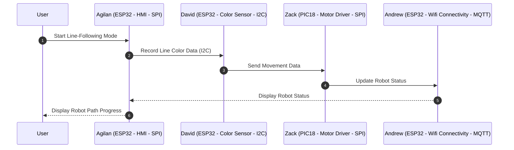
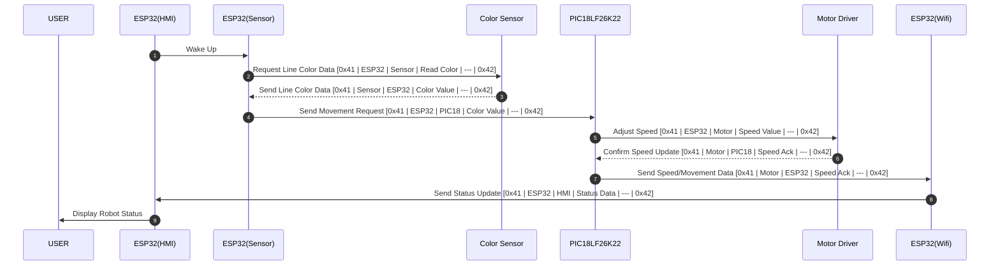

<!-- draw.io diagram -->
<div class="mxgraph" style="max-width:100%;border:1px solid transparent;" data-mxgraph="{&quot;highlight&quot;:&quot;#000000&quot;,&quot;nav&quot;:true,&quot;resize&quot;:true,&quot;dark-mode&quot;:&quot;auto&quot;,&quot;toolbar&quot;:&quot;zoom layers tags lightbox&quot;,&quot;edit&quot;:&quot;_blank&quot;,&quot;xml&quot;:&quot;&lt;mxfile host=\&quot;app.diagrams.net\&quot; agent=\&quot;Mozilla/5.0 (Windows NT 10.0; Win64; x64) AppleWebKit/537.36 (KHTML, like Gecko) Chrome/135.0.0.0 Safari/537.36\&quot; version=\&quot;26.2.15\&quot;&gt;\n  &lt;diagram name=\&quot;Page-1\&quot; id=\&quot;90a13364-a465-7bf4-72fc-28e22215d7a0\&quot;&gt;\n    &lt;mxGraphModel dx=\&quot;4979.5\&quot; dy=\&quot;1176\&quot; grid=\&quot;1\&quot; gridSize=\&quot;10\&quot; guides=\&quot;1\&quot; tooltips=\&quot;1\&quot; connect=\&quot;1\&quot; arrows=\&quot;1\&quot; fold=\&quot;1\&quot; page=\&quot;1\&quot; pageScale=\&quot;1.5\&quot; pageWidth=\&quot;1169\&quot; pageHeight=\&quot;827\&quot; background=\&quot;#ffffff\&quot; math=\&quot;0\&quot; shadow=\&quot;0\&quot;&gt;\n      &lt;root&gt;\n        &lt;mxCell id=\&quot;0\&quot; style=\&quot;;html=1;\&quot; /&gt;\n        &lt;mxCell id=\&quot;1\&quot; style=\&quot;;html=1;\&quot; parent=\&quot;0\&quot; /&gt;\n        &lt;mxCell id=\&quot;aC57QmPyYTqG6Asludqg-9\&quot; value=\&quot;\&quot; style=\&quot;rounded=0;whiteSpace=wrap;html=1;fontSize=16;fillColor=#f8cecc;strokeColor=#b85450;\&quot; parent=\&quot;1\&quot; vertex=\&quot;1\&quot;&gt;\n          &lt;mxGeometry x=\&quot;-170\&quot; y=\&quot;300\&quot; width=\&quot;600\&quot; height=\&quot;630\&quot; as=\&quot;geometry\&quot; /&gt;\n        &lt;/mxCell&gt;\n        &lt;mxCell id=\&quot;9j5Bc3N9rgv02oG_bQQu-47\&quot; value=\&quot;\&quot; style=\&quot;group;strokeWidth=1;\&quot; parent=\&quot;1\&quot; vertex=\&quot;1\&quot; connectable=\&quot;0\&quot;&gt;\n          &lt;mxGeometry x=\&quot;135\&quot; y=\&quot;513\&quot; width=\&quot;250\&quot; height=\&quot;190\&quot; as=\&quot;geometry\&quot; /&gt;\n        &lt;/mxCell&gt;\n        &lt;mxCell id=\&quot;9j5Bc3N9rgv02oG_bQQu-6\&quot; value=\&quot;&amp;lt;strong&amp;gt;&amp;lt;font style=&amp;quot;font-size: 18px;&amp;quot;&amp;gt;ESP32&amp;lt;/font&amp;gt;&amp;lt;/strong&amp;gt;\&quot; style=\&quot;rounded=0;whiteSpace=wrap;html=1;strokeWidth=2;fillColor=#E6E6E6;\&quot; parent=\&quot;9j5Bc3N9rgv02oG_bQQu-47\&quot; vertex=\&quot;1\&quot;&gt;\n          &lt;mxGeometry x=\&quot;-30\&quot; width=\&quot;280\&quot; height=\&quot;170\&quot; as=\&quot;geometry\&quot; /&gt;\n        &lt;/mxCell&gt;\n        &lt;mxCell id=\&quot;9j5Bc3N9rgv02oG_bQQu-31\&quot; value=\&quot;&amp;lt;div&amp;gt;GND&amp;lt;/div&amp;gt;\&quot; style=\&quot;rounded=0;whiteSpace=wrap;html=1;\&quot; parent=\&quot;9j5Bc3N9rgv02oG_bQQu-47\&quot; vertex=\&quot;1\&quot;&gt;\n          &lt;mxGeometry x=\&quot;170\&quot; y=\&quot;60\&quot; width=\&quot;80\&quot; height=\&quot;40\&quot; as=\&quot;geometry\&quot; /&gt;\n        &lt;/mxCell&gt;\n        &lt;mxCell id=\&quot;9j5Bc3N9rgv02oG_bQQu-36\&quot; value=\&quot;SDA (GPIO 21)\&quot; style=\&quot;rounded=0;whiteSpace=wrap;html=1;\&quot; parent=\&quot;9j5Bc3N9rgv02oG_bQQu-47\&quot; vertex=\&quot;1\&quot;&gt;\n          &lt;mxGeometry x=\&quot;-30\&quot; y=\&quot;130\&quot; width=\&quot;60\&quot; height=\&quot;40\&quot; as=\&quot;geometry\&quot; /&gt;\n        &lt;/mxCell&gt;\n        &lt;mxCell id=\&quot;9j5Bc3N9rgv02oG_bQQu-40\&quot; value=\&quot;UART TX (GPIO17)\&quot; style=\&quot;rounded=0;whiteSpace=wrap;html=1;\&quot; parent=\&quot;9j5Bc3N9rgv02oG_bQQu-47\&quot; vertex=\&quot;1\&quot;&gt;\n          &lt;mxGeometry x=\&quot;150\&quot; width=\&quot;80\&quot; height=\&quot;30\&quot; as=\&quot;geometry\&quot; /&gt;\n        &lt;/mxCell&gt;\n        &lt;mxCell id=\&quot;3I63KCLoRFE2I7JEEU8W-35\&quot; value=\&quot;UART RX (GPIO 16)\&quot; style=\&quot;rounded=0;whiteSpace=wrap;html=1;\&quot; parent=\&quot;9j5Bc3N9rgv02oG_bQQu-47\&quot; vertex=\&quot;1\&quot;&gt;\n          &lt;mxGeometry x=\&quot;-9.5\&quot; width=\&quot;80\&quot; height=\&quot;30\&quot; as=\&quot;geometry\&quot; /&gt;\n        &lt;/mxCell&gt;\n        &lt;mxCell id=\&quot;3I63KCLoRFE2I7JEEU8W-73\&quot; value=\&quot;SCL (GPIO 22)\&quot; style=\&quot;rounded=0;whiteSpace=wrap;html=1;\&quot; parent=\&quot;9j5Bc3N9rgv02oG_bQQu-47\&quot; vertex=\&quot;1\&quot;&gt;\n          &lt;mxGeometry x=\&quot;190\&quot; y=\&quot;130\&quot; width=\&quot;60\&quot; height=\&quot;40\&quot; as=\&quot;geometry\&quot; /&gt;\n        &lt;/mxCell&gt;\n        &lt;mxCell id=\&quot;3I63KCLoRFE2I7JEEU8W-21\&quot; style=\&quot;edgeStyle=orthogonalEdgeStyle;rounded=0;orthogonalLoop=1;jettySize=auto;html=1;entryX=0;entryY=0.5;entryDx=0;entryDy=0;\&quot; parent=\&quot;1\&quot; source=\&quot;J8ns3n-xOa6iXa_PQh_Z-11\&quot; target=\&quot;9j5Bc3N9rgv02oG_bQQu-29\&quot; edge=\&quot;1\&quot;&gt;\n          &lt;mxGeometry relative=\&quot;1\&quot; as=\&quot;geometry\&quot; /&gt;\n        &lt;/mxCell&gt;\n        &lt;mxCell id=\&quot;3I63KCLoRFE2I7JEEU8W-77\&quot; style=\&quot;edgeStyle=orthogonalEdgeStyle;rounded=0;orthogonalLoop=1;jettySize=auto;html=1;exitX=0;exitY=0.5;exitDx=0;exitDy=0;entryX=0.5;entryY=1;entryDx=0;entryDy=0;\&quot; parent=\&quot;1\&quot; source=\&quot;J8ns3n-xOa6iXa_PQh_Z-11\&quot; target=\&quot;3I63KCLoRFE2I7JEEU8W-62\&quot; edge=\&quot;1\&quot;&gt;\n          &lt;mxGeometry relative=\&quot;1\&quot; as=\&quot;geometry\&quot;&gt;\n            &lt;Array as=\&quot;points\&quot;&gt;\n              &lt;mxPoint x=\&quot;-160\&quot; y=\&quot;395\&quot; /&gt;\n              &lt;mxPoint x=\&quot;-160\&quot; y=\&quot;875\&quot; /&gt;\n              &lt;mxPoint x=\&quot;250\&quot; y=\&quot;875\&quot; /&gt;\n              &lt;mxPoint x=\&quot;250\&quot; y=\&quot;855\&quot; /&gt;\n            &lt;/Array&gt;\n          &lt;/mxGeometry&gt;\n        &lt;/mxCell&gt;\n        &lt;mxCell id=\&quot;J8ns3n-xOa6iXa_PQh_Z-11\&quot; value=\&quot;&amp;lt;p style=&amp;quot;line-height: 120%&amp;quot;&amp;gt;&amp;lt;span class=&amp;quot;hljs-variable&amp;quot;&amp;gt;ADP44002AUJZ&amp;lt;/span&amp;gt;&amp;lt;span class=&amp;quot;hljs-operator&amp;quot;&amp;gt;-&amp;lt;/span&amp;gt;&amp;lt;span class=&amp;quot;hljs-number&amp;quot;&amp;gt;3.3&amp;lt;/span&amp;gt;&amp;lt;span class=&amp;quot;hljs-operator&amp;quot;&amp;gt;-&amp;lt;/span&amp;gt;&amp;lt;span class=&amp;quot;hljs-variable&amp;quot;&amp;gt;R7&amp;lt;/span&amp;gt; &amp;lt;span class=&amp;quot;hljs-variable&amp;quot;&amp;gt;Switching&amp;lt;/span&amp;gt; &amp;lt;span class=&amp;quot;hljs-variable&amp;quot;&amp;gt;Regulator&amp;lt;/span&amp;gt;&amp;lt;br&amp;gt;&amp;lt;span class=&amp;quot;hljs-variable&amp;quot;&amp;gt;Steps&amp;lt;/span&amp;gt; &amp;lt;span class=&amp;quot;hljs-built_in&amp;quot;&amp;gt;Down&amp;lt;/span&amp;gt; &amp;lt;span class=&amp;quot;hljs-number&amp;quot;&amp;gt;9&amp;lt;/span&amp;gt;&amp;lt;span class=&amp;quot;hljs-variable&amp;quot;&amp;gt;V-12v&amp;lt;/span&amp;gt; &amp;lt;span class=&amp;quot;hljs-variable&amp;quot;&amp;gt;to&amp;lt;/span&amp;gt; &amp;lt;span class=&amp;quot;hljs-variable&amp;quot;&amp;gt;Stable&amp;lt;/span&amp;gt; &amp;lt;span class=&amp;quot;hljs-number&amp;quot;&amp;gt;3.3&amp;lt;/span&amp;gt;&amp;lt;span class=&amp;quot;hljs-variable&amp;quot;&amp;gt;V&amp;amp;nbsp;&amp;lt;/span&amp;gt;&amp;lt;span class=&amp;quot;hljs-number&amp;quot;&amp;gt;,500&amp;lt;/span&amp;gt;&amp;lt;span class=&amp;quot;hljs-variable&amp;quot;&amp;gt;mA&amp;lt;/span&amp;gt;&amp;lt;/p&amp;gt;\&quot; style=\&quot;rounded=0;whiteSpace=wrap;html=1;\&quot; parent=\&quot;1\&quot; vertex=\&quot;1\&quot;&gt;\n          &lt;mxGeometry x=\&quot;-130\&quot; y=\&quot;360\&quot; width=\&quot;155\&quot; height=\&quot;70\&quot; as=\&quot;geometry\&quot; /&gt;\n        &lt;/mxCell&gt;\n        &lt;mxCell id=\&quot;aC57QmPyYTqG6Asludqg-8\&quot; value=\&quot;&amp;lt;div style=&amp;quot;&amp;quot;&amp;gt;&amp;lt;b style=&amp;quot;&amp;quot;&amp;gt;&amp;lt;font style=&amp;quot;font-size: 24px;&amp;quot;&amp;gt;Sensor Block Diagram&amp;lt;/font&amp;gt;&amp;lt;/b&amp;gt;&amp;lt;/div&amp;gt;&amp;lt;div style=&amp;quot;&amp;quot;&amp;gt;&amp;lt;font size=&amp;quot;3&amp;quot;&amp;gt;David Diaz -- Team 305&amp;lt;/font&amp;gt;&amp;lt;/div&amp;gt;\&quot; style=\&quot;text;html=1;strokeColor=none;fillColor=none;align=center;verticalAlign=middle;whiteSpace=wrap;rounded=0;fontSize=16;\&quot; parent=\&quot;1\&quot; vertex=\&quot;1\&quot;&gt;\n          &lt;mxGeometry x=\&quot;-110\&quot; y=\&quot;195\&quot; width=\&quot;440\&quot; height=\&quot;60\&quot; as=\&quot;geometry\&quot; /&gt;\n        &lt;/mxCell&gt;\n        &lt;mxCell id=\&quot;3I63KCLoRFE2I7JEEU8W-37\&quot; style=\&quot;edgeStyle=orthogonalEdgeStyle;rounded=0;orthogonalLoop=1;jettySize=auto;html=1;\&quot; parent=\&quot;1\&quot; source=\&quot;9j5Bc3N9rgv02oG_bQQu-5\&quot; target=\&quot;3I63KCLoRFE2I7JEEU8W-35\&quot; edge=\&quot;1\&quot;&gt;\n          &lt;mxGeometry relative=\&quot;1\&quot; as=\&quot;geometry\&quot; /&gt;\n        &lt;/mxCell&gt;\n        &lt;mxCell id=\&quot;9j5Bc3N9rgv02oG_bQQu-5\&quot; value=\&quot;CONNECTOR IN&amp;amp;nbsp;\&quot; style=\&quot;rounded=0;whiteSpace=wrap;html=1;strokeWidth=2;fillColor=#E6E6E6;\&quot; parent=\&quot;1\&quot; vertex=\&quot;1\&quot;&gt;\n          &lt;mxGeometry x=\&quot;105\&quot; y=\&quot;300\&quot; width=\&quot;121\&quot; height=\&quot;60\&quot; as=\&quot;geometry\&quot; /&gt;\n        &lt;/mxCell&gt;\n        &lt;mxCell id=\&quot;3I63KCLoRFE2I7JEEU8W-11\&quot; value=\&quot;&amp;lt;div style=&amp;quot;&amp;quot;&amp;gt;&amp;lt;font style=&amp;quot;font-size: 9px;&amp;quot;&amp;gt;&amp;lt;span class=&amp;quot;hljs-variable&amp;quot;&amp;gt;Digital&amp;lt;/span&amp;gt; &amp;lt;span class=&amp;quot;hljs-variable&amp;quot;&amp;gt;Signal&amp;lt;/span&amp;gt; &amp;lt;span class=&amp;quot;hljs-punctuation&amp;quot;&amp;gt;(&amp;lt;/span&amp;gt;&amp;lt;span class=&amp;quot;hljs-built_in&amp;quot;&amp;gt;I&amp;lt;/span&amp;gt;²&amp;lt;span class=&amp;quot;hljs-built_in&amp;quot;&amp;gt;C&amp;lt;/span&amp;gt;&amp;lt;span class=&amp;quot;hljs-operator&amp;quot;&amp;gt;,&amp;lt;/span&amp;gt; &amp;lt;span class=&amp;quot;hljs-number&amp;quot;&amp;gt;2&amp;lt;/span&amp;gt; &amp;lt;span class=&amp;quot;hljs-variable&amp;quot;&amp;gt;Pins&amp;lt;/span&amp;gt;&amp;lt;span class=&amp;quot;hljs-operator&amp;quot;&amp;gt;:&amp;lt;/span&amp;gt; &amp;lt;span class=&amp;quot;hljs-variable&amp;quot;&amp;gt;SDA&amp;lt;/span&amp;gt;&amp;lt;span class=&amp;quot;hljs-operator&amp;quot;&amp;gt;,&amp;lt;/span&amp;gt; &amp;lt;span class=&amp;quot;hljs-variable&amp;quot;&amp;gt;SCL&amp;lt;/span&amp;gt;&amp;lt;span class=&amp;quot;hljs-punctuation&amp;quot;&amp;gt;)&amp;lt;/span&amp;gt;  &amp;lt;br&amp;gt;&amp;lt;span class=&amp;quot;hljs-variable&amp;quot;&amp;gt;Transmits&amp;lt;/span&amp;gt; &amp;lt;span class=&amp;quot;hljs-variable&amp;quot;&amp;gt;RGBW&amp;lt;/span&amp;gt; &amp;lt;span class=&amp;quot;hljs-variable&amp;quot;&amp;gt;Data&amp;lt;/span&amp;gt; &amp;lt;span class=&amp;quot;hljs-variable&amp;quot;&amp;gt;to&amp;lt;/span&amp;gt; &amp;lt;span class=&amp;quot;hljs-variable&amp;quot;&amp;gt;ESP32&amp;lt;/span&amp;gt; &amp;lt;span class=&amp;quot;hljs-variable&amp;quot;&amp;gt;for&amp;lt;/span&amp;gt; &amp;lt;span class=&amp;quot;hljs-variable&amp;quot;&amp;gt;Processing&amp;lt;/span&amp;gt;&amp;lt;/font&amp;gt;&amp;lt;/div&amp;gt;\&quot; style=\&quot;text;html=1;strokeColor=none;fillColor=none;align=center;verticalAlign=middle;whiteSpace=wrap;rounded=0;fontSize=8;rotation=0;\&quot; parent=\&quot;1\&quot; vertex=\&quot;1\&quot;&gt;\n          &lt;mxGeometry x=\&quot;160\&quot; y=\&quot;720\&quot; width=\&quot;175\&quot; height=\&quot;30\&quot; as=\&quot;geometry\&quot; /&gt;\n        &lt;/mxCell&gt;\n        &lt;mxCell id=\&quot;3I63KCLoRFE2I7JEEU8W-24\&quot; value=\&quot;\&quot; style=\&quot;edgeStyle=orthogonalEdgeStyle;rounded=0;orthogonalLoop=1;jettySize=auto;html=1;\&quot; parent=\&quot;1\&quot; source=\&quot;3I63KCLoRFE2I7JEEU8W-22\&quot; target=\&quot;3I63KCLoRFE2I7JEEU8W-23\&quot; edge=\&quot;1\&quot;&gt;\n          &lt;mxGeometry relative=\&quot;1\&quot; as=\&quot;geometry\&quot; /&gt;\n        &lt;/mxCell&gt;\n        &lt;mxCell id=\&quot;3I63KCLoRFE2I7JEEU8W-22\&quot; value=\&quot;&amp;lt;span class=&amp;quot;hljs-number&amp;quot;&amp;gt;12&amp;lt;/span&amp;gt;&amp;lt;span class=&amp;quot;hljs-variable&amp;quot;&amp;gt;V&amp;lt;/span&amp;gt; &amp;lt;span class=&amp;quot;hljs-number&amp;quot;&amp;gt;2&amp;lt;/span&amp;gt;&amp;lt;span class=&amp;quot;hljs-variable&amp;quot;&amp;gt;A&amp;lt;/span&amp;gt; &amp;lt;span class=&amp;quot;hljs-variable&amp;quot;&amp;gt;AC&amp;lt;/span&amp;gt;&amp;lt;span class=&amp;quot;hljs-operator&amp;quot;&amp;gt;-&amp;lt;/span&amp;gt;&amp;lt;span class=&amp;quot;hljs-variable&amp;quot;&amp;gt;DC&amp;lt;/span&amp;gt; &amp;lt;span class=&amp;quot;hljs-variable&amp;quot;&amp;gt;Wall&amp;lt;/span&amp;gt; &amp;lt;span class=&amp;quot;hljs-built_in&amp;quot;&amp;gt;Power&amp;lt;/span&amp;gt; &amp;lt;span class=&amp;quot;hljs-variable&amp;quot;&amp;gt;Supply&amp;lt;/span&amp;gt;  &amp;lt;br/&amp;gt;&amp;lt;span class=&amp;quot;hljs-variable&amp;quot;&amp;gt;Provides&amp;lt;/span&amp;gt; &amp;lt;span class=&amp;quot;hljs-built_in&amp;quot;&amp;gt;Power&amp;lt;/span&amp;gt; &amp;lt;span class=&amp;quot;hljs-variable&amp;quot;&amp;gt;to&amp;lt;/span&amp;gt; &amp;lt;span class=&amp;quot;hljs-variable&amp;quot;&amp;gt;Barrel&amp;lt;/span&amp;gt; &amp;lt;span class=&amp;quot;hljs-variable&amp;quot;&amp;gt;Jack&amp;lt;/span&amp;gt; &amp;lt;span class=&amp;quot;hljs-variable&amp;quot;&amp;gt;Adapter&amp;lt;/span&amp;gt;\&quot; style=\&quot;rounded=0;whiteSpace=wrap;html=1;\&quot; parent=\&quot;1\&quot; vertex=\&quot;1\&quot;&gt;\n          &lt;mxGeometry x=\&quot;-142.5\&quot; y=\&quot;930\&quot; width=\&quot;180\&quot; height=\&quot;70\&quot; as=\&quot;geometry\&quot; /&gt;\n        &lt;/mxCell&gt;\n        &lt;mxCell id=\&quot;3I63KCLoRFE2I7JEEU8W-81\&quot; style=\&quot;edgeStyle=orthogonalEdgeStyle;rounded=0;orthogonalLoop=1;jettySize=auto;html=1;entryX=0.5;entryY=1;entryDx=0;entryDy=0;\&quot; parent=\&quot;1\&quot; source=\&quot;3I63KCLoRFE2I7JEEU8W-23\&quot; target=\&quot;J8ns3n-xOa6iXa_PQh_Z-11\&quot; edge=\&quot;1\&quot;&gt;\n          &lt;mxGeometry relative=\&quot;1\&quot; as=\&quot;geometry\&quot; /&gt;\n        &lt;/mxCell&gt;\n        &lt;mxCell id=\&quot;3I63KCLoRFE2I7JEEU8W-23\&quot; value=\&quot;&amp;lt;p style=&amp;quot;line-height: 120%&amp;quot;&amp;gt;Barrel Jack Adapter  &amp;lt;br/&amp;gt;Outputs &amp;lt;span class=&amp;quot;hljs-number&amp;quot;&amp;gt;9&amp;lt;/span&amp;gt;V/&amp;lt;span class=&amp;quot;hljs-number&amp;quot;&amp;gt;12&amp;lt;/span&amp;gt;V &amp;lt;span class=&amp;quot;hljs-selector-tag&amp;quot;&amp;gt;to&amp;lt;/span&amp;gt; Voltage Regulator&amp;amp;nbsp;&amp;lt;/p&amp;gt;\&quot; style=\&quot;rounded=0;whiteSpace=wrap;html=1;\&quot; parent=\&quot;1\&quot; vertex=\&quot;1\&quot;&gt;\n          &lt;mxGeometry x=\&quot;-130\&quot; y=\&quot;520\&quot; width=\&quot;155\&quot; height=\&quot;70\&quot; as=\&quot;geometry\&quot; /&gt;\n        &lt;/mxCell&gt;\n        &lt;mxCell id=\&quot;un7PfHGXHGi1KQfJizUK-11\&quot; style=\&quot;edgeStyle=orthogonalEdgeStyle;rounded=0;orthogonalLoop=1;jettySize=auto;html=1;exitX=0.5;exitY=0;exitDx=0;exitDy=0;entryX=0.5;entryY=0;entryDx=0;entryDy=0;\&quot; parent=\&quot;1\&quot; source=\&quot;3I63KCLoRFE2I7JEEU8W-36\&quot; target=\&quot;Zyt2fzy2bafqhQG2lDP6-8\&quot; edge=\&quot;1\&quot;&gt;\n          &lt;mxGeometry relative=\&quot;1\&quot; as=\&quot;geometry\&quot; /&gt;\n        &lt;/mxCell&gt;\n        &lt;mxCell id=\&quot;3I63KCLoRFE2I7JEEU8W-36\&quot; value=\&quot;CONNECTOR OUT\&quot; style=\&quot;rounded=0;whiteSpace=wrap;html=1;strokeWidth=2;fillColor=#E6E6E6;\&quot; parent=\&quot;1\&quot; vertex=\&quot;1\&quot;&gt;\n          &lt;mxGeometry x=\&quot;264\&quot; y=\&quot;300\&quot; width=\&quot;121\&quot; height=\&quot;60\&quot; as=\&quot;geometry\&quot; /&gt;\n        &lt;/mxCell&gt;\n        &lt;mxCell id=\&quot;3I63KCLoRFE2I7JEEU8W-38\&quot; style=\&quot;edgeStyle=orthogonalEdgeStyle;rounded=0;orthogonalLoop=1;jettySize=auto;html=1;entryX=0.5;entryY=1;entryDx=0;entryDy=0;\&quot; parent=\&quot;1\&quot; source=\&quot;9j5Bc3N9rgv02oG_bQQu-40\&quot; target=\&quot;3I63KCLoRFE2I7JEEU8W-36\&quot; edge=\&quot;1\&quot;&gt;\n          &lt;mxGeometry relative=\&quot;1\&quot; as=\&quot;geometry\&quot; /&gt;\n        &lt;/mxCell&gt;\n        &lt;mxCell id=\&quot;3I63KCLoRFE2I7JEEU8W-72\&quot; style=\&quot;edgeStyle=orthogonalEdgeStyle;rounded=0;orthogonalLoop=1;jettySize=auto;html=1;exitX=0;exitY=0.5;exitDx=0;exitDy=0;entryX=0.25;entryY=1;entryDx=0;entryDy=0;\&quot; parent=\&quot;1\&quot; edge=\&quot;1\&quot;&gt;\n          &lt;mxGeometry relative=\&quot;1\&quot; as=\&quot;geometry\&quot;&gt;\n            &lt;mxPoint x=\&quot;167.5\&quot; y=\&quot;807.5\&quot; as=\&quot;sourcePoint\&quot; /&gt;\n            &lt;mxPoint x=\&quot;135\&quot; y=\&quot;683\&quot; as=\&quot;targetPoint\&quot; /&gt;\n          &lt;/mxGeometry&gt;\n        &lt;/mxCell&gt;\n        &lt;mxCell id=\&quot;3I63KCLoRFE2I7JEEU8W-75\&quot; style=\&quot;edgeStyle=orthogonalEdgeStyle;rounded=0;orthogonalLoop=1;jettySize=auto;html=1;exitX=1;exitY=0.5;exitDx=0;exitDy=0;\&quot; parent=\&quot;1\&quot; source=\&quot;3I63KCLoRFE2I7JEEU8W-62\&quot; target=\&quot;3I63KCLoRFE2I7JEEU8W-73\&quot; edge=\&quot;1\&quot;&gt;\n          &lt;mxGeometry relative=\&quot;1\&quot; as=\&quot;geometry\&quot;&gt;\n            &lt;Array as=\&quot;points\&quot;&gt;\n              &lt;mxPoint x=\&quot;355\&quot; y=\&quot;808\&quot; /&gt;\n            &lt;/Array&gt;\n          &lt;/mxGeometry&gt;\n        &lt;/mxCell&gt;\n        &lt;mxCell id=\&quot;3I63KCLoRFE2I7JEEU8W-62\&quot; value=\&quot;&amp;lt;span class=&amp;quot;hljs-variable&amp;quot;&amp;gt;OPT4060&amp;lt;/span&amp;gt; &amp;lt;span class=&amp;quot;hljs-variable&amp;quot;&amp;gt;RGBW&amp;lt;/span&amp;gt; &amp;lt;span class=&amp;quot;hljs-variable&amp;quot;&amp;gt;Color&amp;lt;/span&amp;gt; &amp;lt;span class=&amp;quot;hljs-variable&amp;quot;&amp;gt;Sensor&amp;lt;/span&amp;gt;  &amp;lt;br/&amp;gt;&amp;lt;span class=&amp;quot;hljs-variable&amp;quot;&amp;gt;Detects&amp;lt;/span&amp;gt; &amp;lt;span class=&amp;quot;hljs-built_in&amp;quot;&amp;gt;Line&amp;lt;/span&amp;gt; &amp;lt;span class=&amp;quot;hljs-variable&amp;quot;&amp;gt;Color&amp;lt;/span&amp;gt; &amp;lt;span class=&amp;quot;hljs-variable&amp;quot;&amp;gt;Contrast&amp;lt;/span&amp;gt;&amp;amp;nbsp;&amp;lt;span class=&amp;quot;hljs-built_in&amp;quot;&amp;gt;I&amp;lt;/span&amp;gt;²&amp;lt;span class=&amp;quot;hljs-built_in&amp;quot;&amp;gt;C&amp;lt;/span&amp;gt; &amp;lt;span class=&amp;quot;hljs-variable&amp;quot;&amp;gt;Serial&amp;lt;/span&amp;gt; &amp;lt;span class=&amp;quot;hljs-variable&amp;quot;&amp;gt;Output&amp;lt;/span&amp;gt; &amp;lt;span class=&amp;quot;hljs-punctuation&amp;quot;&amp;gt;(&amp;lt;/span&amp;gt;&amp;lt;span class=&amp;quot;hljs-variable&amp;quot;&amp;gt;SDA&amp;lt;/span&amp;gt;&amp;lt;span class=&amp;quot;hljs-operator&amp;quot;&amp;gt;,&amp;lt;/span&amp;gt; &amp;lt;span class=&amp;quot;hljs-variable&amp;quot;&amp;gt;SCL&amp;lt;/span&amp;gt;&amp;lt;span class=&amp;quot;hljs-punctuation&amp;quot;&amp;gt;)&amp;lt;/span&amp;gt;\&quot; style=\&quot;rounded=0;whiteSpace=wrap;html=1;\&quot; parent=\&quot;1\&quot; vertex=\&quot;1\&quot;&gt;\n          &lt;mxGeometry x=\&quot;152.5\&quot; y=\&quot;760\&quot; width=\&quot;185\&quot; height=\&quot;95\&quot; as=\&quot;geometry\&quot; /&gt;\n        &lt;/mxCell&gt;\n        &lt;mxCell id=\&quot;9j5Bc3N9rgv02oG_bQQu-29\&quot; value=\&quot;&amp;lt;div&amp;gt;3.3V VCC&amp;lt;/div&amp;gt;\&quot; style=\&quot;rounded=0;whiteSpace=wrap;html=1;\&quot; parent=\&quot;1\&quot; vertex=\&quot;1\&quot;&gt;\n          &lt;mxGeometry x=\&quot;105\&quot; y=\&quot;570\&quot; width=\&quot;80\&quot; height=\&quot;40\&quot; as=\&quot;geometry\&quot; /&gt;\n        &lt;/mxCell&gt;\n        &lt;mxCell id=\&quot;S8yp5X4-lJhxRksTFqpk-8\&quot; value=\&quot;\&quot; style=\&quot;rounded=1;whiteSpace=wrap;html=1;fillColor=none;dashed=1;\&quot; parent=\&quot;1\&quot; vertex=\&quot;1\&quot;&gt;\n          &lt;mxGeometry x=\&quot;-147.5\&quot; y=\&quot;350\&quot; width=\&quot;190\&quot; height=\&quot;250\&quot; as=\&quot;geometry\&quot; /&gt;\n        &lt;/mxCell&gt;\n        &lt;mxCell id=\&quot;cNyn5FgZRci5ZLgEMvEf-2\&quot; value=\&quot;\&quot; style=\&quot;rounded=0;whiteSpace=wrap;html=1;fillColor=none;dashed=1;strokeWidth=2;\&quot; parent=\&quot;1\&quot; vertex=\&quot;1\&quot;&gt;\n          &lt;mxGeometry x=\&quot;60\&quot; y=\&quot;490\&quot; width=\&quot;335\&quot; height=\&quot;410\&quot; as=\&quot;geometry\&quot; /&gt;\n        &lt;/mxCell&gt;\n        &lt;mxCell id=\&quot;Zyt2fzy2bafqhQG2lDP6-1\&quot; value=\&quot;\&quot; style=\&quot;rounded=0;whiteSpace=wrap;html=1;fillColor=#d5e8d4;strokeColor=#82b366;\&quot; parent=\&quot;1\&quot; vertex=\&quot;1\&quot;&gt;\n          &lt;mxGeometry x=\&quot;450\&quot; y=\&quot;300\&quot; width=\&quot;540\&quot; height=\&quot;630\&quot; as=\&quot;geometry\&quot; /&gt;\n        &lt;/mxCell&gt;\n        &lt;mxCell id=\&quot;Zyt2fzy2bafqhQG2lDP6-2\&quot; value=\&quot;\&quot; style=\&quot;rounded=0;html=1;dashed=1;dashPattern=12 12;whiteSpace=wrap;fillColor=#d5e8d4;strokeColor=#82b366;\&quot; parent=\&quot;1\&quot; vertex=\&quot;1\&quot;&gt;\n          &lt;mxGeometry x=\&quot;460\&quot; y=\&quot;457\&quot; width=\&quot;510\&quot; height=\&quot;413\&quot; as=\&quot;geometry\&quot; /&gt;\n        &lt;/mxCell&gt;\n        &lt;mxCell id=\&quot;Zyt2fzy2bafqhQG2lDP6-3\&quot; value=\&quot;Microchip&amp;amp;nbsp;&amp;lt;div&amp;gt;PIC18LF26K22&amp;lt;br&amp;gt;&amp;lt;/div&amp;gt;\&quot; style=\&quot;rounded=0;whiteSpace=wrap;html=1;fillColor=light-dark(#E6E6E6,#3E3E3E);strokeColor=#23445d;strokeWidth=2;\&quot; parent=\&quot;1\&quot; vertex=\&quot;1\&quot;&gt;\n          &lt;mxGeometry x=\&quot;560\&quot; y=\&quot;487\&quot; width=\&quot;260\&quot; height=\&quot;233\&quot; as=\&quot;geometry\&quot; /&gt;\n        &lt;/mxCell&gt;\n        &lt;mxCell id=\&quot;Zyt2fzy2bafqhQG2lDP6-4\&quot; value=\&quot;UART RX1\&quot; style=\&quot;rounded=0;whiteSpace=wrap;html=1;\&quot; parent=\&quot;1\&quot; vertex=\&quot;1\&quot;&gt;\n          &lt;mxGeometry x=\&quot;560\&quot; y=\&quot;487\&quot; width=\&quot;60\&quot; height=\&quot;30\&quot; as=\&quot;geometry\&quot; /&gt;\n        &lt;/mxCell&gt;\n        &lt;mxCell id=\&quot;Zyt2fzy2bafqhQG2lDP6-5\&quot; style=\&quot;edgeStyle=orthogonalEdgeStyle;rounded=0;orthogonalLoop=1;jettySize=auto;html=1;exitX=0.5;exitY=0;exitDx=0;exitDy=0;entryX=0.5;entryY=1;entryDx=0;entryDy=0;\&quot; parent=\&quot;1\&quot; source=\&quot;Zyt2fzy2bafqhQG2lDP6-6\&quot; target=\&quot;Zyt2fzy2bafqhQG2lDP6-9\&quot; edge=\&quot;1\&quot;&gt;\n          &lt;mxGeometry relative=\&quot;1\&quot; as=\&quot;geometry\&quot; /&gt;\n        &lt;/mxCell&gt;\n        &lt;mxCell id=\&quot;Zyt2fzy2bafqhQG2lDP6-6\&quot; value=\&quot;UART&amp;amp;nbsp; TX1\&quot; style=\&quot;rounded=0;whiteSpace=wrap;html=1;\&quot; parent=\&quot;1\&quot; vertex=\&quot;1\&quot;&gt;\n          &lt;mxGeometry x=\&quot;760\&quot; y=\&quot;487\&quot; width=\&quot;60\&quot; height=\&quot;30\&quot; as=\&quot;geometry\&quot; /&gt;\n        &lt;/mxCell&gt;\n        &lt;mxCell id=\&quot;Zyt2fzy2bafqhQG2lDP6-7\&quot; style=\&quot;edgeStyle=orthogonalEdgeStyle;rounded=0;orthogonalLoop=1;jettySize=auto;html=1;exitX=0.5;exitY=1;exitDx=0;exitDy=0;entryX=0.5;entryY=0;entryDx=0;entryDy=0;\&quot; parent=\&quot;1\&quot; source=\&quot;Zyt2fzy2bafqhQG2lDP6-8\&quot; target=\&quot;Zyt2fzy2bafqhQG2lDP6-4\&quot; edge=\&quot;1\&quot;&gt;\n          &lt;mxGeometry relative=\&quot;1\&quot; as=\&quot;geometry\&quot; /&gt;\n        &lt;/mxCell&gt;\n        &lt;mxCell id=\&quot;Zyt2fzy2bafqhQG2lDP6-8\&quot; value=\&quot;CONNECTOR IN\&quot; style=\&quot;rounded=0;whiteSpace=wrap;html=1;fillColor=light-dark(#e6e6e6, #3e3e3e);\&quot; parent=\&quot;1\&quot; vertex=\&quot;1\&quot;&gt;\n          &lt;mxGeometry x=\&quot;530\&quot; y=\&quot;300\&quot; width=\&quot;120\&quot; height=\&quot;60\&quot; as=\&quot;geometry\&quot; /&gt;\n        &lt;/mxCell&gt;\n        &lt;mxCell id=\&quot;un7PfHGXHGi1KQfJizUK-15\&quot; style=\&quot;edgeStyle=orthogonalEdgeStyle;rounded=0;orthogonalLoop=1;jettySize=auto;html=1;exitX=0.5;exitY=0;exitDx=0;exitDy=0;entryX=0.5;entryY=0;entryDx=0;entryDy=0;\&quot; parent=\&quot;1\&quot; source=\&quot;Zyt2fzy2bafqhQG2lDP6-9\&quot; target=\&quot;aVXlbrfe1HY1APvneNgD-26\&quot; edge=\&quot;1\&quot;&gt;\n          &lt;mxGeometry relative=\&quot;1\&quot; as=\&quot;geometry\&quot; /&gt;\n        &lt;/mxCell&gt;\n        &lt;mxCell id=\&quot;Zyt2fzy2bafqhQG2lDP6-9\&quot; value=\&quot;CONNECTOR OUT\&quot; style=\&quot;rounded=0;whiteSpace=wrap;html=1;fillColor=light-dark(#e6e6e6, #3e3e3e);\&quot; parent=\&quot;1\&quot; vertex=\&quot;1\&quot;&gt;\n          &lt;mxGeometry x=\&quot;730\&quot; y=\&quot;300\&quot; width=\&quot;120\&quot; height=\&quot;60\&quot; as=\&quot;geometry\&quot; /&gt;\n        &lt;/mxCell&gt;\n        &lt;mxCell id=\&quot;Zyt2fzy2bafqhQG2lDP6-10\&quot; value=\&quot;3.3V 1.5A Switching Voltage Regulator\&quot; style=\&quot;rounded=0;whiteSpace=wrap;html=1;\&quot; parent=\&quot;1\&quot; vertex=\&quot;1\&quot;&gt;\n          &lt;mxGeometry x=\&quot;460\&quot; y=\&quot;820\&quot; width=\&quot;120\&quot; height=\&quot;50\&quot; as=\&quot;geometry\&quot; /&gt;\n        &lt;/mxCell&gt;\n        &lt;mxCell id=\&quot;Zyt2fzy2bafqhQG2lDP6-11\&quot; style=\&quot;edgeStyle=orthogonalEdgeStyle;rounded=0;orthogonalLoop=1;jettySize=auto;html=1;exitX=0.5;exitY=0;exitDx=0;exitDy=0;entryX=0.5;entryY=1;entryDx=0;entryDy=0;\&quot; parent=\&quot;1\&quot; source=\&quot;Zyt2fzy2bafqhQG2lDP6-23\&quot; target=\&quot;Zyt2fzy2bafqhQG2lDP6-10\&quot; edge=\&quot;1\&quot;&gt;\n          &lt;mxGeometry relative=\&quot;1\&quot; as=\&quot;geometry\&quot;&gt;\n            &lt;mxPoint x=\&quot;530\&quot; y=\&quot;840\&quot; as=\&quot;sourcePoint\&quot; /&gt;\n          &lt;/mxGeometry&gt;\n        &lt;/mxCell&gt;\n        &lt;mxCell id=\&quot;Zyt2fzy2bafqhQG2lDP6-12\&quot; value=\&quot;Power\&quot; style=\&quot;edgeLabel;html=1;align=center;verticalAlign=middle;resizable=0;points=[];\&quot; parent=\&quot;Zyt2fzy2bafqhQG2lDP6-11\&quot; connectable=\&quot;0\&quot; vertex=\&quot;1\&quot;&gt;\n          &lt;mxGeometry x=\&quot;0.0245\&quot; relative=\&quot;1\&quot; as=\&quot;geometry\&quot;&gt;\n            &lt;mxPoint as=\&quot;offset\&quot; /&gt;\n          &lt;/mxGeometry&gt;\n        &lt;/mxCell&gt;\n        &lt;mxCell id=\&quot;Zyt2fzy2bafqhQG2lDP6-14\&quot; value=\&quot;&amp;lt;font style=&amp;quot;font-size: 24px;&amp;quot;&amp;gt;&amp;lt;b style=&amp;quot;&amp;quot;&amp;gt;MQTT Wifi Server Block Diagram&amp;lt;/b&amp;gt;&amp;lt;/font&amp;gt;&amp;lt;div&amp;gt;&amp;lt;font style=&amp;quot;font-size: 16px;&amp;quot;&amp;gt;Andrew Rushton -- Team 305&amp;lt;/font&amp;gt;&amp;lt;/div&amp;gt;\&quot; style=\&quot;text;html=1;align=center;verticalAlign=middle;whiteSpace=wrap;rounded=0;\&quot; parent=\&quot;1\&quot; vertex=\&quot;1\&quot;&gt;\n          &lt;mxGeometry x=\&quot;1027.5\&quot; y=\&quot;180\&quot; width=\&quot;473.5\&quot; height=\&quot;90\&quot; as=\&quot;geometry\&quot; /&gt;\n        &lt;/mxCell&gt;\n        &lt;mxCell id=\&quot;un7PfHGXHGi1KQfJizUK-20\&quot; style=\&quot;edgeStyle=orthogonalEdgeStyle;rounded=0;orthogonalLoop=1;jettySize=auto;html=1;exitX=0.5;exitY=1;exitDx=0;exitDy=0;entryX=1;entryY=0.5;entryDx=0;entryDy=0;\&quot; parent=\&quot;1\&quot; source=\&quot;Zyt2fzy2bafqhQG2lDP6-16\&quot; target=\&quot;Zyt2fzy2bafqhQG2lDP6-18\&quot; edge=\&quot;1\&quot;&gt;\n          &lt;mxGeometry relative=\&quot;1\&quot; as=\&quot;geometry\&quot; /&gt;\n        &lt;/mxCell&gt;\n        &lt;mxCell id=\&quot;Zyt2fzy2bafqhQG2lDP6-16\&quot; value=\&quot;Microchip Snap Programmer\&quot; style=\&quot;rounded=0;whiteSpace=wrap;html=1;\&quot; parent=\&quot;1\&quot; vertex=\&quot;1\&quot;&gt;\n          &lt;mxGeometry x=\&quot;830\&quot; y=\&quot;380\&quot; width=\&quot;120\&quot; height=\&quot;60\&quot; as=\&quot;geometry\&quot; /&gt;\n        &lt;/mxCell&gt;\n        &lt;mxCell id=\&quot;Zyt2fzy2bafqhQG2lDP6-18\&quot; value=\&quot;ICSP\&quot; style=\&quot;rounded=0;whiteSpace=wrap;html=1;\&quot; parent=\&quot;1\&quot; vertex=\&quot;1\&quot;&gt;\n          &lt;mxGeometry x=\&quot;770\&quot; y=\&quot;537\&quot; width=\&quot;50\&quot; height=\&quot;30\&quot; as=\&quot;geometry\&quot; /&gt;\n        &lt;/mxCell&gt;\n        &lt;mxCell id=\&quot;Zyt2fzy2bafqhQG2lDP6-19\&quot; style=\&quot;edgeStyle=orthogonalEdgeStyle;rounded=0;orthogonalLoop=1;jettySize=auto;html=1;exitX=1;exitY=0.5;exitDx=0;exitDy=0;\&quot; parent=\&quot;1\&quot; source=\&quot;Zyt2fzy2bafqhQG2lDP6-20\&quot; target=\&quot;Zyt2fzy2bafqhQG2lDP6-35\&quot; edge=\&quot;1\&quot;&gt;\n          &lt;mxGeometry relative=\&quot;1\&quot; as=\&quot;geometry\&quot; /&gt;\n        &lt;/mxCell&gt;\n        &lt;mxCell id=\&quot;Zyt2fzy2bafqhQG2lDP6-20\&quot; value=\&quot;SPI\&quot; style=\&quot;rounded=0;whiteSpace=wrap;html=1;\&quot; parent=\&quot;1\&quot; vertex=\&quot;1\&quot;&gt;\n          &lt;mxGeometry x=\&quot;770\&quot; y=\&quot;575\&quot; width=\&quot;50\&quot; height=\&quot;50\&quot; as=\&quot;geometry\&quot; /&gt;\n        &lt;/mxCell&gt;\n        &lt;mxCell id=\&quot;Zyt2fzy2bafqhQG2lDP6-21\&quot; value=\&quot;2x SE15K1BTYJ&amp;lt;br&amp;gt;&amp;lt;div&amp;gt;12V DC Motors&amp;lt;/div&amp;gt;\&quot; style=\&quot;rounded=0;whiteSpace=wrap;html=1;\&quot; parent=\&quot;1\&quot; vertex=\&quot;1\&quot;&gt;\n          &lt;mxGeometry x=\&quot;830\&quot; y=\&quot;810\&quot; width=\&quot;120\&quot; height=\&quot;60\&quot; as=\&quot;geometry\&quot; /&gt;\n        &lt;/mxCell&gt;\n        &lt;mxCell id=\&quot;Zyt2fzy2bafqhQG2lDP6-23\&quot; value=\&quot;&amp;lt;div&amp;gt;9V Battery or 9V 3A AC-DC Power Supply&amp;lt;/div&amp;gt;\&quot; style=\&quot;rounded=0;whiteSpace=wrap;html=1;\&quot; parent=\&quot;1\&quot; vertex=\&quot;1\&quot;&gt;\n          &lt;mxGeometry x=\&quot;460\&quot; y=\&quot;930\&quot; width=\&quot;120\&quot; height=\&quot;50\&quot; as=\&quot;geometry\&quot; /&gt;\n        &lt;/mxCell&gt;\n        &lt;mxCell id=\&quot;hVMliXPcuLUprzn8B3sD-21\&quot; style=\&quot;edgeStyle=orthogonalEdgeStyle;rounded=0;orthogonalLoop=1;jettySize=auto;html=1;\&quot; edge=\&quot;1\&quot; parent=\&quot;1\&quot; source=\&quot;Zyt2fzy2bafqhQG2lDP6-25\&quot; target=\&quot;hVMliXPcuLUprzn8B3sD-17\&quot;&gt;\n          &lt;mxGeometry relative=\&quot;1\&quot; as=\&quot;geometry\&quot; /&gt;\n        &lt;/mxCell&gt;\n        &lt;mxCell id=\&quot;Zyt2fzy2bafqhQG2lDP6-25\&quot; value=\&quot;&amp;lt;div&amp;gt;DO&amp;lt;/div&amp;gt;RA1\&quot; style=\&quot;rounded=0;whiteSpace=wrap;html=1;\&quot; parent=\&quot;1\&quot; vertex=\&quot;1\&quot;&gt;\n          &lt;mxGeometry x=\&quot;560\&quot; y=\&quot;604.5\&quot; width=\&quot;50\&quot; height=\&quot;30\&quot; as=\&quot;geometry\&quot; /&gt;\n        &lt;/mxCell&gt;\n        &lt;mxCell id=\&quot;hVMliXPcuLUprzn8B3sD-22\&quot; style=\&quot;edgeStyle=orthogonalEdgeStyle;rounded=0;orthogonalLoop=1;jettySize=auto;html=1;\&quot; edge=\&quot;1\&quot; parent=\&quot;1\&quot; source=\&quot;Zyt2fzy2bafqhQG2lDP6-27\&quot; target=\&quot;hVMliXPcuLUprzn8B3sD-18\&quot;&gt;\n          &lt;mxGeometry relative=\&quot;1\&quot; as=\&quot;geometry\&quot;&gt;\n            &lt;mxPoint x=\&quot;540\&quot; y=\&quot;664\&quot; as=\&quot;targetPoint\&quot; /&gt;\n          &lt;/mxGeometry&gt;\n        &lt;/mxCell&gt;\n        &lt;mxCell id=\&quot;Zyt2fzy2bafqhQG2lDP6-27\&quot; value=\&quot;&amp;lt;div&amp;gt;DO&amp;lt;/div&amp;gt;RA0\&quot; style=\&quot;rounded=0;whiteSpace=wrap;html=1;\&quot; parent=\&quot;1\&quot; vertex=\&quot;1\&quot;&gt;\n          &lt;mxGeometry x=\&quot;560\&quot; y=\&quot;648.5\&quot; width=\&quot;50\&quot; height=\&quot;30\&quot; as=\&quot;geometry\&quot; /&gt;\n        &lt;/mxCell&gt;\n        &lt;mxCell id=\&quot;hVMliXPcuLUprzn8B3sD-1\&quot; style=\&quot;edgeStyle=orthogonalEdgeStyle;rounded=0;orthogonalLoop=1;jettySize=auto;html=1;entryX=1;entryY=0.5;entryDx=0;entryDy=0;\&quot; edge=\&quot;1\&quot; parent=\&quot;1\&quot; source=\&quot;Zyt2fzy2bafqhQG2lDP6-29\&quot; target=\&quot;Zyt2fzy2bafqhQG2lDP6-38\&quot;&gt;\n          &lt;mxGeometry relative=\&quot;1\&quot; as=\&quot;geometry\&quot; /&gt;\n        &lt;/mxCell&gt;\n        &lt;mxCell id=\&quot;Zyt2fzy2bafqhQG2lDP6-29\&quot; value=\&quot;&amp;lt;div&amp;gt;DO&amp;lt;/div&amp;gt;RA3\&quot; style=\&quot;rounded=0;whiteSpace=wrap;html=1;\&quot; parent=\&quot;1\&quot; vertex=\&quot;1\&quot;&gt;\n          &lt;mxGeometry x=\&quot;560\&quot; y=\&quot;520.5\&quot; width=\&quot;50\&quot; height=\&quot;30\&quot; as=\&quot;geometry\&quot; /&gt;\n        &lt;/mxCell&gt;\n        &lt;mxCell id=\&quot;hVMliXPcuLUprzn8B3sD-20\&quot; style=\&quot;edgeStyle=orthogonalEdgeStyle;rounded=0;orthogonalLoop=1;jettySize=auto;html=1;entryX=1;entryY=0.5;entryDx=0;entryDy=0;\&quot; edge=\&quot;1\&quot; parent=\&quot;1\&quot; source=\&quot;Zyt2fzy2bafqhQG2lDP6-31\&quot; target=\&quot;hVMliXPcuLUprzn8B3sD-16\&quot;&gt;\n          &lt;mxGeometry relative=\&quot;1\&quot; as=\&quot;geometry\&quot; /&gt;\n        &lt;/mxCell&gt;\n        &lt;mxCell id=\&quot;Zyt2fzy2bafqhQG2lDP6-31\&quot; value=\&quot;&amp;lt;div&amp;gt;DO&amp;lt;/div&amp;gt;RA2\&quot; style=\&quot;rounded=0;whiteSpace=wrap;html=1;\&quot; parent=\&quot;1\&quot; vertex=\&quot;1\&quot;&gt;\n          &lt;mxGeometry x=\&quot;560\&quot; y=\&quot;563.5\&quot; width=\&quot;50\&quot; height=\&quot;30\&quot; as=\&quot;geometry\&quot; /&gt;\n        &lt;/mxCell&gt;\n        &lt;mxCell id=\&quot;Zyt2fzy2bafqhQG2lDP6-35\&quot; value=\&quot;2x&amp;amp;nbsp;&amp;lt;div&amp;gt;BTM9011EPXUMA1&amp;lt;/div&amp;gt;&amp;lt;div&amp;gt;Motor Drivers&amp;lt;/div&amp;gt;\&quot; style=\&quot;rounded=0;whiteSpace=wrap;html=1;\&quot; parent=\&quot;1\&quot; vertex=\&quot;1\&quot;&gt;\n          &lt;mxGeometry x=\&quot;830\&quot; y=\&quot;662\&quot; width=\&quot;120\&quot; height=\&quot;60\&quot; as=\&quot;geometry\&quot; /&gt;\n        &lt;/mxCell&gt;\n        &lt;mxCell id=\&quot;Zyt2fzy2bafqhQG2lDP6-36\&quot; style=\&quot;edgeStyle=orthogonalEdgeStyle;rounded=0;orthogonalLoop=1;jettySize=auto;html=1;exitX=0.5;exitY=1;exitDx=0;exitDy=0;\&quot; parent=\&quot;1\&quot; source=\&quot;Zyt2fzy2bafqhQG2lDP6-2\&quot; target=\&quot;Zyt2fzy2bafqhQG2lDP6-2\&quot; edge=\&quot;1\&quot;&gt;\n          &lt;mxGeometry relative=\&quot;1\&quot; as=\&quot;geometry\&quot; /&gt;\n        &lt;/mxCell&gt;\n        &lt;mxCell id=\&quot;Zyt2fzy2bafqhQG2lDP6-37\&quot; style=\&quot;edgeStyle=orthogonalEdgeStyle;rounded=0;orthogonalLoop=1;jettySize=auto;html=1;exitX=0.5;exitY=1;exitDx=0;exitDy=0;\&quot; parent=\&quot;1\&quot; edge=\&quot;1\&quot;&gt;\n          &lt;mxGeometry relative=\&quot;1\&quot; as=\&quot;geometry\&quot;&gt;\n            &lt;mxPoint x=\&quot;840\&quot; y=\&quot;927.0000000000002\&quot; as=\&quot;sourcePoint\&quot; /&gt;\n            &lt;mxPoint x=\&quot;840\&quot; y=\&quot;927.0000000000002\&quot; as=\&quot;targetPoint\&quot; /&gt;\n          &lt;/mxGeometry&gt;\n        &lt;/mxCell&gt;\n        &lt;mxCell id=\&quot;Zyt2fzy2bafqhQG2lDP6-38\&quot; value=\&quot;White LED\&quot; style=\&quot;rounded=0;whiteSpace=wrap;html=1;\&quot; parent=\&quot;1\&quot; vertex=\&quot;1\&quot;&gt;\n          &lt;mxGeometry x=\&quot;467.5\&quot; y=\&quot;521.5\&quot; width=\&quot;70\&quot; height=\&quot;28\&quot; as=\&quot;geometry\&quot; /&gt;\n        &lt;/mxCell&gt;\n        &lt;mxCell id=\&quot;aVXlbrfe1HY1APvneNgD-1\&quot; value=\&quot;\&quot; style=\&quot;rounded=0;whiteSpace=wrap;html=1;fillColor=#e1d5e7;strokeColor=#9673a6;\&quot; parent=\&quot;1\&quot; vertex=\&quot;1\&quot;&gt;\n          &lt;mxGeometry x=\&quot;1010\&quot; y=\&quot;300\&quot; width=\&quot;520\&quot; height=\&quot;630\&quot; as=\&quot;geometry\&quot; /&gt;\n        &lt;/mxCell&gt;\n        &lt;mxCell id=\&quot;aVXlbrfe1HY1APvneNgD-2\&quot; value=\&quot;\&quot; style=\&quot;rounded=0;whiteSpace=wrap;html=1;dashed=1;dashPattern=8 8;fillColor=#e1d5e7;strokeColor=#9673a6;\&quot; parent=\&quot;1\&quot; vertex=\&quot;1\&quot;&gt;\n          &lt;mxGeometry x=\&quot;1020\&quot; y=\&quot;450\&quot; width=\&quot;500\&quot; height=\&quot;320\&quot; as=\&quot;geometry\&quot; /&gt;\n        &lt;/mxCell&gt;\n        &lt;mxCell id=\&quot;aVXlbrfe1HY1APvneNgD-3\&quot; value=\&quot;&amp;lt;div style=&amp;quot;color: rgb(0, 0, 0);&amp;quot;&amp;gt;Espressif Systems&amp;lt;/div&amp;gt;&amp;lt;div style=&amp;quot;color: rgb(0, 0, 0);&amp;quot;&amp;gt;ESP32&amp;lt;/div&amp;gt;\&quot; style=\&quot;rounded=0;whiteSpace=wrap;html=1;fillColor=#E6E6E6;strokeColor=#666666;fontColor=#333333;\&quot; parent=\&quot;1\&quot; vertex=\&quot;1\&quot;&gt;\n          &lt;mxGeometry x=\&quot;1129.25\&quot; y=\&quot;470\&quot; width=\&quot;284\&quot; height=\&quot;170\&quot; as=\&quot;geometry\&quot; /&gt;\n        &lt;/mxCell&gt;\n        &lt;mxCell id=\&quot;aVXlbrfe1HY1APvneNgD-6\&quot; value=\&quot;MQTT Server\&quot; style=\&quot;ellipse;shape=cloud;whiteSpace=wrap;html=1;\&quot; parent=\&quot;1\&quot; vertex=\&quot;1\&quot;&gt;\n          &lt;mxGeometry x=\&quot;1129.25\&quot; y=\&quot;760\&quot; width=\&quot;325\&quot; height=\&quot;140\&quot; as=\&quot;geometry\&quot; /&gt;\n        &lt;/mxCell&gt;\n        &lt;mxCell id=\&quot;aVXlbrfe1HY1APvneNgD-7\&quot; value=\&quot;Publish\&quot; style=\&quot;rounded=0;whiteSpace=wrap;html=1;\&quot; parent=\&quot;1\&quot; vertex=\&quot;1\&quot;&gt;\n          &lt;mxGeometry x=\&quot;1178.75\&quot; y=\&quot;610\&quot; width=\&quot;115\&quot; height=\&quot;30\&quot; as=\&quot;geometry\&quot; /&gt;\n        &lt;/mxCell&gt;\n        &lt;mxCell id=\&quot;aVXlbrfe1HY1APvneNgD-8\&quot; value=\&quot;Subscribe\&quot; style=\&quot;rounded=0;whiteSpace=wrap;html=1;\&quot; parent=\&quot;1\&quot; vertex=\&quot;1\&quot;&gt;\n          &lt;mxGeometry x=\&quot;1293.75\&quot; y=\&quot;610\&quot; width=\&quot;115\&quot; height=\&quot;30\&quot; as=\&quot;geometry\&quot; /&gt;\n        &lt;/mxCell&gt;\n        &lt;mxCell id=\&quot;aVXlbrfe1HY1APvneNgD-15\&quot; value=\&quot;UART RX0\&quot; style=\&quot;rounded=0;whiteSpace=wrap;html=1;\&quot; parent=\&quot;1\&quot; vertex=\&quot;1\&quot;&gt;\n          &lt;mxGeometry x=\&quot;1129.25\&quot; y=\&quot;470\&quot; width=\&quot;71\&quot; height=\&quot;40\&quot; as=\&quot;geometry\&quot; /&gt;\n        &lt;/mxCell&gt;\n        &lt;mxCell id=\&quot;aVXlbrfe1HY1APvneNgD-16\&quot; value=\&quot;UART RX1\&quot; style=\&quot;rounded=0;whiteSpace=wrap;html=1;\&quot; parent=\&quot;1\&quot; vertex=\&quot;1\&quot;&gt;\n          &lt;mxGeometry x=\&quot;1200.25\&quot; y=\&quot;470\&quot; width=\&quot;71\&quot; height=\&quot;40\&quot; as=\&quot;geometry\&quot; /&gt;\n        &lt;/mxCell&gt;\n        &lt;mxCell id=\&quot;aVXlbrfe1HY1APvneNgD-25\&quot; value=\&quot;&amp;lt;font style=&amp;quot;font-size: 24px;&amp;quot;&amp;gt;&amp;lt;b style=&amp;quot;&amp;quot;&amp;gt;Motor Drive Block Diagram&amp;lt;/b&amp;gt;&amp;lt;/font&amp;gt;&amp;lt;div&amp;gt;&amp;lt;font style=&amp;quot;font-size: 16px;&amp;quot;&amp;gt;Zachary Romero -- Team 305&amp;lt;/font&amp;gt;&amp;lt;/div&amp;gt;\&quot; style=\&quot;text;html=1;align=center;verticalAlign=middle;whiteSpace=wrap;rounded=0;\&quot; parent=\&quot;1\&quot; vertex=\&quot;1\&quot;&gt;\n          &lt;mxGeometry x=\&quot;540\&quot; y=\&quot;180\&quot; width=\&quot;390\&quot; height=\&quot;90\&quot; as=\&quot;geometry\&quot; /&gt;\n        &lt;/mxCell&gt;\n        &lt;mxCell id=\&quot;un7PfHGXHGi1KQfJizUK-13\&quot; style=\&quot;edgeStyle=orthogonalEdgeStyle;rounded=0;orthogonalLoop=1;jettySize=auto;html=1;exitX=0.5;exitY=1;exitDx=0;exitDy=0;entryX=0.5;entryY=0;entryDx=0;entryDy=0;\&quot; parent=\&quot;1\&quot; source=\&quot;aVXlbrfe1HY1APvneNgD-26\&quot; target=\&quot;aVXlbrfe1HY1APvneNgD-15\&quot; edge=\&quot;1\&quot;&gt;\n          &lt;mxGeometry relative=\&quot;1\&quot; as=\&quot;geometry\&quot; /&gt;\n        &lt;/mxCell&gt;\n        &lt;mxCell id=\&quot;aVXlbrfe1HY1APvneNgD-26\&quot; value=\&quot;CONNECTOR IN\&quot; style=\&quot;rounded=0;whiteSpace=wrap;html=1;fillColor=light-dark(#e6e6e6, #3e3e3e);\&quot; parent=\&quot;1\&quot; vertex=\&quot;1\&quot;&gt;\n          &lt;mxGeometry x=\&quot;1104.75\&quot; y=\&quot;300\&quot; width=\&quot;120\&quot; height=\&quot;60\&quot; as=\&quot;geometry\&quot; /&gt;\n        &lt;/mxCell&gt;\n        &lt;mxCell id=\&quot;un7PfHGXHGi1KQfJizUK-25\&quot; style=\&quot;edgeStyle=orthogonalEdgeStyle;rounded=0;orthogonalLoop=1;jettySize=auto;html=1;exitX=0.5;exitY=0;exitDx=0;exitDy=0;entryX=0.5;entryY=0;entryDx=0;entryDy=0;\&quot; parent=\&quot;1\&quot; source=\&quot;aVXlbrfe1HY1APvneNgD-27\&quot; target=\&quot;CHz-cVB5UHpbshBLmoc9-26\&quot; edge=\&quot;1\&quot;&gt;\n          &lt;mxGeometry relative=\&quot;1\&quot; as=\&quot;geometry\&quot;&gt;\n            &lt;Array as=\&quot;points\&quot;&gt;\n              &lt;mxPoint x=\&quot;1307\&quot; y=\&quot;260\&quot; /&gt;\n              &lt;mxPoint x=\&quot;-470\&quot; y=\&quot;260\&quot; /&gt;\n            &lt;/Array&gt;\n          &lt;/mxGeometry&gt;\n        &lt;/mxCell&gt;\n        &lt;mxCell id=\&quot;aVXlbrfe1HY1APvneNgD-27\&quot; value=\&quot;CONNECTOR OUT\&quot; style=\&quot;rounded=0;whiteSpace=wrap;html=1;fillColor=light-dark(#e6e6e6, #3e3e3e);\&quot; parent=\&quot;1\&quot; vertex=\&quot;1\&quot;&gt;\n          &lt;mxGeometry x=\&quot;1246.75\&quot; y=\&quot;300\&quot; width=\&quot;120\&quot; height=\&quot;60\&quot; as=\&quot;geometry\&quot; /&gt;\n        &lt;/mxCell&gt;\n        &lt;mxCell id=\&quot;aVXlbrfe1HY1APvneNgD-28\&quot; value=\&quot;GPIO 10\&quot; style=\&quot;rounded=0;whiteSpace=wrap;html=1;\&quot; parent=\&quot;1\&quot; vertex=\&quot;1\&quot;&gt;\n          &lt;mxGeometry x=\&quot;1328.25\&quot; y=\&quot;535\&quot; width=\&quot;85\&quot; height=\&quot;40\&quot; as=\&quot;geometry\&quot; /&gt;\n        &lt;/mxCell&gt;\n        &lt;mxCell id=\&quot;aVXlbrfe1HY1APvneNgD-29\&quot; value=\&quot;GPIO 11\&quot; style=\&quot;rounded=0;whiteSpace=wrap;html=1;\&quot; parent=\&quot;1\&quot; vertex=\&quot;1\&quot;&gt;\n          &lt;mxGeometry x=\&quot;1129.25\&quot; y=\&quot;535\&quot; width=\&quot;85\&quot; height=\&quot;40\&quot; as=\&quot;geometry\&quot; /&gt;\n        &lt;/mxCell&gt;\n        &lt;mxCell id=\&quot;aVXlbrfe1HY1APvneNgD-30\&quot; value=\&quot;Debug LED\&quot; style=\&quot;rounded=0;whiteSpace=wrap;html=1;\&quot; parent=\&quot;1\&quot; vertex=\&quot;1\&quot;&gt;\n          &lt;mxGeometry x=\&quot;1027.5\&quot; y=\&quot;495\&quot; width=\&quot;85\&quot; height=\&quot;40\&quot; as=\&quot;geometry\&quot; /&gt;\n        &lt;/mxCell&gt;\n        &lt;mxCell id=\&quot;aVXlbrfe1HY1APvneNgD-32\&quot; value=\&quot;Debug LED\&quot; style=\&quot;rounded=0;whiteSpace=wrap;html=1;\&quot; parent=\&quot;1\&quot; vertex=\&quot;1\&quot;&gt;\n          &lt;mxGeometry x=\&quot;1430\&quot; y=\&quot;493\&quot; width=\&quot;85\&quot; height=\&quot;40\&quot; as=\&quot;geometry\&quot; /&gt;\n        &lt;/mxCell&gt;\n        &lt;mxCell id=\&quot;un7PfHGXHGi1KQfJizUK-14\&quot; style=\&quot;edgeStyle=orthogonalEdgeStyle;rounded=0;orthogonalLoop=1;jettySize=auto;html=1;exitX=0.5;exitY=0;exitDx=0;exitDy=0;entryX=0.5;entryY=1;entryDx=0;entryDy=0;\&quot; parent=\&quot;1\&quot; source=\&quot;aVXlbrfe1HY1APvneNgD-35\&quot; target=\&quot;aVXlbrfe1HY1APvneNgD-27\&quot; edge=\&quot;1\&quot;&gt;\n          &lt;mxGeometry relative=\&quot;1\&quot; as=\&quot;geometry\&quot; /&gt;\n        &lt;/mxCell&gt;\n        &lt;mxCell id=\&quot;aVXlbrfe1HY1APvneNgD-35\&quot; value=\&quot;UART TX0\&quot; style=\&quot;rounded=0;whiteSpace=wrap;html=1;\&quot; parent=\&quot;1\&quot; vertex=\&quot;1\&quot;&gt;\n          &lt;mxGeometry x=\&quot;1271.25\&quot; y=\&quot;470\&quot; width=\&quot;71\&quot; height=\&quot;40\&quot; as=\&quot;geometry\&quot; /&gt;\n        &lt;/mxCell&gt;\n        &lt;mxCell id=\&quot;aVXlbrfe1HY1APvneNgD-36\&quot; value=\&quot;UART TX1\&quot; style=\&quot;rounded=0;whiteSpace=wrap;html=1;\&quot; parent=\&quot;1\&quot; vertex=\&quot;1\&quot;&gt;\n          &lt;mxGeometry x=\&quot;1342.25\&quot; y=\&quot;470\&quot; width=\&quot;71\&quot; height=\&quot;40\&quot; as=\&quot;geometry\&quot; /&gt;\n        &lt;/mxCell&gt;\n        &lt;mxCell id=\&quot;aVXlbrfe1HY1APvneNgD-39\&quot; value=\&quot;\&quot; style=\&quot;endArrow=classic;html=1;rounded=0;exitX=0;exitY=0.5;exitDx=0;exitDy=0;entryX=0.5;entryY=1;entryDx=0;entryDy=0;\&quot; parent=\&quot;1\&quot; source=\&quot;aVXlbrfe1HY1APvneNgD-29\&quot; target=\&quot;aVXlbrfe1HY1APvneNgD-30\&quot; edge=\&quot;1\&quot;&gt;\n          &lt;mxGeometry width=\&quot;50\&quot; height=\&quot;50\&quot; relative=\&quot;1\&quot; as=\&quot;geometry\&quot;&gt;\n            &lt;mxPoint x=\&quot;1045\&quot; y=\&quot;535\&quot; as=\&quot;sourcePoint\&quot; /&gt;\n            &lt;mxPoint x=\&quot;1095\&quot; y=\&quot;485\&quot; as=\&quot;targetPoint\&quot; /&gt;\n            &lt;Array as=\&quot;points\&quot;&gt;\n              &lt;mxPoint x=\&quot;1070.25\&quot; y=\&quot;555\&quot; /&gt;\n            &lt;/Array&gt;\n          &lt;/mxGeometry&gt;\n        &lt;/mxCell&gt;\n        &lt;mxCell id=\&quot;aVXlbrfe1HY1APvneNgD-40\&quot; value=\&quot;\&quot; style=\&quot;endArrow=classic;html=1;rounded=0;exitX=1;exitY=0.5;exitDx=0;exitDy=0;entryX=0.5;entryY=1;entryDx=0;entryDy=0;\&quot; parent=\&quot;1\&quot; source=\&quot;aVXlbrfe1HY1APvneNgD-28\&quot; edge=\&quot;1\&quot;&gt;\n          &lt;mxGeometry width=\&quot;50\&quot; height=\&quot;50\&quot; relative=\&quot;1\&quot; as=\&quot;geometry\&quot;&gt;\n            &lt;mxPoint x=\&quot;1044.25\&quot; y=\&quot;680\&quot; as=\&quot;sourcePoint\&quot; /&gt;\n            &lt;mxPoint x=\&quot;1473.25\&quot; y=\&quot;533\&quot; as=\&quot;targetPoint\&quot; /&gt;\n            &lt;Array as=\&quot;points\&quot;&gt;\n              &lt;mxPoint x=\&quot;1473.25\&quot; y=\&quot;555\&quot; /&gt;\n            &lt;/Array&gt;\n          &lt;/mxGeometry&gt;\n        &lt;/mxCell&gt;\n        &lt;mxCell id=\&quot;aVXlbrfe1HY1APvneNgD-41\&quot; value=\&quot;\&quot; style=\&quot;endArrow=classic;html=1;rounded=0;exitX=0.5;exitY=1;exitDx=0;exitDy=0;entryX=0.334;entryY=0.145;entryDx=0;entryDy=0;entryPerimeter=0;\&quot; parent=\&quot;1\&quot; source=\&quot;aVXlbrfe1HY1APvneNgD-7\&quot; target=\&quot;aVXlbrfe1HY1APvneNgD-6\&quot; edge=\&quot;1\&quot;&gt;\n          &lt;mxGeometry width=\&quot;50\&quot; height=\&quot;50\&quot; relative=\&quot;1\&quot; as=\&quot;geometry\&quot;&gt;\n            &lt;mxPoint x=\&quot;1330.5\&quot; y=\&quot;717.5\&quot; as=\&quot;sourcePoint\&quot; /&gt;\n            &lt;mxPoint x=\&quot;1380.5\&quot; y=\&quot;667.5\&quot; as=\&quot;targetPoint\&quot; /&gt;\n          &lt;/mxGeometry&gt;\n        &lt;/mxCell&gt;\n        &lt;mxCell id=\&quot;aVXlbrfe1HY1APvneNgD-42\&quot; value=\&quot;\&quot; style=\&quot;endArrow=classic;html=1;rounded=0;exitX=0.692;exitY=0.216;exitDx=0;exitDy=0;exitPerimeter=0;entryX=0.5;entryY=1;entryDx=0;entryDy=0;\&quot; parent=\&quot;1\&quot; source=\&quot;aVXlbrfe1HY1APvneNgD-6\&quot; target=\&quot;aVXlbrfe1HY1APvneNgD-8\&quot; edge=\&quot;1\&quot;&gt;\n          &lt;mxGeometry width=\&quot;50\&quot; height=\&quot;50\&quot; relative=\&quot;1\&quot; as=\&quot;geometry\&quot;&gt;\n            &lt;mxPoint x=\&quot;1420.5\&quot; y=\&quot;717.5\&quot; as=\&quot;sourcePoint\&quot; /&gt;\n            &lt;mxPoint x=\&quot;1470.5\&quot; y=\&quot;667.5\&quot; as=\&quot;targetPoint\&quot; /&gt;\n          &lt;/mxGeometry&gt;\n        &lt;/mxCell&gt;\n        &lt;mxCell id=\&quot;CHz-cVB5UHpbshBLmoc9-2\&quot; value=\&quot;\&quot; style=\&quot;rounded=0;whiteSpace=wrap;html=1;fontSize=16;fillColor=#dae8fc;strokeColor=#6c8ebf;\&quot; parent=\&quot;1\&quot; vertex=\&quot;1\&quot;&gt;\n          &lt;mxGeometry x=\&quot;-620\&quot; y=\&quot;300\&quot; width=\&quot;430\&quot; height=\&quot;630\&quot; as=\&quot;geometry\&quot; /&gt;\n        &lt;/mxCell&gt;\n        &lt;mxCell id=\&quot;CHz-cVB5UHpbshBLmoc9-3\&quot; value=\&quot;\&quot; style=\&quot;rounded=0;whiteSpace=wrap;html=1;fillColor=none;dashed=1;strokeWidth=2;\&quot; parent=\&quot;1\&quot; vertex=\&quot;1\&quot;&gt;\n          &lt;mxGeometry x=\&quot;-610\&quot; y=\&quot;470\&quot; width=\&quot;410\&quot; height=\&quot;400\&quot; as=\&quot;geometry\&quot; /&gt;\n        &lt;/mxCell&gt;\n        &lt;mxCell id=\&quot;CHz-cVB5UHpbshBLmoc9-4\&quot; value=\&quot;\&quot; style=\&quot;group;strokeWidth=1;\&quot; parent=\&quot;1\&quot; connectable=\&quot;0\&quot; vertex=\&quot;1\&quot;&gt;\n          &lt;mxGeometry x=\&quot;-480\&quot; y=\&quot;493\&quot; width=\&quot;250\&quot; height=\&quot;190\&quot; as=\&quot;geometry\&quot; /&gt;\n        &lt;/mxCell&gt;\n        &lt;mxCell id=\&quot;CHz-cVB5UHpbshBLmoc9-5\&quot; value=\&quot;&amp;lt;div&amp;gt;Espressif Systems&amp;lt;/div&amp;gt;&amp;lt;div&amp;gt;ESP32&amp;lt;/div&amp;gt;\&quot; style=\&quot;rounded=0;whiteSpace=wrap;html=1;strokeWidth=2;fillColor=#E6E6E6;\&quot; parent=\&quot;CHz-cVB5UHpbshBLmoc9-4\&quot; vertex=\&quot;1\&quot;&gt;\n          &lt;mxGeometry x=\&quot;-30\&quot; width=\&quot;280\&quot; height=\&quot;170\&quot; as=\&quot;geometry\&quot; /&gt;\n        &lt;/mxCell&gt;\n        &lt;mxCell id=\&quot;CHz-cVB5UHpbshBLmoc9-6\&quot; value=\&quot;&amp;lt;div&amp;gt;UART RX&amp;lt;/div&amp;gt;\&quot; style=\&quot;rounded=0;whiteSpace=wrap;html=1;\&quot; parent=\&quot;CHz-cVB5UHpbshBLmoc9-4\&quot; vertex=\&quot;1\&quot;&gt;\n          &lt;mxGeometry x=\&quot;-30\&quot; width=\&quot;80\&quot; height=\&quot;30\&quot; as=\&quot;geometry\&quot; /&gt;\n        &lt;/mxCell&gt;\n        &lt;mxCell id=\&quot;CHz-cVB5UHpbshBLmoc9-7\&quot; value=\&quot;VCC&amp;lt;div&amp;gt;3.3V/5V&amp;lt;/div&amp;gt;\&quot; style=\&quot;rounded=0;whiteSpace=wrap;html=1;\&quot; parent=\&quot;CHz-cVB5UHpbshBLmoc9-4\&quot; vertex=\&quot;1\&quot;&gt;\n          &lt;mxGeometry x=\&quot;-30\&quot; y=\&quot;57\&quot; width=\&quot;70\&quot; height=\&quot;30\&quot; as=\&quot;geometry\&quot; /&gt;\n        &lt;/mxCell&gt;\n        &lt;mxCell id=\&quot;CHz-cVB5UHpbshBLmoc9-8\&quot; value=\&quot;SPI\&quot; style=\&quot;rounded=0;whiteSpace=wrap;html=1;\&quot; parent=\&quot;CHz-cVB5UHpbshBLmoc9-4\&quot; vertex=\&quot;1\&quot;&gt;\n          &lt;mxGeometry x=\&quot;175\&quot; y=\&quot;140\&quot; width=\&quot;70\&quot; height=\&quot;30\&quot; as=\&quot;geometry\&quot; /&gt;\n        &lt;/mxCell&gt;\n        &lt;mxCell id=\&quot;un7PfHGXHGi1KQfJizUK-22\&quot; value=\&quot;&amp;lt;div&amp;gt;UART TX&amp;lt;/div&amp;gt;\&quot; style=\&quot;rounded=0;whiteSpace=wrap;html=1;\&quot; parent=\&quot;CHz-cVB5UHpbshBLmoc9-4\&quot; vertex=\&quot;1\&quot;&gt;\n          &lt;mxGeometry x=\&quot;100.5\&quot; width=\&quot;80\&quot; height=\&quot;30\&quot; as=\&quot;geometry\&quot; /&gt;\n        &lt;/mxCell&gt;\n        &lt;mxCell id=\&quot;CHz-cVB5UHpbshBLmoc9-22\&quot; value=\&quot;OLED/LCD&amp;lt;div&amp;gt;Display&amp;lt;/div&amp;gt;\&quot; style=\&quot;rounded=0;whiteSpace=wrap;html=1;\&quot; parent=\&quot;1\&quot; vertex=\&quot;1\&quot;&gt;\n          &lt;mxGeometry x=\&quot;-330\&quot; y=\&quot;760\&quot; width=\&quot;120\&quot; height=\&quot;60\&quot; as=\&quot;geometry\&quot; /&gt;\n        &lt;/mxCell&gt;\n        &lt;mxCell id=\&quot;CHz-cVB5UHpbshBLmoc9-26\&quot; value=\&quot;CONNECTOR IN&amp;amp;nbsp;\&quot; style=\&quot;rounded=0;whiteSpace=wrap;html=1;strokeWidth=2;fillColor=#E6E6E6;\&quot; parent=\&quot;1\&quot; vertex=\&quot;1\&quot;&gt;\n          &lt;mxGeometry x=\&quot;-530.5\&quot; y=\&quot;300\&quot; width=\&quot;121\&quot; height=\&quot;60\&quot; as=\&quot;geometry\&quot; /&gt;\n        &lt;/mxCell&gt;\n        &lt;mxCell id=\&quot;l1yQYvgbWmrKeJ51ZKhI-2\&quot; style=\&quot;edgeStyle=orthogonalEdgeStyle;rounded=0;orthogonalLoop=1;jettySize=auto;html=1;exitX=0.5;exitY=0;exitDx=0;exitDy=0;entryX=0.5;entryY=0;entryDx=0;entryDy=0;\&quot; parent=\&quot;1\&quot; source=\&quot;CHz-cVB5UHpbshBLmoc9-27\&quot; target=\&quot;9j5Bc3N9rgv02oG_bQQu-5\&quot; edge=\&quot;1\&quot;&gt;\n          &lt;mxGeometry relative=\&quot;1\&quot; as=\&quot;geometry\&quot;&gt;\n            &lt;mxPoint x=\&quot;100\&quot; y=\&quot;150\&quot; as=\&quot;targetPoint\&quot; /&gt;\n            &lt;Array as=\&quot;points\&quot;&gt;\n              &lt;mxPoint x=\&quot;-339\&quot; y=\&quot;280\&quot; /&gt;\n              &lt;mxPoint x=\&quot;166\&quot; y=\&quot;280\&quot; /&gt;\n            &lt;/Array&gt;\n          &lt;/mxGeometry&gt;\n        &lt;/mxCell&gt;\n        &lt;mxCell id=\&quot;CHz-cVB5UHpbshBLmoc9-27\&quot; value=\&quot;CONNECTOR OUT\&quot; style=\&quot;rounded=0;whiteSpace=wrap;html=1;strokeWidth=2;fillColor=#E6E6E6;\&quot; parent=\&quot;1\&quot; vertex=\&quot;1\&quot;&gt;\n          &lt;mxGeometry x=\&quot;-400\&quot; y=\&quot;300\&quot; width=\&quot;121\&quot; height=\&quot;60\&quot; as=\&quot;geometry\&quot; /&gt;\n        &lt;/mxCell&gt;\n        &lt;mxCell id=\&quot;un7PfHGXHGi1KQfJizUK-19\&quot; value=\&quot;&amp;lt;div style=&amp;quot;&amp;quot;&amp;gt;&amp;lt;b style=&amp;quot;&amp;quot;&amp;gt;&amp;lt;font style=&amp;quot;font-size: 24px;&amp;quot;&amp;gt;HMI Interface Block Diagram&amp;lt;/font&amp;gt;&amp;lt;/b&amp;gt;&amp;lt;/div&amp;gt;&amp;lt;div style=&amp;quot;&amp;quot;&amp;gt;&amp;lt;font size=&amp;quot;3&amp;quot;&amp;gt;Agilan Kumar-Team 305&amp;lt;/font&amp;gt;&amp;lt;/div&amp;gt;\&quot; style=\&quot;text;html=1;strokeColor=none;fillColor=none;align=center;verticalAlign=middle;whiteSpace=wrap;rounded=0;fontSize=16;\&quot; parent=\&quot;1\&quot; vertex=\&quot;1\&quot;&gt;\n          &lt;mxGeometry x=\&quot;-610\&quot; y=\&quot;195\&quot; width=\&quot;410\&quot; height=\&quot;60\&quot; as=\&quot;geometry\&quot; /&gt;\n        &lt;/mxCell&gt;\n        &lt;mxCell id=\&quot;un7PfHGXHGi1KQfJizUK-23\&quot; style=\&quot;edgeStyle=orthogonalEdgeStyle;rounded=0;orthogonalLoop=1;jettySize=auto;html=1;exitX=0.5;exitY=0;exitDx=0;exitDy=0;entryX=0.5;entryY=1;entryDx=0;entryDy=0;\&quot; parent=\&quot;1\&quot; source=\&quot;CHz-cVB5UHpbshBLmoc9-6\&quot; target=\&quot;CHz-cVB5UHpbshBLmoc9-26\&quot; edge=\&quot;1\&quot;&gt;\n          &lt;mxGeometry relative=\&quot;1\&quot; as=\&quot;geometry\&quot; /&gt;\n        &lt;/mxCell&gt;\n        &lt;mxCell id=\&quot;un7PfHGXHGi1KQfJizUK-24\&quot; style=\&quot;edgeStyle=orthogonalEdgeStyle;rounded=0;orthogonalLoop=1;jettySize=auto;html=1;exitX=0.5;exitY=0;exitDx=0;exitDy=0;entryX=0.5;entryY=1;entryDx=0;entryDy=0;\&quot; parent=\&quot;1\&quot; source=\&quot;un7PfHGXHGi1KQfJizUK-22\&quot; target=\&quot;CHz-cVB5UHpbshBLmoc9-27\&quot; edge=\&quot;1\&quot;&gt;\n          &lt;mxGeometry relative=\&quot;1\&quot; as=\&quot;geometry\&quot; /&gt;\n        &lt;/mxCell&gt;\n        &lt;mxCell id=\&quot;aVXlbrfe1HY1APvneNgD-43\&quot; value=\&quot;&amp;lt;div&amp;gt;12V 2A DC Battery Pack&amp;lt;/div&amp;gt;\&quot; style=\&quot;rounded=0;whiteSpace=wrap;html=1;\&quot; parent=\&quot;1\&quot; vertex=\&quot;1\&quot;&gt;\n          &lt;mxGeometry x=\&quot;-610\&quot; y=\&quot;930\&quot; width=\&quot;120\&quot; height=\&quot;50\&quot; as=\&quot;geometry\&quot; /&gt;\n        &lt;/mxCell&gt;\n        &lt;mxCell id=\&quot;aVXlbrfe1HY1APvneNgD-44\&quot; value=\&quot;Barrel Jack Adapter\&quot; style=\&quot;rounded=0;whiteSpace=wrap;html=1;\&quot; parent=\&quot;1\&quot; vertex=\&quot;1\&quot;&gt;\n          &lt;mxGeometry x=\&quot;-610\&quot; y=\&quot;810\&quot; width=\&quot;120\&quot; height=\&quot;60\&quot; as=\&quot;geometry\&quot; /&gt;\n        &lt;/mxCell&gt;\n        &lt;mxCell id=\&quot;aVXlbrfe1HY1APvneNgD-45\&quot; value=\&quot;3.3V 1.5A Switching Voltage Regulator\&quot; style=\&quot;rounded=0;whiteSpace=wrap;html=1;\&quot; parent=\&quot;1\&quot; vertex=\&quot;1\&quot;&gt;\n          &lt;mxGeometry x=\&quot;-610\&quot; y=\&quot;710\&quot; width=\&quot;120\&quot; height=\&quot;50\&quot; as=\&quot;geometry\&quot; /&gt;\n        &lt;/mxCell&gt;\n        &lt;mxCell id=\&quot;aVXlbrfe1HY1APvneNgD-46\&quot; value=\&quot;\&quot; style=\&quot;endArrow=classic;html=1;rounded=0;exitX=0.5;exitY=0;exitDx=0;exitDy=0;entryX=0.5;entryY=1;entryDx=0;entryDy=0;\&quot; parent=\&quot;1\&quot; source=\&quot;aVXlbrfe1HY1APvneNgD-44\&quot; target=\&quot;aVXlbrfe1HY1APvneNgD-45\&quot; edge=\&quot;1\&quot;&gt;\n          &lt;mxGeometry width=\&quot;50\&quot; height=\&quot;50\&quot; relative=\&quot;1\&quot; as=\&quot;geometry\&quot;&gt;\n            &lt;mxPoint x=\&quot;-575\&quot; y=\&quot;805\&quot; as=\&quot;sourcePoint\&quot; /&gt;\n            &lt;mxPoint x=\&quot;-525\&quot; y=\&quot;755\&quot; as=\&quot;targetPoint\&quot; /&gt;\n          &lt;/mxGeometry&gt;\n        &lt;/mxCell&gt;\n        &lt;mxCell id=\&quot;aVXlbrfe1HY1APvneNgD-47\&quot; value=\&quot;\&quot; style=\&quot;endArrow=classic;html=1;rounded=0;exitX=0.5;exitY=0;exitDx=0;exitDy=0;entryX=0.5;entryY=1;entryDx=0;entryDy=0;\&quot; parent=\&quot;1\&quot; source=\&quot;aVXlbrfe1HY1APvneNgD-43\&quot; target=\&quot;aVXlbrfe1HY1APvneNgD-44\&quot; edge=\&quot;1\&quot;&gt;\n          &lt;mxGeometry width=\&quot;50\&quot; height=\&quot;50\&quot; relative=\&quot;1\&quot; as=\&quot;geometry\&quot;&gt;\n            &lt;mxPoint x=\&quot;-550\&quot; y=\&quot;1030\&quot; as=\&quot;sourcePoint\&quot; /&gt;\n            &lt;mxPoint x=\&quot;-510\&quot; y=\&quot;920\&quot; as=\&quot;targetPoint\&quot; /&gt;\n          &lt;/mxGeometry&gt;\n        &lt;/mxCell&gt;\n        &lt;mxCell id=\&quot;un7PfHGXHGi1KQfJizUK-28\&quot; style=\&quot;edgeStyle=orthogonalEdgeStyle;rounded=0;orthogonalLoop=1;jettySize=auto;html=1;exitX=0.5;exitY=1;exitDx=0;exitDy=0;entryX=0.5;entryY=0;entryDx=0;entryDy=0;\&quot; parent=\&quot;1\&quot; source=\&quot;CHz-cVB5UHpbshBLmoc9-8\&quot; target=\&quot;CHz-cVB5UHpbshBLmoc9-22\&quot; edge=\&quot;1\&quot;&gt;\n          &lt;mxGeometry relative=\&quot;1\&quot; as=\&quot;geometry\&quot; /&gt;\n        &lt;/mxCell&gt;\n        &lt;mxCell id=\&quot;un7PfHGXHGi1KQfJizUK-33\&quot; value=\&quot;&amp;lt;div&amp;gt;12V 2A DC Battery Pack&amp;lt;/div&amp;gt;\&quot; style=\&quot;rounded=0;whiteSpace=wrap;html=1;\&quot; parent=\&quot;1\&quot; vertex=\&quot;1\&quot;&gt;\n          &lt;mxGeometry x=\&quot;1020\&quot; y=\&quot;930\&quot; width=\&quot;120\&quot; height=\&quot;50\&quot; as=\&quot;geometry\&quot; /&gt;\n        &lt;/mxCell&gt;\n        &lt;mxCell id=\&quot;un7PfHGXHGi1KQfJizUK-34\&quot; value=\&quot;Barrel Jack Adapter\&quot; style=\&quot;rounded=0;whiteSpace=wrap;html=1;\&quot; parent=\&quot;1\&quot; vertex=\&quot;1\&quot;&gt;\n          &lt;mxGeometry x=\&quot;1020\&quot; y=\&quot;830\&quot; width=\&quot;120\&quot; height=\&quot;60\&quot; as=\&quot;geometry\&quot; /&gt;\n        &lt;/mxCell&gt;\n        &lt;mxCell id=\&quot;un7PfHGXHGi1KQfJizUK-35\&quot; value=\&quot;3.3V 1.5A Switching Voltage Regulator\&quot; style=\&quot;rounded=0;whiteSpace=wrap;html=1;\&quot; parent=\&quot;1\&quot; vertex=\&quot;1\&quot;&gt;\n          &lt;mxGeometry x=\&quot;1020\&quot; y=\&quot;722\&quot; width=\&quot;120\&quot; height=\&quot;50\&quot; as=\&quot;geometry\&quot; /&gt;\n        &lt;/mxCell&gt;\n        &lt;mxCell id=\&quot;un7PfHGXHGi1KQfJizUK-36\&quot; value=\&quot;\&quot; style=\&quot;endArrow=classic;html=1;rounded=0;exitX=0.5;exitY=0;exitDx=0;exitDy=0;entryX=0.5;entryY=1;entryDx=0;entryDy=0;\&quot; parent=\&quot;1\&quot; source=\&quot;un7PfHGXHGi1KQfJizUK-34\&quot; target=\&quot;un7PfHGXHGi1KQfJizUK-35\&quot; edge=\&quot;1\&quot;&gt;\n          &lt;mxGeometry width=\&quot;50\&quot; height=\&quot;50\&quot; relative=\&quot;1\&quot; as=\&quot;geometry\&quot;&gt;\n            &lt;mxPoint x=\&quot;1055\&quot; y=\&quot;805\&quot; as=\&quot;sourcePoint\&quot; /&gt;\n            &lt;mxPoint x=\&quot;1105\&quot; y=\&quot;755\&quot; as=\&quot;targetPoint\&quot; /&gt;\n          &lt;/mxGeometry&gt;\n        &lt;/mxCell&gt;\n        &lt;mxCell id=\&quot;un7PfHGXHGi1KQfJizUK-37\&quot; value=\&quot;\&quot; style=\&quot;endArrow=classic;html=1;rounded=0;exitX=0.5;exitY=0;exitDx=0;exitDy=0;entryX=0.5;entryY=1;entryDx=0;entryDy=0;\&quot; parent=\&quot;1\&quot; source=\&quot;un7PfHGXHGi1KQfJizUK-33\&quot; target=\&quot;un7PfHGXHGi1KQfJizUK-34\&quot; edge=\&quot;1\&quot;&gt;\n          &lt;mxGeometry width=\&quot;50\&quot; height=\&quot;50\&quot; relative=\&quot;1\&quot; as=\&quot;geometry\&quot;&gt;\n            &lt;mxPoint x=\&quot;1080\&quot; y=\&quot;1030\&quot; as=\&quot;sourcePoint\&quot; /&gt;\n            &lt;mxPoint x=\&quot;1120\&quot; y=\&quot;920\&quot; as=\&quot;targetPoint\&quot; /&gt;\n          &lt;/mxGeometry&gt;\n        &lt;/mxCell&gt;\n        &lt;mxCell id=\&quot;hVMliXPcuLUprzn8B3sD-3\&quot; style=\&quot;edgeStyle=orthogonalEdgeStyle;rounded=0;orthogonalLoop=1;jettySize=auto;html=1;exitX=0.5;exitY=1;exitDx=0;exitDy=0;\&quot; edge=\&quot;1\&quot; parent=\&quot;1\&quot; source=\&quot;Zyt2fzy2bafqhQG2lDP6-3\&quot; target=\&quot;Zyt2fzy2bafqhQG2lDP6-3\&quot;&gt;\n          &lt;mxGeometry relative=\&quot;1\&quot; as=\&quot;geometry\&quot; /&gt;\n        &lt;/mxCell&gt;\n        &lt;mxCell id=\&quot;hVMliXPcuLUprzn8B3sD-4\&quot; value=\&quot;&amp;lt;div&amp;gt;DO&amp;lt;/div&amp;gt;RB4\&quot; style=\&quot;rounded=0;whiteSpace=wrap;html=1;\&quot; vertex=\&quot;1\&quot; parent=\&quot;1\&quot;&gt;\n          &lt;mxGeometry x=\&quot;631\&quot; y=\&quot;690\&quot; width=\&quot;50\&quot; height=\&quot;30\&quot; as=\&quot;geometry\&quot; /&gt;\n        &lt;/mxCell&gt;\n        &lt;mxCell id=\&quot;hVMliXPcuLUprzn8B3sD-12\&quot; style=\&quot;edgeStyle=orthogonalEdgeStyle;rounded=0;orthogonalLoop=1;jettySize=auto;html=1;exitX=0.5;exitY=1;exitDx=0;exitDy=0;entryX=0.75;entryY=0;entryDx=0;entryDy=0;\&quot; edge=\&quot;1\&quot; parent=\&quot;1\&quot; source=\&quot;hVMliXPcuLUprzn8B3sD-5\&quot; target=\&quot;hVMliXPcuLUprzn8B3sD-8\&quot;&gt;\n          &lt;mxGeometry relative=\&quot;1\&quot; as=\&quot;geometry\&quot; /&gt;\n        &lt;/mxCell&gt;\n        &lt;mxCell id=\&quot;hVMliXPcuLUprzn8B3sD-5\&quot; value=\&quot;&amp;lt;div&amp;gt;DO&amp;lt;/div&amp;gt;RC0\&quot; style=\&quot;rounded=0;whiteSpace=wrap;html=1;\&quot; vertex=\&quot;1\&quot; parent=\&quot;1\&quot;&gt;\n          &lt;mxGeometry x=\&quot;695\&quot; y=\&quot;690\&quot; width=\&quot;50\&quot; height=\&quot;30\&quot; as=\&quot;geometry\&quot; /&gt;\n        &lt;/mxCell&gt;\n        &lt;mxCell id=\&quot;hVMliXPcuLUprzn8B3sD-6\&quot; value=\&quot;&amp;lt;div&amp;gt;DO&amp;lt;/div&amp;gt;RC2\&quot; style=\&quot;rounded=0;whiteSpace=wrap;html=1;\&quot; vertex=\&quot;1\&quot; parent=\&quot;1\&quot;&gt;\n          &lt;mxGeometry x=\&quot;760\&quot; y=\&quot;690\&quot; width=\&quot;50\&quot; height=\&quot;30\&quot; as=\&quot;geometry\&quot; /&gt;\n        &lt;/mxCell&gt;\n        &lt;mxCell id=\&quot;hVMliXPcuLUprzn8B3sD-10\&quot; style=\&quot;edgeStyle=orthogonalEdgeStyle;rounded=0;orthogonalLoop=1;jettySize=auto;html=1;exitX=0.5;exitY=1;exitDx=0;exitDy=0;entryX=0;entryY=0.5;entryDx=0;entryDy=0;\&quot; edge=\&quot;1\&quot; parent=\&quot;1\&quot; source=\&quot;hVMliXPcuLUprzn8B3sD-7\&quot; target=\&quot;hVMliXPcuLUprzn8B3sD-8\&quot;&gt;\n          &lt;mxGeometry relative=\&quot;1\&quot; as=\&quot;geometry\&quot; /&gt;\n        &lt;/mxCell&gt;\n        &lt;mxCell id=\&quot;hVMliXPcuLUprzn8B3sD-7\&quot; value=\&quot;&amp;lt;div&amp;gt;DO&amp;lt;/div&amp;gt;RA6\&quot; style=\&quot;rounded=0;whiteSpace=wrap;html=1;\&quot; vertex=\&quot;1\&quot; parent=\&quot;1\&quot;&gt;\n          &lt;mxGeometry x=\&quot;570\&quot; y=\&quot;690\&quot; width=\&quot;50\&quot; height=\&quot;30\&quot; as=\&quot;geometry\&quot; /&gt;\n        &lt;/mxCell&gt;\n        &lt;mxCell id=\&quot;hVMliXPcuLUprzn8B3sD-15\&quot; style=\&quot;edgeStyle=orthogonalEdgeStyle;rounded=0;orthogonalLoop=1;jettySize=auto;html=1;entryX=0;entryY=0.5;entryDx=0;entryDy=0;\&quot; edge=\&quot;1\&quot; parent=\&quot;1\&quot; source=\&quot;hVMliXPcuLUprzn8B3sD-8\&quot; target=\&quot;Zyt2fzy2bafqhQG2lDP6-21\&quot;&gt;\n          &lt;mxGeometry relative=\&quot;1\&quot; as=\&quot;geometry\&quot;&gt;\n            &lt;Array as=\&quot;points\&quot;&gt;\n              &lt;mxPoint x=\&quot;690\&quot; y=\&quot;840\&quot; /&gt;\n            &lt;/Array&gt;\n          &lt;/mxGeometry&gt;\n        &lt;/mxCell&gt;\n        &lt;mxCell id=\&quot;hVMliXPcuLUprzn8B3sD-8\&quot; value=\&quot;&amp;lt;div&amp;gt;VK04 FAN8100N&amp;lt;/div&amp;gt;&amp;lt;div&amp;gt;Motor Driver&amp;lt;/div&amp;gt;\&quot; style=\&quot;rounded=0;whiteSpace=wrap;html=1;\&quot; vertex=\&quot;1\&quot; parent=\&quot;1\&quot;&gt;\n          &lt;mxGeometry x=\&quot;630\&quot; y=\&quot;740\&quot; width=\&quot;120\&quot; height=\&quot;60\&quot; as=\&quot;geometry\&quot; /&gt;\n        &lt;/mxCell&gt;\n        &lt;mxCell id=\&quot;hVMliXPcuLUprzn8B3sD-11\&quot; style=\&quot;edgeStyle=orthogonalEdgeStyle;rounded=0;orthogonalLoop=1;jettySize=auto;html=1;exitX=0.5;exitY=1;exitDx=0;exitDy=0;entryX=0.22;entryY=0.011;entryDx=0;entryDy=0;entryPerimeter=0;\&quot; edge=\&quot;1\&quot; parent=\&quot;1\&quot; source=\&quot;hVMliXPcuLUprzn8B3sD-4\&quot; target=\&quot;hVMliXPcuLUprzn8B3sD-8\&quot;&gt;\n          &lt;mxGeometry relative=\&quot;1\&quot; as=\&quot;geometry\&quot; /&gt;\n        &lt;/mxCell&gt;\n        &lt;mxCell id=\&quot;hVMliXPcuLUprzn8B3sD-13\&quot; style=\&quot;edgeStyle=orthogonalEdgeStyle;rounded=0;orthogonalLoop=1;jettySize=auto;html=1;exitX=0.5;exitY=1;exitDx=0;exitDy=0;\&quot; edge=\&quot;1\&quot; parent=\&quot;1\&quot; source=\&quot;hVMliXPcuLUprzn8B3sD-6\&quot;&gt;\n          &lt;mxGeometry relative=\&quot;1\&quot; as=\&quot;geometry\&quot;&gt;\n            &lt;mxPoint x=\&quot;749\&quot; y=\&quot;770\&quot; as=\&quot;targetPoint\&quot; /&gt;\n            &lt;Array as=\&quot;points\&quot;&gt;\n              &lt;mxPoint x=\&quot;785\&quot; y=\&quot;770\&quot; /&gt;\n              &lt;mxPoint x=\&quot;749\&quot; y=\&quot;770\&quot; /&gt;\n            &lt;/Array&gt;\n          &lt;/mxGeometry&gt;\n        &lt;/mxCell&gt;\n        &lt;mxCell id=\&quot;hVMliXPcuLUprzn8B3sD-16\&quot; value=\&quot;Red LED\&quot; style=\&quot;rounded=0;whiteSpace=wrap;html=1;\&quot; vertex=\&quot;1\&quot; parent=\&quot;1\&quot;&gt;\n          &lt;mxGeometry x=\&quot;467.5\&quot; y=\&quot;564.5\&quot; width=\&quot;70\&quot; height=\&quot;28\&quot; as=\&quot;geometry\&quot; /&gt;\n        &lt;/mxCell&gt;\n        &lt;mxCell id=\&quot;hVMliXPcuLUprzn8B3sD-17\&quot; value=\&quot;Blue LED\&quot; style=\&quot;rounded=0;whiteSpace=wrap;html=1;\&quot; vertex=\&quot;1\&quot; parent=\&quot;1\&quot;&gt;\n          &lt;mxGeometry x=\&quot;467.5\&quot; y=\&quot;605.5\&quot; width=\&quot;70\&quot; height=\&quot;28\&quot; as=\&quot;geometry\&quot; /&gt;\n        &lt;/mxCell&gt;\n        &lt;mxCell id=\&quot;hVMliXPcuLUprzn8B3sD-18\&quot; value=\&quot;Green LED\&quot; style=\&quot;rounded=0;whiteSpace=wrap;html=1;\&quot; vertex=\&quot;1\&quot; parent=\&quot;1\&quot;&gt;\n          &lt;mxGeometry x=\&quot;467.5\&quot; y=\&quot;649.5\&quot; width=\&quot;70\&quot; height=\&quot;28\&quot; as=\&quot;geometry\&quot; /&gt;\n        &lt;/mxCell&gt;\n      &lt;/root&gt;\n    &lt;/mxGraphModel&gt;\n  &lt;/diagram&gt;\n&lt;/mxfile&gt;\n&quot;}">

[Block Diagram PDF](images/EGR314TeamBlockDiagram.drawio.pdf)

## **Sequence Diagram**

### 1. User Starts the Robot
- The user interacts with the HMI to power on robot out of sleep, and enable line-following mode.
- The HMI sends a command to the ESP32 to activate the system.

### 2. ESP32 Requests Color Sensor Data
- The ESP32 sends an I2C request to the Color Sensor to read the line position.

### 3. Color Sensor Sends Data to ESP32
- The Color Sensor detects the line position and records position data (e.g., whether the robot is:
    - Centered
    - Drifting Left
    - Drifting Right
- The sensor sends this data back to the ESP32 over I2C.

### 4. ESP32 Processes and Sends Data to PIC
- Based on the Color Sensor readings, the ESP32 determines the required motor adjustments:
    - If centered, maintain speed.
    - If drifting left, increase right motor speed and reduce left motor speed.
    - If drifting right, increase left motor speed and reduce right motor speed.
- The ESP32 sends the position command to the PIC with the updated speed values.

### 5. PIC Sends Command to Motor Drivers
- The PIC recieves the command to move from the ESP32 and speaks to the motor drivers over SPI

### 6. Motor Driver Executes Speed Adjustments
- The Motor Driver processes the speed and direction commands and adjusts the motors accordingly.  
- The Motor Driver sends a confirmation message back to the PIC, indicating that the motor speed update was applied.

### 7. PIC Confirms Movement and Sends Movement Data to Wifi
- The PIC recieves mesage that motor driver has moved
- The PIC sends speed and movement data to Wifi ESP32 through UART to be recorded

### 8. ESP32 Updates the HMI for User Feedback
- The ESP32 sends real-time updates to the HMI (OLED Display), showing:
    - Robot movement status (e.g., "Turning Left", "Going Straight").
    - Sensor readings (e.g., "Line detected at center", "Line shifted left").
    - Motor speed adjustments in real-time.

### 9. User Monitors the Robot's Status on the HMI
- The HMI displays live feedback about the robot’s navigation and behavior.
- The user can see real-time updates on how the robot is following the path.

### The Process Repeats Continuously
- The system loops from Step 2 to Step 9, ensuring the robot dynamically adjusts its speed and direction in real-time.

## **Communication Protocols Used**
- I2C Communication → Used between the ESP32 and Color Sensor for real-time data exchange and control.  
- SPI Signals → Used internally within the Motor Driver to control motor speed and direction based on PIC commands.  
- UART Communication → Used for debugging and communication between systems.  

---

---

## **Message Structure Diagram**

### ESP32 Requests Sensor Data
- The ESP32 sends an I2C request to the Color Sensor.
- The request follows the format:  
  `[0x41 | Source: ESP32 | Destination: Sensor | Read Color Command | End Byte: 0x42]`

### Color Sensor Responds to ESP32
- The Color Sensor reads the line position and sends the data back to the ESP32.
- The response format:  
  `[0x41 | Source: Sensor | Destination: ESP32 | Color Value | End Byte: 0x42]`

### ESP32 Sends Line Data to PIC18 
- Based on the sensor data, the ESP32 calculates the required motor speed and direction adjustments.
- The ESP32 sends an I2C command to the Motor Driver with the new speed settings.
- The message format:  
  `[0x41 | Source: ESP32 | Destination: PIC18 | Speed Value | End Byte: 0x42]`

### PIC18 gives Motor Driver Movement Command
- The Motor Driver processes the command and adjusts the wheel speed.
- The Motor Driver then sends a confirmation message back to the ESP32.
- The confirmation format:  
  `[0x41 | Source: PIC18 | Destination: Motor Driver | Speed Ack | End Byte: 0x42]`

### PIC18 Sends Status Update to HMI
- The ESP32 sends real-time status updates to the HMI.
- The HMI displays the current status (e.g., robot speed, direction, sensor readings).
- The message format:  
  `[0x41 | Source: PIC18 | Destination: HMI | Status Data | End Byte: 0x42]`

### HMI Displays Robot Status to the User
- The HMI receives the status update and displays live feedback on the screen.
- The user can monitor how the robot is navigating based on sensor input and speed adjustments.

### The Process Repeats Continuously
- The ESP32 continuously requests and processes data from the sensors, motor, and HMI to keep the robot on track.

---

---
[Enlarged Sequence Diagram](images/Sequence_Diagram.pdf)
