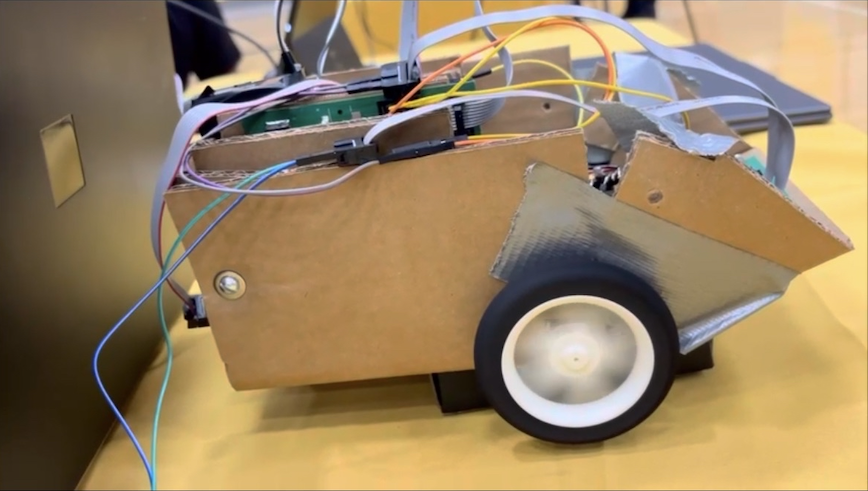

# **Final Design/Team code**

## **Overview**

<iframe width="560" height="315"
        src="https://www.youtube.com/embed/59AQpQhoQbQ?si=3Z9q4qeOMQNP5bYt"
        title="YouTube video player"
        frameborder="0"
        allow="accelerometer; autoplay; clipboard-write; encrypted-media; gyroscope; picture-in-picture; web-share"
        referrerpolicy="strict-origin-when-cross-origin"
        allowfullscreen>
</iframe>

&nbsp;

        
  
Figure 2.1: Our final design for the body of our robot with all the boards inside

&nbsp;

  
Figure 2.2: All of our boards connected creating communication through all subsystems

&nbsp;

   ## **Indvidual Codes for all Subsystems**

   ## **MQTT**

   ## **Color Sensor**

   ## **HMI**
- [Agilan's site](resources/code_esp32_oled-main2.zip)

   ## **Motor/Motor Driver**

  ## **SolidWorks Files**
  - [Download CAD Files.zip](resources/BoardHolder(1).SLDPRT.zip)
   
