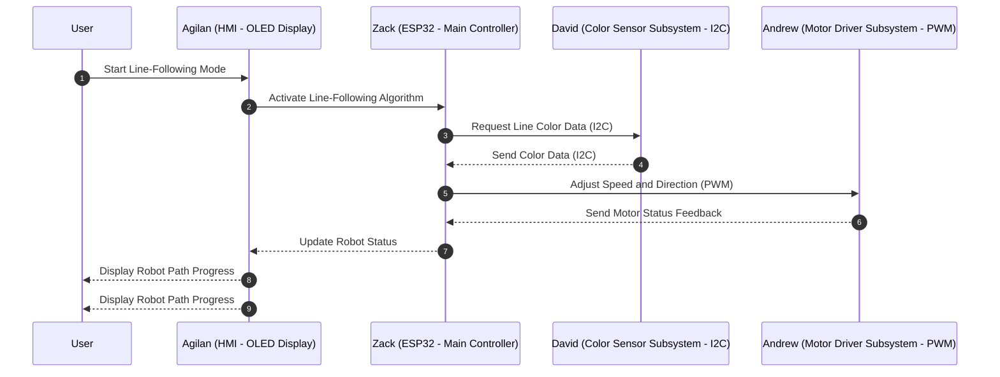

## **Process Flow of the Sequence Diagram**

### User Starts the Robot
- The user interacts with the HMI to enable line-following mode.
- The HMI sends a command to the ESP32  to activate the system.

### ESP32 Requests Color Sensor Data
- The ESP32 sends an I2C request to the Color Sensor to read the line position.

### Color Sensor Sends Data to ESP32
- The Color Sensor detects the line position and sends the processed data (e.g., whether the robot is:
  - Centered
  - Drifting Left
  - Drifting Right
- The sensor sends this data back to the ESP32 over I2C.

### ESP32 Processes Data and Adjusts Motor Speed
- Based on the Color Sensor readings, the ESP32 determines the required motor adjustments:
  - If centered, maintain speed.
  - If drifting left, increase right motor speed and reduce left motor speed.
  - If drifting right, increase left motor speed and reduce right motor speed.
- The ESP32 sends an I2C command to the Motor Driver with the updated speed values.

### Motor Driver Executes Speed Adjustments
- The Motor Driver processes the speed and direction commands and adjusts the motors accordingly.  
- The Motor Driver sends a confirmation message back to the ESP32, indicating that the motor speed update was applied.

### ESP32 Updates the HMI for User Feedback
- The ESP32 sends real-time updates to the HMI (OLED Display), showing:
  - Robot movement status (e.g., "Turning Left", "Going Straight").
  - Sensor readings (e.g., "Line detected at center", "Line shifted left").
  - Motor speed adjustments in real-time.

### User Monitors the Robot's Status on the HMI
- The HMI displays live feedback about the robot’s navigation and behavior.
- The user can see real-time updates on how the robot is following the path.

### The Process Repeats Continuously
- The system loops from Step 2 to Step 7, ensuring the robot dynamically adjusts its speed and direction in real-time.


## **Communication Protocols Used**
- I2C Communication → Used between the ESP32, Color Sensor, and Motor Driver for real-time data exchange and control.  
- PWM Signals → Used internally within the Motor Driver to control motor speed and direction based on ESP32 commands.  
- UART Communication → Used for debugging and optional remote monitoring.  


---

---

## **Message Structure Diagram**

### Message Format:
All messages in our system use I2C communication to exchange data between the ESP32 (main controller), sensor (color detection), motor driver (speed control), and HMI (OLED display).  


```mermaid
sequenceDiagram
    autonumber
    participant ESP32 as Zack (ESP32 - Main Controller - I2C)
    participant Sensor as David (Color Sensor - I2C)
    participant Motor as Andrew (Motor Driver - I2C)
    participant HMI as Agilan (HMI - OLED Display - I2C)

    ESP32->>Sensor: Request Line Color Data [0x41 | ESP32 | Sensor | Read Color | --- | 0x42]
    Sensor-->>ESP32: Send Line Color Data [0x41 | Sensor | ESP32 | Color Value | --- | 0x42]
    
    ESP32->>Motor: Adjust Speed [0x41 | ESP32 | Motor | Speed Value | --- | 0x42]
    Motor-->>ESP32: Confirm Speed Update [0x41 | Motor | ESP32 | Speed Ack | --- | 0x42]

    ESP32->>HMI: Send Status Update [0x41 | ESP32 | HMI | Status Data | --- | 0x42]
    HMI-->>User: Display Robot Status
