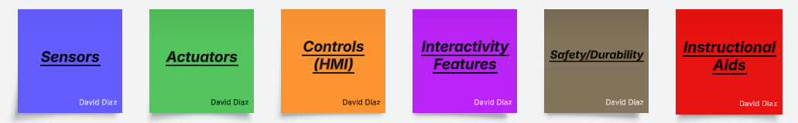
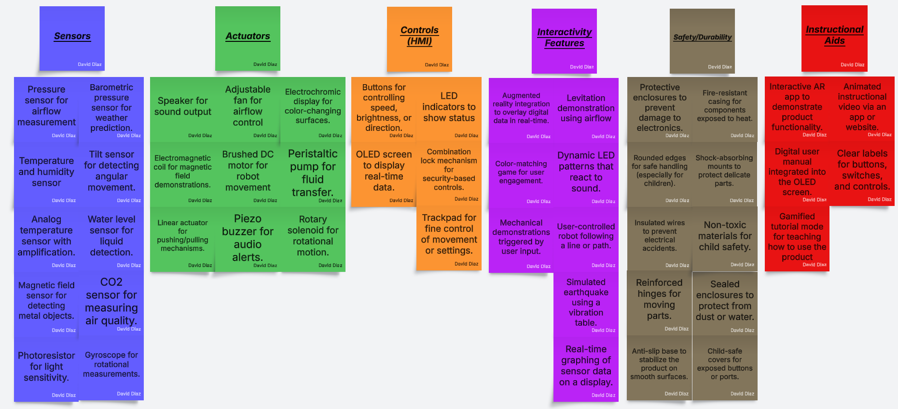
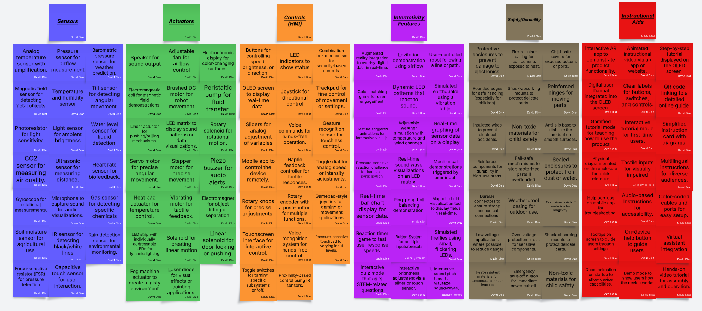

# **Project Ideation and Concept Generation**

## **Abstract**

<iframe width="560" height="315" src="https://www.youtube.com/embed/dQw4w9WgXcQ?si=4idBWLHa1T7gQbJk" title="YouTube video player" frameborder="0" allow="accelerometer; autoplay; clipboard-write; encrypted-media; gyroscope; picture-in-picture; web-share" referrerpolicy="strict-origin-when-cross-origin" allowfullscreen></iframe>

## **Introduction**
Our team recognized the importance of thoroughly understanding our challenge before diving into solutions. We needed to clearly define the goal of our exhibit—what message or concept we wanted to communicate—and identify who our audience would be. These foundational steps were critical to ensure that our efforts aligned with the needs and expectations of the visitors we aimed to engage. By focusing on fostering curiosity, learning, and meaningful interactions, we set the stage for designing an exhibit that could leave a lasting impression.

To move forward, we initiated a brainstorming session to generate potential solutions and features for our exhibit. Drawing inspiration from best practices in interactive exhibit design, we considered factors like intuitive controls, safety, accessibility, and engagement. Our goal was to explore a wide variety of ideas, encourage creativity, and develop concepts that could address both the needs of our audience and the unique challenges presented by our project. Through this process, we aimed to identify innovative and practical solutions to bring our vision to life.

## **Understanding the Exhibit**

Our exhibit aims to create an engaging, hands-on learning experience that allows visitors to explore fundamental STEM concepts interactively. The goal is to inspire curiosity and critical thinking by providing an intuitive, user-friendly experience that encourages visitors to experiment and understand key scientific principles. Through interactive demonstrations, we strive to bridge the gap between theoretical knowledge and real-world applications, making learning both fun and educational.

Our primary audience includes K-12 students, educators, and families seeking to enhance their understanding of STEM concepts through interactive exhibits. The design of our exhibit takes into consideration factors such as varying age groups, cognitive abilities, and accessibility needs. For younger audiences, the interface will be simple and visually engaging, while older students and educators will benefit from deeper insights and advanced features. Ensuring safety, durability, and inclusivity is paramount, allowing all visitors to participate and gain meaningful insights from the experience.

## Brainstorming Process and Sorted Ideas

Our brainstorming sessions were structured to foster creativity and collaboration while addressing the diverse challenges of designing an effective and engaging exhibit. We utilized Lucidchart as a tool for documenting and organizing ideas in real-time. Through a series of structured sessions, we explored various aspects of the project to ensure a thorough and impactful ideation process. The key components of our approach included:

- **Brainstorming sessions**: Team members were encouraged to freely contribute ideas in a judgment-free and collaborative environment. We focused on generating a wide range of ideas, prioritizing quantity over quality during the initial phase to ensure unconventional and innovative concepts were considered.

- **SWOT analysis**: Each idea was evaluated using a framework to identify its strengths, weaknesses, opportunities, and threats. This process helped us refine our focus and prioritize ideas that were both practical and impactful.

- **Prototyping and feedback loops**: Rough prototypes were developed for selected concepts, and iterative feedback was collected. This allowed us to improve and refine ideas based on functionality, feasibility, and user engagement.

To begin the brainstorming process, we first discussed the major features and systems that would make our project both educational for the audience and a valuable learning experience for our team. From these discussions, we identified the need for multiple systems incorporating sensors, actuators, and human-machine interfaces (HMI). In addition, we emphasized the importance of safety and durability, instructional aids for better learning, and interactivity features to accommodate audiences with diverse abilities.

*Figure 1.1: Organized Ideas*

As a result, we aimed to generate at least 100 ideas covering the key areas of sensors, actuators, controls, and interactive features. This comprehensive approach helped us lay the foundation for a modular, user-friendly project design that could be further refined during the subsequent steps.

*Figure 1.2: Mid Organized Brainstorming Results*

---

## Sorted and Ranked Ideas

After completing the brainstorming process, we organized and refined the ideas to identify the most impactful and cohesive concepts for our project. The ideas were grouped into four main categories—Sensors, Actuators, Controls (HMI), and Interactivity Features. Each category was further analyzed to select the top ideas based on feasibility, educational value, and audience engagement.

### Sensors
1. Analog temperature sensor with amplification for real-time weather monitoring.
2. Pressure sensor to measure airflow changes in a Bernoulli Effect demonstration.
3. Ultrasonic sensor to detect distances for precise measurements.
4. Light sensor to measure ambient brightness for dynamic lighting systems.
5. Microphone to capture sound for audio visualization projects.

### Actuators
1. Adjustable fan to simulate airflow in weather or fluid dynamics experiments.
2. Brushed DC motor to enable movement in robotic systems.
3. Stepper motor for precise control in self-balancing robots or visual demonstrations.
4. LED matrix for dynamic data visualization and engaging displays.
5. Vibrating motor to provide tactile feedback in interactive systems.

### Controls (HMI)
1. OLED screen to display real-time data and visual feedback.
2. Buttons to adjust speed, brightness, or other system parameters.
3. Joystick for controlling robotic movements or interactive inputs.
4. Gesture recognition sensor for touchless control of the system.
5. Voice commands for hands-free interaction with the exhibit.

### Interactivity Features
1. Levitation demonstration using airflow to engage users in fluid dynamics.
2. Dynamic LED patterns that react to sound or user inputs.
3. Real-time graphing of sensor data on a display for educational purposes.
4. Adjustable weather simulation with temperature and airflow changes.
5. Reaction timer to measure and display user response times.

---

*Figure 1.3: Final Organized Brainstorming Results*

## Key Findings

From our brainstorming and analysis, the following ideas emerged as practical, impactful, and aligned with the goals of the project:

**Bernoulli Effect Demonstrator**

   - Concept: A hands-on exhibit where visitors can adjust airflow using fans and observe how objects like ping-pong balls levitate.
     
   - Audience Impact: Engages visitors by visualizing fluid dynamics in a fun, interactive way.

**Simple Weather Station**

   - Concept: A device that measures temperature, humidity, and light levels, with real-time display and internet connectivity.
     
   - Audience Impact: Helps students understand environmental monitoring and weather data through live sensor feedback and actuation.

**Self-Balancing Robot**

   - Concept: A robot that uses gyroscopes and motors to balance on two wheels, teaching feedback loops and stability.
     
   - Audience Impact: Demonstrates control systems in robotics, with options for user adjustments via a phone app.

**Line-Following Robot**

   - Concept: A robot that follows a drawn line on a surface, teaching pathfinding algorithms and sensor use.
     
   - Audience Impact: Simple to operate and visually engaging, allowing students to experiment with paths.

**Interactive LED Sound Visualizer**

   - Concept: A sound-activated LED matrix that displays patterns and waveforms based on sound input, visualizing the properties of sound waves.
     
   - Audience Impact: Combines audio and visuals to create an immersive STEM learning experience, teaching about frequency, amplitude, and waveforms.

## **Final Design Concept**

*Figure 1.4: Final Design Concept* 

Our concept sketch is of a line following a robot designed to teach museum visitors about pathfinding algorithms and sensor functionality. This concept satisfies all the needs of the museum visitors by offering an engaging and hands-on learning experience. The robot’s ability to follow a line demonstrates the real-world application of sensor-based navigation, similar to autonomous cars. Visitors will gain insights into how the sensors detect and respond to the environment and how the algorithm processes the data to make decisions. The interactive nature of this device is very user-friendly and easy to use for all ages. 

Science Exhibits Readings Summary:
Clear instruction labels make the device intuitive and educational. We will provide easy-to-read instruction labels for the visitors to easily use and understand. 
As far as controls it will be fairly simple since the algorithm requires the visitor to draw a line and the robot will follow. 
The robot will be made to be durable since many visitors will be using it and the device needs to be able to last for long periods. 
We will provide a very detailed instruction label on the device and make sure it is clear to read so no error can be made during use.

Our project will be split into four main components: 
1. The first will be the output screen, which will display the real-time camera view of the robot to further teach the concepts of how the software functions and what the machine is doing. The screen will also function as a controller for the robot, allowing you to power it off and change certain settings. 
1. The second will be the wireless connection between the robot and the screen, which will be an internet-based two-way communication. 
1. The third component will be the camera sensor and the coding behind the visual detection as well as the position calculation. 
1. The fourth and final will be the motor controls as well as handling input data from the sensors.

## **Conclusion**
The goal of the project is to provide a device that can help teach students all types of sciences and give them a head start if they are heading
toward the engineering route. We are supposed to create an impact on the audience and help them engage in a STEM learning experience. The brainstorming of the devices that could help engage students can help show them a wide variety of STEM-related topics. The topics can range from understanding science topics better to a headstart toward robotics, and many other topics. These devices will also be very engaging so that users can easily figure out how they work. The goal is to provide a learning experience more than anything and help the user better understand the topic they are learning. As for the future
