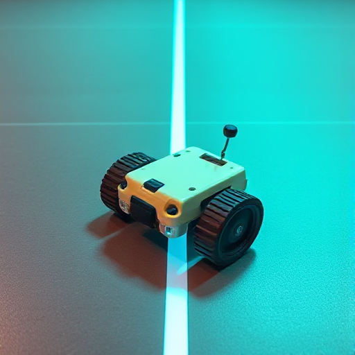

# Project Ideation and Concept Generation

## Introduction
Our team recognized the importance of thoroughly understanding our challenge before diving into solutions. We needed to clearly define the goal of our exhibit—what message or concept we wanted to communicate—and identify who our audience would be. These foundational steps were critical to ensure that our efforts aligned with the needs and expectations of the visitors we aimed to engage. By focusing on fostering curiosity, learning, and meaningful interactions, we set the stage for designing an exhibit that could leave a lasting impression.

To move forward, we initiated a brainstorming session to generate potential solutions and features for our exhibit. Drawing inspiration from best practices in interactive exhibit design, we considered factors like intuitive controls, safety, accessibility, and engagement. Our goal was to explore a wide variety of ideas, encourage creativity, and develop concepts that could address both the needs of our audience and the unique challenges presented by our project. Through this process, we aimed to identify innovative and practical solutions to bring our vision to life.

## Preparation
The primary goal of our exhibit is to communicate a specific message or concept effectively through interactive engagement. Whether it’s magnifying an image, demonstrating a phenomenon, comparing objects, or encouraging cause-and-effect reasoning, the exhibit should allow visitors to explore and learn in a hands-on manner. Clear objectives help determine whether an interactive device is the best medium for conveying the desired information. The design should focus on fostering curiosity, learning, and enjoyment while providing memorable experiences for visitors.

The audience may vary widely, from young children to adults, and should be clearly defined during the planning phase. Whether targeting a specific age group, skill level, or interest, understanding the audience helps tailor the exhibit to their needs. For example, children between the ages of 6 and 10 may require simple, intuitive designs, while an exhibit for all ages would demand accessibility for people of varying physical sizes and abilities. Front-end evaluation helps identify the audience’s existing knowledge, interests, and misconceptions, enabling a more relevant and engaging experience for diverse visitors.

## Methods Used
To begin brainstorming, our team used the app Lucidchart to document progress from our sessions.
- Brainstorming sessions
- SWOT analysis
- Prototyping and feedback loops

## Key Findings
Summarize the main ideas and concepts that emerged from the process here.

## Final Design Concept

Our group chose to create a this because it will show that.

## Conclusion
Conclude with the impact of these ideas on the project's development and future steps.
